# lilbee Architecture

## What is lilbee?

lilbee is a local search engine for your own documents. It runs entirely on your machine: no cloud, no API keys, no data leaving your computer.

You point it at a folder (markdown, code, PDFs, Office docs, ebooks, images, anything), it indexes them, and then you can search them, chat with a model that answers from them, or let lilbee auto-build a wiki of the concepts and entities they contain. Every answer comes with citations linked back to the source chunk.

lilbee is a single executable: the same process drives the CLI, the Textual TUI, the REST API server, the MCP server for AI agents, and a Python library (`from lilbee import Lilbee`). No sidecar services to run alongside it.

---

## System Overview

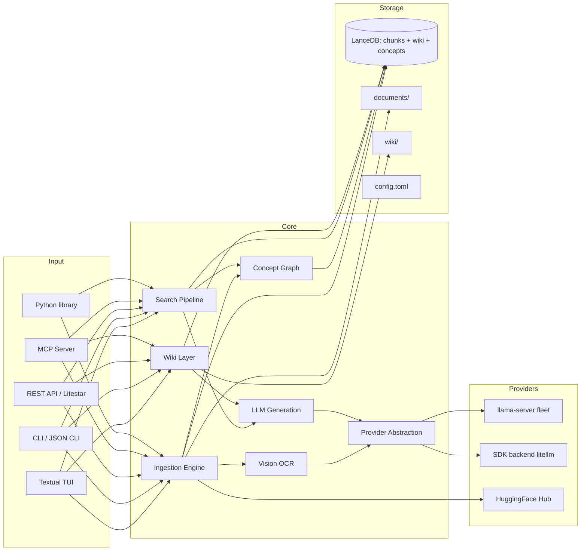

### Process boundaries: engine out of process, retrieval in

One rule decides every process boundary: **a separate process is warranted only where
the kernel cannot share the resource through the filesystem.**

The engine qualifies. VRAM is per-process and a C++ inference crash must not take the
app down, so llama-server runs externally behind llama-swap over localhost HTTP. The
hop carries token streaming, where transport cost is noise next to per-token compute.

The retrieval index does not. LanceDB is an embedded mmap'd store: queries read index
pages in-process, and the OS page cache shares those pages across processes for free.
In-process retrieval is already shared retrieval.

What this buys:

- **No transport on the hottest read path.** Candidate sets flow between search stages
  as in-memory objects, not round-trips.
- **Search cannot be "down."** No retrieval service to start, health-check, or crash.
- **Library-first, CLI-first.** `lilbee search "q" --json` boots, maps the index, runs
  the full pipeline, prints, and exits. No server, no daemon.
- **Concurrency scales with processes**, not a shared service's event loop.

The price is write coordination: writers serialize through a cross-process file lock
and readers tolerate a bounded staleness window (LanceDB MVCC, 5s read-consistency).
Cheap for a read-heavy knowledge base. Surfaces that cannot run in-process still get
the full pipeline over HTTP via `/api/search`.

---

## Ingestion Pipeline

Documents are chunked, embedded, and stored as vectors for later retrieval.

- **File discovery.** Recursive walk of `documents/` with SHA-256 hash-based change detection so only modified files are re-indexed. Each source row also stores the file's size and mtime, so an unchanged file is skipped on a stat alone; the hash runs only when the stat pair drifts. Stores created before these columns re-hash once and backfill. This diff is streamed shard by shard so embedding starts before the whole corpus is hashed — see [Streaming the plan](#streaming-the-plan-start-embedding-before-the-corpus-is-hashed).
- **Markdown.** Heading-aware chunking via xberg's `chunker_type="markdown"` with `prepend_heading_context=True`. Splits at heading boundaries and prepends the full hierarchy path (e.g., `# Setup > ## Install`) so each chunk's section context travels with it. Inspired by Anthropic's Contextual Retrieval (2024), which showed adding context to chunks reduces retrieval failures by 49%.
- **Code.** tree-sitter AST splitting via tree-sitter-language-pack for 150+ languages, with symbol name, type, and line range in chunk headers.
- **PDF.** xberg text extraction with an OCR fallback chain (text extraction → Tesseract OCR → GGUF vision model on `llama-server`). PDF page rasterization is delegated to xberg's `PdfPageIterator`.
- **Vision OCR.** When `LILBEE_VISION_MODEL` is set, scanned PDFs and images are transcribed by a GGUF vision model served by `llama-server` with an `--mmproj` projector. The pipeline streams an SSE heartbeat during long scans and preserves tables, headings, and multi-column layout as structured markdown. Falls back to Tesseract when no vision model is configured.
- **Structured files.** xberg handles XML, JSON, JSONL, YAML, and CSV natively. Language detection for code-shaped content is delegated to tree-sitter-language-pack's `detect_language()`.
- **Web pages.** crawl4ai fetches HTML with JavaScript rendering via Playwright, converts to markdown, and saves to `documents/_web/` for indexing. Recursive crawls emit live progress, respect per-domain rate limits, and retry on HTTP 429/503 with jitter. SSRF protection blocks internal networks by default.
- **Chunking strategy.** Fixed-size chunking (default, token-aware) for reliability on procedural and reference docs. Opt-in semantic chunking (`LILBEE_SEMANTIC_CHUNKING=true`) splits at topic boundaries via xberg's ONNX embedding model; better on prose-heavy corpora at the cost of roughly 9x more downstream embedding calls.
- **Embedding.** Provider-agnostic: native GGUF on the local `llama-server` engine by default, or any backend reachable via the SDK protocol when `pip install lilbee[litellm]` is available.
- **Asymmetric query/document embedding.** Instruction-tuned embedders (Qwen3-Embedding, e5/gte `*-instruct`) only reach their retrieval scores when the query carries a task instruction (`Instruct: ...\nQuery: <q>`) embedded differently from documents; base e5 uses `query:`/`passage:` prefixes. lilbee detects the family from the configured embedder ref and applies the right prefixes automatically (`retrieval/embedding_profiles.py`): the query path uses `embed_query`/`embed_query_batch`, the document path keeps `embed`/`embed_batch`. Symmetric models (bge-m3, nomic) and unrecognized models get no prefix, so behavior is unchanged for them. There is no instruction config: a wrong template silently underperforms, so support for a new family is a curated map entry, not a user knob.
- **Concept extraction (opt-in).** With `pip install lilbee[graph]`, spaCy noun phrases are extracted per chunk, a co-occurrence graph is built with PPMI weights, and Leiden clustering assigns concepts to communities.
- **Wiki generation.** Wikification is explicit: `lilbee wiki build` (or the TUI Wikify action, or the HTTP/MCP build endpoints) issues one LLM call per source; `lilbee sync` only runs the capped `lilbee.wiki.ingest.incremental_update` hook when `wiki_auto_update` is enabled. Each call jointly identifies 3–5 concepts worth their own page and drafts a section for each. Sections are citation-verified and embedding-faithfulness-scored before landing in `concepts/`, `entities/`, or `drafts/`. See the [Wiki Layer](#wiki-layer) section.
- **Storage.** LanceDB tables: chunks (with FTS index for hybrid retrieval), sources, citations, wiki chunks, concept graph nodes/edges, and chunk-to-concept mappings.

### Planning: which files to ingest

Before any embedding, sync diffs the corpus against the store to decide which files to process. That diff is a **stat-gated hash**, per file.

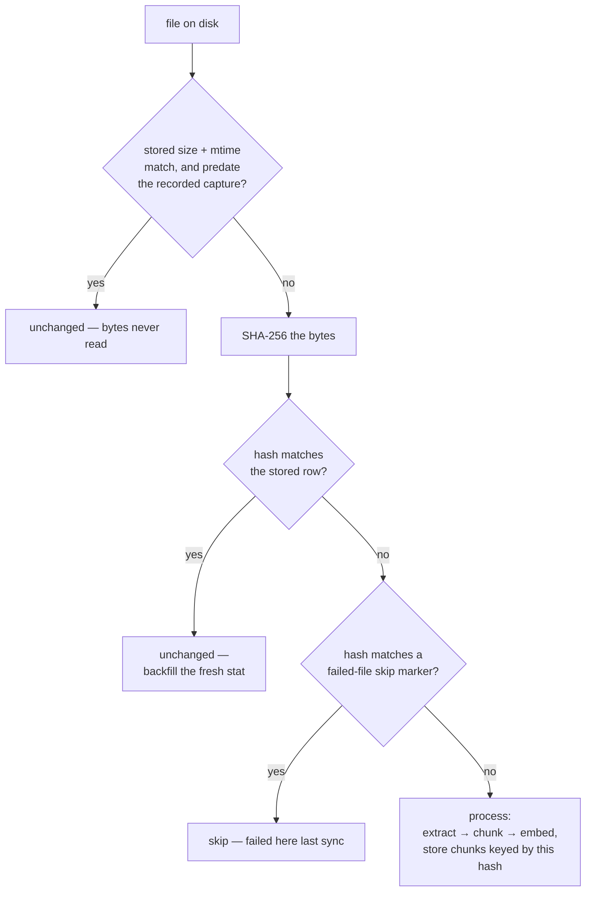

The hash is doing two jobs at once, which is why it stays in this pass and cannot move to write time:

- **Change key.** The stored hash is what the next sync diffs against. A stat match alone skips the read; the hash runs only when the stat pair drifts.
- **Content identity.** The chunks written for a file are keyed by the hash of the *same bytes* they were extracted from. Deferring the hash to flush time would let a file edited mid-run store stale chunks under the new content's hash — the next sync would then see a matching stat, match the stored hash, and never re-process, serving stale chunks forever.

### Streaming the plan: start embedding before the corpus is hashed

Planning the whole corpus first, then embedding, means the GPU fleet sits idle for the entire diff. On a multi-million-file corpus that walk-plus-hash pass is tens of minutes of paid idle before the first passage is embedded.

Instead, the plan is **sharded and overlapped** with ingest. Files are sorted, sliced into contiguous shards (ramping 256 → 8192), and each shard is handed to ingest as it lands. The next shard is planned on a dedicated thread while the current one is being extracted and embedded.

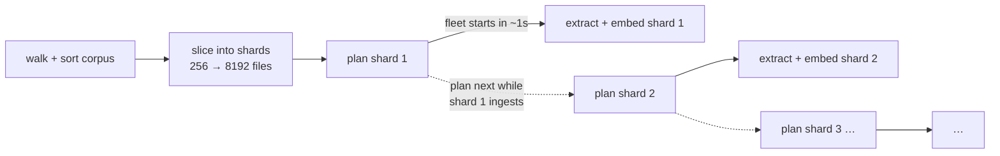

Correctness is unchanged because shards are contiguous slices of one sorted list consumed in order: the streamed plan is byte-for-byte the single-pass plan, only delivered in pieces. Cross-shard bookkeeping (added/updated sets, one-to-one move detection for relocated files, skip markers) accumulates across shards to the same result. The planner runs on its own thread rather than the shared ingest pool, which extraction saturates once ingest is under way.

**Why the list is sorted.** `os.walk` yields files in arbitrary filesystem order, so the corpus is sorted by key first. That fixed order is what makes the plan deterministic: classification fans out across a thread pool and completes out of order, but the plan is reassembled in sorted order, so it matches what a single serial pass would produce regardless of thread scheduling (a test asserts `parallel == serial`). It also makes move detection deterministic — when several deleted sources share a content hash, a reappeared file pairs with exactly one old key — and makes the shard boundaries stable, so a killed-and-restarted run re-shards the same corpus the same way.

### Ingest concurrency: keeping the GPUs fed

A full-corpus OCR ingest is a producer/consumer pipeline: CPU-side work (rasterizing
PDF pages) feeds GPU-side work (vision OCR). Admit too few documents at once and the
GPUs sit idle waiting for pages; admit too many and the CPU thrashes while RAM and GPU
temperature climb. The right number is not a constant — it depends on the machine, the
corpus, and how many GPUs are present.

lilbee bounds how many documents are in their compute phase at once with an **admission
gate**, and `LILBEE_INGEST_CONCURRENCY` chooses how that gate is sized:

| Mode | Gate | What it does |
|------|------|--------------|
| `static` *(default)* | fixed semaphore | A constant limit derived from the fleet's slot capacity. Proven, predictable, and the always-safe fallback. Nothing changes for anyone who does not opt in. |
| `adaptive-conservative` | resizable, cautious | A background controller tunes the limit toward this box's actual throughput knee, climbing slowly and backing off at the first sign of pressure. |
| `adaptive-aggressive` | resizable, faster | Same control law and the *same* safety limits, but larger steps and a shorter interval, so it finds the knee faster on short runs. |

Adaptive mode engages only when a GPU fleet is present (a GPU-less host always runs
`static`), and the controller is best-effort: if a measurement ever fails it is logged
and skipped, so the tuner can never crash the ingest it is only advising.

#### How adaptive sizing works

Instead of chasing a hardcoded target like "90% GPU utilization," the controller finds
the **throughput knee** — the point where adding more in-flight documents stops adding
throughput and only inflates latency. This is a safety-gated hill-climb on smoothed
per-page throughput, drawn from proven congestion-control and thread-pool autotuning
practice (AIMD, TCP BBR / Kleinrock's operating point, the .NET CLR ThreadPool
hill-climber, the Universal Scalability Law).

Every interval it samples the signals and decides one small change:

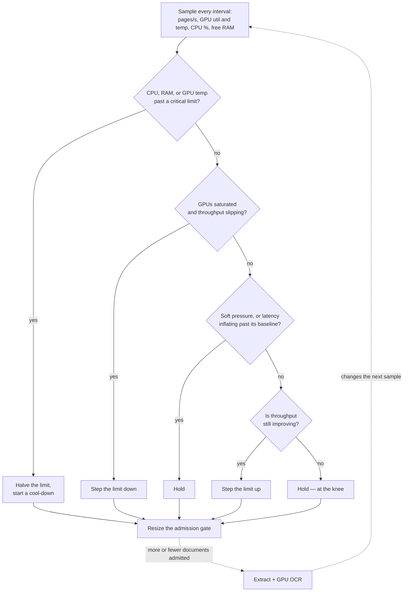

Two ideas make it both fast and safe:

- **Latency leads the knee (TCP Vegas / Netflix Gradient2).** Waiting for throughput to
  visibly flatten is too late — you have already overshot. So the controller estimates
  per-page residence time with Little's Law (`in-flight ÷ throughput`), tracks its
  unloaded minimum, and stops climbing the moment that estimate inflates, before
  throughput rolls over.
- **Safety is never traded for speed.** Critical CPU, RAM, or GPU-temperature signals
  force an immediate multiplicative back-off and a cool-down. The two adaptive profiles
  differ only in how quickly they climb — never in these limits. Throughput is measured
  in OCR pages, not documents, so a 500-page scan counts as 500 units of work and does
  not read as a throughput collapse.

#### Parameters

Safety limits are identical across both adaptive profiles; only the climb speed differs.

| | `conservative` | `aggressive` | Safety (both) |
|---|---|---|---|
| sample interval | 5 s | 2 s | — |
| smoothing (EWMA γ) | 0.3 | 0.5 | — |
| climb step | +1 | +1 + ⌊√limit ÷ 4⌋ | — |
| dead band | 5% | 3% | — |
| latency veto | 1.5× baseline | 2.0× baseline | — |
| cool-down | 3 intervals | 2 intervals | — |
| back-off on danger | — | — | ×0.5 |
| GPU-saturation veto | — | — | 97% util |
| CPU soft / critical | — | — | 90% / 97% |
| free RAM soft / min | — | — | 20% / 10% |
| GPU temp warn / critical | — | — | 80°C / 85°C |

### Three ceilings govern ingest throughput

Admission control keeps the GPUs fed, but it is only one of three limits, and tuning the
wrong one wastes effort. Ingest throughput is the minimum of:

1. **The GPU ceiling.** How fast the cards can actually run the model.
2. **The admission ceiling.** How many documents the controller lets in flight, which is
   what the adaptive profiles above tune.
3. **The CPU decode ceiling.** How fast one core can turn embed responses back into
   Python objects, because that step holds the GIL and therefore does not scale with
   threads or with GPUs.

The third is the least obvious and the easiest to misread as a GPU problem, so it is
worth knowing how to tell them apart:

| What you observe | Which ceiling is binding |
|---|---|
| All cards near 100% util, throughput flat | GPU. Add or upgrade cards. |
| Cards well under 100%, CPU cores all moderate | Admission. The controller is holding back. |
| Cards uneven and starved, **one** core pegged at 100% | CPU decode. More concurrency will not help. |

The third row is a real failure lilbee hit: 8 A100s capped near 161 docs/sec at roughly
78% util with cards ranging 10 to 98 percent, while 2 slower L40S cards sat at an even
97/97 percent. The slower pair was GPU-bound and healthy; the faster eight were waiting
on a single core. The rest of this section is why, and what fixed it.

#### Embedding responses are binary, not JSON floats

Ingest dispatches embed calls from a thread pool, so many files are in flight at once.
The network wait overlaps well, because httpx releases the GIL while waiting. Decoding
the response does not.

That is the whole problem. A vector arriving as JSON decimal literals becomes one Python
float per dimension, parsed individually under the GIL. A 4096-dimensional vector is
4096 separately parsed numbers. However many threads or GPUs are running, one core
decodes all of them, and that core's rate is the fleet's rate.

So lilbee asks for `encoding_format: base64`. The response is still JSON, with the same
envelope and the same fields. Only the vector itself is written differently:

```jsonc
// before: 4096 decimal literals to parse, one Python float each
"embedding": [-0.0029101597, -0.0131583912, 0.0144413067, ...]

// after: one string, decoded by numpy.frombuffer in a single C call
"embedding": "Ybg+u0uWV7w7m2w8foWVvaJerzvbiCq8C1Yo..."
```

Measured through the client's own embed path, one core, 4096-dimensional vectors,
64 per batch:

| | Before (JSON floats) | After (base64) |
|---|---|---|
| CPU per 1k vectors | 785 ms | **110 ms** |
| Response body per batch | 5.41 MB | **1.40 MB** |
| One-core decode ceiling | ~1,300 vectors/sec | **~9,000 vectors/sec** |
| Work per vector | 4096 Python float objects | 1 buffer copy |
| 8xA100 observed | 161 docs/sec, cards 10-98% util | GPU-bound |

Roughly seven times cheaper. The last row is the point: at about eight chunks per
document, 1,300 vectors/sec works out to about 160 docs/sec, which is exactly where the
8-card host was stuck. That arithmetic is the quickest field test for whether decode is
your limit. Divide one core's decode rate by chunks per document and compare it to
observed throughput.

Reranking shares the `/v1/embeddings` endpoint under rank pooling, so it receives the
same encoding. Both callers decode through one helper, which keeps the wire format out
of the score path.

**Why not a real binary protocol?** MessagePack or protobuf would drop base64's 33% size
inflation, but most of the remaining 110 ms is building Python floats for the caller, not
the wire format. On the decode alone a raw binary buffer costs 55 ms per 1k vectors
against base64's 97, so the entire protocol change is worth about 40 ms. It is also not
reachable: the endpoint is llama.cpp's OpenAI-compatible API, which speaks JSON. Base64
takes most of the available win using a format the engine already implements.

**Why no strict base64 validation?** Rejecting non-alphabet characters during decode
measured 12% slower, to guard against corruption that loopback HTTP already excludes. A
wrong buffer length, a wrong response shape, and a wrong vector dimension are each still
caught, the last by the store on write.

**Vectors stay numpy to the store.** Most of what was left after base64 was not the wire
at all. `numpy.frombuffer` gives a float32 array, and the client then called `.tolist()`
on it, building 4096 Python float objects per vector to satisfy a `list[list[float]]`
signature. Nothing downstream wanted them: pyarrow and LanceDB take float32 arrays
directly, and the vector column is float32 either way. So `LLMProvider.embed` returns
`list[NDArray[float32]]` (`Vector` in `core/vectors.py`) and the conversion is gone.

Measured end to end through `LlamaServerClient.embed` against a mock transport, so the
figure includes envelope parse, base64 decode, and the client's own batching, not decode
alone. 4096-dimensional, 64 per batch, median of 7 reps:

| | base64 + `tolist` | base64, numpy |
|---|---|---|
| CPU per 1k vectors | 128 ms | **70 ms** |

Base measured against itself across runs varies about 1.5%, so the 46% drop is signal.
Isolating the decode alone puts the remaining cost near 40 ms per 1k and the one-core
ceiling around 25,000 vectors/sec, up from roughly 9,000.

Batching the conversion was not the alternative. One contiguous 2D `tolist` measured
101 ms per 1k against 96 ms per vector: the cost is allocating float objects, not call
overhead, so only not allocating them helps.

The SDK backends (Ollama, OpenAI via litellm) receive JSON float lists from their SDK
and convert once at the provider boundary. They are network-bound, so the conversion
does not show up. Two places still need Python lists and say so: `MemoryRow` serializes
to JSON on write, and LanceDB read rows (`SearchChunk.vector`) come back as lists.

#### One worker process per GPU (`ingest_processes`)

**The problem.** One process cannot feed several cards. The work is serialized through
one plan stream, one collect and one writer, and that serial stage is the bottleneck:
on 8xH100 a plain `lilbee sync` measured 152 docs/sec across eight cards against 162
across four, so the eighth card made the run slower.

**The shape.** A sync large enough to pay for them fans out into one worker process per
visible card. Each worker is an ordinary `lilbee sync` over a deterministic slice of the
corpus, with its own store; the parent supervises and folds the shards into one index.

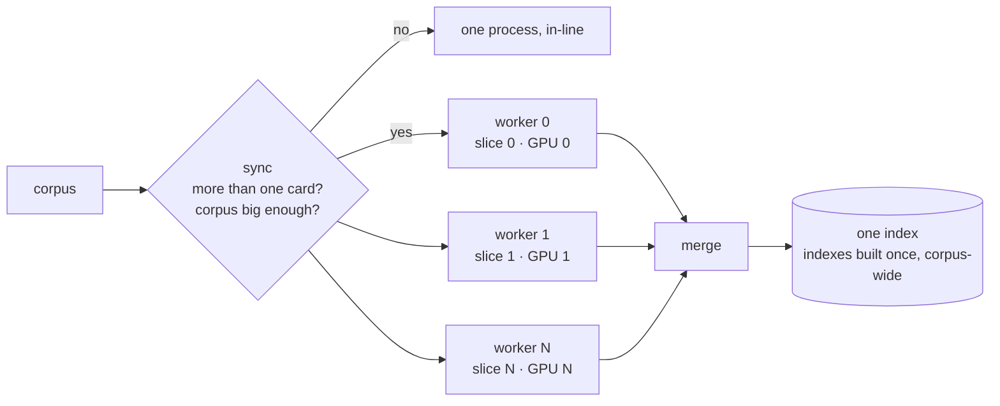

**What each worker owns.**

| What it owns | Why |
|---|---|
| One card, masked at the process | Sizing and placement read the mask, so a worker plans against its own card, not the box. |
| An engine slot, keyed by card | Without one, every worker scans the machine-wide slot, finds worker 0's fleet and adopts it: one card at 95% and seven at 0%, run completes, index correct, no error. Workers sharing a card share its slot deliberately. |
| A data root and store | No shared write drain, which is what capped the previous mechanism. |
| Its share of the CPU pools | Eight workers each sizing to a 160-core box put 4208 threads on it, load average 254, GPUs idle. |
| A slice of the corpus | Hashed with blake2b, not `hash()`, so a resume deals the corpus the same way and re-embeds nothing. |
| Its own log | The parent shows one progress bar instead of N log files. |

**The setting.** `ingest_processes` counts worker processes. `0` (the default) is one per
card, `1` keeps ingest in this process, and `N` pins the count with worker *i* on card
*i % card_count*, so more workers than cards is expressible without a second fleet on a
card.

**Why this replaced the old mechanism.** It used to be a pool inside one process: workers
produced records, a single parent collected them over IPC and wrote the one store. That
parent drain was the binding ceiling for a large embedder, which is why the setting was
off by default and measured 1.00x. Per-card workers remove the drain instead of widening
it: eight pinned workers on the same 8xH100 box measured 415 docs/sec at a GPU busy
fraction of 0.93.

**Where the work is skipped.** Workers build no indexes and run no corpus-wide passes:
the merge rebuilds ANN and BM25 over the whole corpus anyway, and per-shard builds
measured a third of an 800k run's wall clock before being thrown away.

**Two costs.** The merge copies rows rather than committing metadata, so a first full
ingest writes the corpus twice; and the shard stores are kept as the resume state, so
vectors live on disk twice until the merge becomes a metadata-only Lance commit.

**When something breaks.** A worker that fails leaves its shard in place, stops the merge
and names itself and its log, rather than producing an index that is silently short of
rows.

---

## Provider Abstraction

lilbee treats chat, embedding, vision (OCR), and reranking as independent **model roles**. Each role resolves to a provider at call time, so you can mix local and remote freely (e.g., a local GGUF chat model with a remote embedding model, or the reverse).

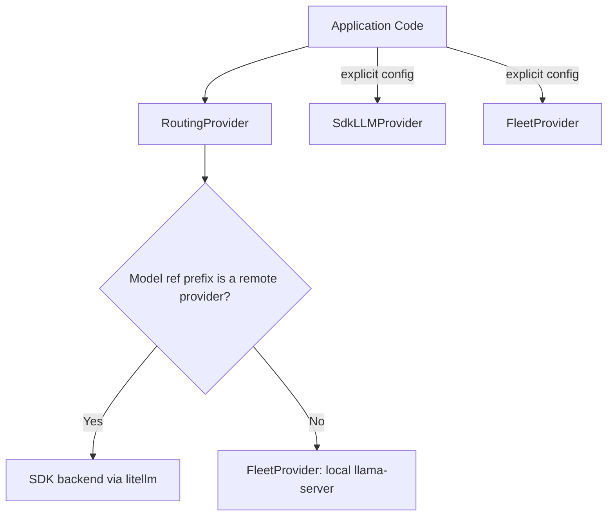

- **auto** (default). `RoutingProvider` dispatches by model-ref prefix: a remote ref (`ollama/`, `openai/`, ...) goes to the SDK backend; a native GGUF ref runs locally on the managed `llama-server` engine.
- **remote**. Force all calls through the SDK backend (anything litellm reaches). Requires `pip install lilbee[litellm]`.

**Model roles** (`lilbee model list --task <role>`):

| Role | Config field | Used for |
|------|--------------|----------|
| chat | `LILBEE_CHAT_MODEL` | `ask`, `chat`, wiki generation |
| embedding | `LILBEE_EMBEDDING_MODEL` | ingest, search, faithfulness scoring |
| vision | `LILBEE_VISION_MODEL` | OCR for scanned PDFs and images |
| reranker | `LILBEE_RERANKER_MODEL` | cross-encoder precision pass |

`validate_model_task_assignment` (invoked at config write time) rejects assignments where the model's capability declaration doesn't match the role, so you can't accidentally wire a pure-chat model into the vision slot.

**Model management.** Native GGUF support tracks [llama.cpp](https://github.com/ggml-org/llama.cpp) 1:1, so any GGUF that `llama-server` loads loads in lilbee. Pulls come from HuggingFace via the catalog (`lilbee model pull`, `/models` in the TUI). Picks per role are the most popular models of each parameter tier, fetched live from HuggingFace's trending ranking and held for the session; the catalog view additionally exposes the full HuggingFace GGUF search. External models reached via the SDK backend are used for inference when available but are not managed by lilbee.

---

## Local inference engine

The local engine is a managed `llama-server` fleet (`FleetProvider`,
`src/lilbee/providers/fleet/`): lilbee starts one `llama-server` per
configured role, routes each call to the least-busy healthy server for that role,
and tears them down on exit. A single machine is a fleet-of-one; the same code
scales to N GPUs by bin-packing models across them. Placement is planned jointly
for every configured role up front, but each role's server spawns lazily on first
use, so a batch `lilbee add` that only embeds never loads the chat model's VRAM;
the interactive warm-up (`worker_pool_eager_start`) brings every role up at once. There is no separate engine to
install or run, and no in-process binding: the engine is 100% llama.cpp, and lilbee
adds a placement planner, a process supervisor, and a thin httpx router. All four
roles run over HTTP: chat and vision use `/v1/chat/completions` (chat with
`--jinja` for native tool calls; vision adds an `--mmproj` projector), embed and
rerank use `/v1/embeddings` (rerank with `--pooling rank` and a
`query</s></s>candidate` pairing, never the template-dependent `/v1/rerank`). A
configured role whose server cannot start surfaces a user-facing `ProviderError`
rather than degrading silently.

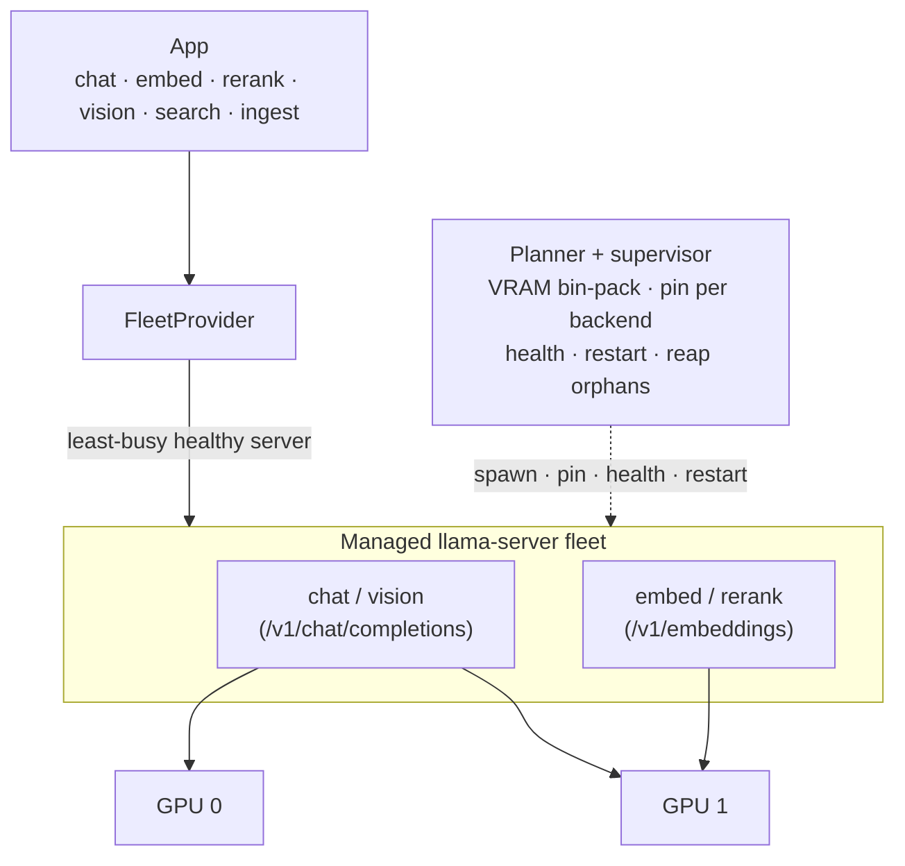

#### Supervision layout

Follow the numbers: the planner measures, renders a config per role, each role's
llama-swap spawns and watches that role's servers, and the provider routes live
requests by role. Rerank and vision follow the same shape as embed. Because every
role has its own supervisor, config, log, and state file, a placement change
restarts only the roles whose launches changed (see the reload diff below).

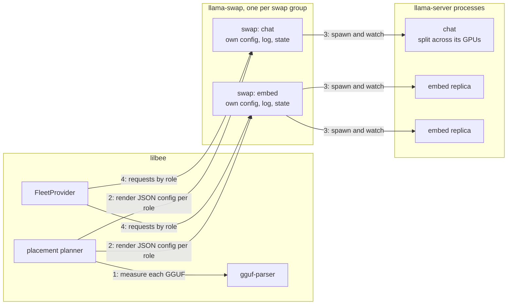

- **Detection** (`devices.probe_devices`): GPUs come from the binary's own
  `llama-server --list-devices`, so enumeration and pinning share one backend-native
  index space. A device index from one API (Vulkan) is meaningless to another (CUDA),
  so we never cross them; the Vulkan VRAM probe (`gpu_select`) is only a fallback.
  The probe runs in its own process group with a hard timeout: a probe wedged in
  GPU-driver I/O is killed (and abandoned if unkillable) and surfaces as a named
  error through the warm tracker, health, and the TUI, never as an empty device
  list or a silent never-ready fleet.
- **Pinning**: per backend, never by a foreign index, and in two shapes depending on
  whether the backend's environment variable speaks the same space `--list-devices`
  numbers.
  - By name, via `--device` (`planning._device_names`): **Vulkan** and **SYCL**.
    `GGML_VK_VISIBLE_DEVICES` indexes the raw loader enumeration, not ggml's
    filtered list, and setting it also disables ggml's device-type filter, its
    `storageBuffer16BitAccess` support check and its same-UUID dedup.
    `ONEAPI_DEVICE_SELECTOR` is a selector over a backend runtime rather than an
    index list, so a device the engine calls `SYCL1` need not be Level Zero
    ordinal 1. `--device` names devices exactly as `--list-devices` printed them,
    which is where the indices came from. Devices synthesized by the Vulkan
    fallback are never pinned: they carry raw loader ordinals, so the engine is
    left to select for itself.
  - By environment (`devices.visible_env`): **CUDA** via `CUDA_VISIBLE_DEVICES`
    with `CUDA_DEVICE_ORDER` (`PCI_BUS_ID` unless the environment presets another
    order), **ROCm/HIP** via one of `ROCR_VISIBLE_DEVICES`/`HIP_VISIBLE_DEVICES`
    (never both: ROCr filters first and HIP re-indexes within the survivors, so
    writing both double-filters). When the parent environment already restricts a
    visible-devices var (a pod preset like `CUDA_VISIBLE_DEVICES=2,3`), the probe's
    indices are relative to that list, so the child env maps them back through it
    (integer or UUID entries) and keeps naming the same physical cards the probe
    saw.
  - When the engine listed GPUs and placement refused all of them, the launch
    carries `--device none`: dropping a device from lilbee's view does not stop
    ggml choosing it, and its fallback takes the first non-CPU adapter.
- **VRAM estimation** (`vram.py`): each instance's footprint comes from
  **`gguf-parser`** (`estimate_instance_footprint`), a UMA-aware estimator run as a
  subprocess and memoized on the GGUF's path + mtime + sizing. It reports both a
  discrete-GPU footprint (`nonuma`, what lands in device VRAM) and a unified-memory
  footprint (`uma`, total resident on an Apple Silicon / shared-RAM host); the
  planner charges whichever matches the host. For a multi-GPU tensor-split it passes
  `--tensor-split`, so gguf-parser returns the **per-device** breakdown; placement
  then charges each card its own share and gates on each card's headroom, with the
  busiest card (`peak_footprint`) as the binding constraint, because a split OOMs on
  whichever GPU is fullest, not on the summed total. The estimate also carries the
  same `--batch-size`/`--ubatch-size` the launch will use (pooled embed/rerank raise
  them to the full context), so the compute-buffer estimate matches what the server
  actually allocates. For a vision model the discrete-GPU number is corrected on
  lilbee's side: gguf-parser's `nonuma` merge charges any multimodal projector
  roughly 10 GiB of phantom compute buffer (a 1.2 GiB OCR model plus its 0.9 GiB
  projector came back as 12.7 GiB), so the projector is instead charged at its
  unified-memory delta, floored at the projector's own weights. This replaced a
  hand-rolled
  weights + KV-cache estimate that used discrete-GPU accounting and over-estimated
  ~3x on unified memory, which was crowding the co-resident embed/rerank servers out
  of the budget and 503-ing every search.
- **Placement** (`placement.py`): bin-packed in `placement_rank` order (search roles,
  then vision, then the elastic chat model), largest-first within a rank, with 90%
  headroom.
  A model that fits one GPU is a single pinned instance; small models co-locate; a
  model too big for one GPU is tensor-split across enough cards that each card's
  per-device footprint fits, charged against each card's total VRAM capacity (so a
  warm fleet's own resident models aren't double-counted, and unequal GPUs don't OOM
  the smaller one). For the chat model the planner does not stop at the fewest fitting
  cards: it sizes each candidate shard's served context the way the launch will
  (`ctx.fit_split_ctx`, against the **clean-box plan snapshot**) and **widens onto idle cards** when
  a tighter shard would starve KV below the context target, falling back to the
  largest-context shard when no shard reaches it. This keeps placement and launch in
  agreement, so a giant chat that just fits the fewest cards no longer collapses to the
  512-token floor while spare cards sit idle; a chat already comfortable on few cards
  stays there (no needless inter-GPU traffic), and the context target follows
  `cfg.num_ctx` / `cfg.chat_n_ctx_target`. A tensor-split chat serves **one full-context sequence**
  (`--parallel 1`): a giant filling several cards has no room to divide its context
  across batching slots, so the planner reserves and launches it at the single-sequence
  footprint rather than `ceiling x` the single-GPU slot count (multi-slot batching is
  for a chat that fits one card). Its context is then sized (`ctx.fit_split_ctx`, a
  binary search over the gguf-parser estimate) so **each card's own share fits that
  card's own headroom**, never the combined pool, so the per-GPU compute buffer can't
  overflow device 0 even when the cards are unequal. On a
  single CPU/Metal box this
  is a fleet-of-one against one shared pool, where the **search-critical roles
  (embed/rerank) are reserved before the elastic chat model**: chat's slot count and
  context are sized against the budget *minus* the search footprint, and the shared
  pool places search first, so a large chat can never starve search (the proven
  embed-starvation bug). Placement gates against **free system RAM** rather than a
  GPU budget: unified memory is shared with the OS, so a model that exceeds free RAM
  is marked unplaceable (no server, clean error) instead of loaded. Loading past free
  RAM on a unified-memory host drives the OS into a swap-thrash OOM livelock that
  hard-freezes the machine, so refusing is the safe outcome; chat slot count
  (`--parallel`) steps down the same way before refusing.

- **Reload and the plan snapshot** (`planning.capture_plan_probe`,
  `provider._reload_pass`): each swap group runs behind its own llama-swap process
  (one per role, except co-tenant chat and vision which share one), and a reload
  re-plans the whole fleet but restarts **only the groups whose launches
  changed**. That diff is sound because launches are a pure function of config,
  hardware capacity, and a **clean-box memory snapshot**: devices, usable VRAM,
  and free system RAM are captured once per boot (right after stale-server
  reaping, when nothing lilbee owns is loaded) and every re-plan reads the
  snapshot instead of probing live. A live probe under a loaded fleet would
  report the fleet's own residency as unavailable, shrinking chat context and
  slot counts, widening splits, and (on unified memory) evicting roles outright.
  Full fleet teardown clears the snapshot, so the next boot probes fresh and
  still respects VRAM other processes hold. The read/view surfaces
  (`GET /api/placement`, `placement show`, preview) keep a live short-TTL probe
  so displayed free bytes stay current; they never feed the launch path.

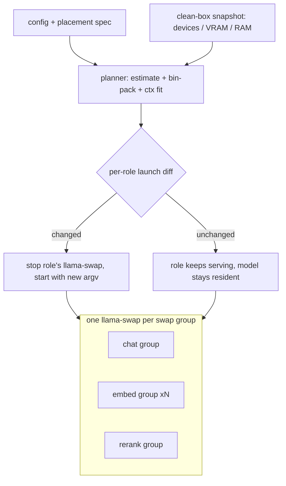

#### Manual placement

By default the auto planner runs every time a fleet is built. When a `placement`
spec is set, it replaces the planner entirely: the spec's assignments are used
as-is and the VRAM bin-pack does not run.

The spec is per-role. Each role entry accepts:

- `devices` (required): list of GPU indices to use for that role.
- `tensor_split` (optional): per-device weight proportions for a tensor-split
  instance. When omitted, the model is split evenly across the listed devices.
- `replicas` (optional): how many independent servers to run for embed and
  vision roles. Defaults to 1.

```json
{
  "chat":    { "devices": [0, 1], "tensor_split": [1, 1] },
  "embed":   { "devices": [2], "replicas": 2 },
  "rerank":  { "devices": [2] },
  "vision":  { "devices": [3] }
}
```

The `placement` field is stored as a JSON scalar in `config.toml` (a single
`placement = '{"chat": ...}'` key), because the config store is a flat
key-value file and cannot represent the nested shape natively. The placement
surfaces (CLI, HTTP, MCP, TUI) handle encoding and decoding; editing
`config.toml` by hand is not the intended path.

When a pinned placement no longer fits the card it names, lilbee surfaces a
hard error that identifies the card by name (e.g. `CUDA0: RTX 4090
(23.7 GiB free, 24.0 GiB total)`) rather than failing silently. This makes
hardware-change failures explicit.

The surfaces go through the one `app/placement.py` use-case:
CLI (`lilbee placement show/preview/set/clear`), MCP
(`get_gpus`, `get_placement`, `preview_placement`, `set_placement`, `clear_placement`),
and the TUI Placement screen. Over HTTP the reads are always served
(`GET /api/placement`, `POST /api/placement/preview`, `GET /api/gpus`).
Applying or clearing placement restarts the fleet's moved roles, so `PUT`/`DELETE
/api/placement` are refused by default and gated on `allow_http_placement`
(`LILBEE_ALLOW_HTTP_PLACEMENT`), which an operator enables for a single-client
or owned deployment (the plugin's managed server, or a personally-owned pod) to
get the same apply/clear capability as the CLI and TUI. The `preview` operation is a dry-run: it shows
what the auto planner would assign (or what a candidate spec would assign)
including each card's backend+index label, name, and free/total VRAM, without
touching the running fleet.

- **Resident tiers and the elastic ingest pool**: placement charges roles in the
  registry's `placement_rank` order. The pinned tier goes first: one embed server
  (`embed-0`), rerank, and one vision server (`vision-0`). Chat is charged last,
  against what the pinned tier leaves, because chat's KV cache is the one footprint
  that can shrink. Search therefore never loses its servers to a large chat model,
  and vision is placeable whenever it fits beside the search tier, no matter how
  large the chat model is. Extra embed and vision replicas (`embed-1..N`,
  additional vision) are placed only into the VRAM that remains, and stay resident
  there; nothing is unloaded when an ingest finishes. If llama-swap is restarted or
  found dead, the fleet re-probes once and rebuilds its model config before
  reporting a failure.
- **Swap tenancy**: the planner matches the old in-process pool (last shipped in
  v0.6.66b507; see its
  [Inference Worker Pool](https://github.com/tobocop2/lilbee/blob/v0.6.66b507/docs/architecture.md#inference-worker-pool)
  section), where a role's worker spawned lazily on first call, so ingest
  (embed + vision OCR) and a query (embed + rerank + chat) never held each
  other's models in VRAM. Roles that share
  no run **phase** (`RoleInfo.phases`) are never resident together, so when they
  cannot all co-reside a role that does not fit **refunds** the already-charged
  phase-disjoint roles and retries; the roles that let it in become co-tenants of a
  single `swap: true` llama-swap group. On a tight card this pulls the query-only
  rerank and chat into vision's swap group, so ingest's embed + vision fits exactly
  as it did in-process. Only one member is resident at a time, so the group is
  charged its largest member and each co-tenant runs a single instance (a
  `swap: true` group evicts same-group siblings, so a second replica inside it would
  evict the first). Interleaving a query with an ingest costs a model reload each
  way. With the VRAM to hold everything at once, no swap group forms and every role
  pins to its own group. On GPUs the estimate advises but does not gate the load: a
  role that does not fit even beside the one embedder its own phase needs is still
  **placed tight** (best-effort) on the emptiest card, anchoring the swap group so the load
  starts against as much free VRAM as possible, with a memory-is-tight warning
  carrying the estimated shortfall. The in-process pool never gated a load on an
  estimate, and the load itself is the only reliable arbiter (the estimate can be
  high, and some drivers page into shared memory rather than fail). The one
  exception is not about whether the load succeeds: a chat whose **fitted window
  cannot hold the minimum grounded prompt** (system prompt, one retrieved source,
  the question, and the answer reserve) would load, report ready, and then fail
  every query at the window, so `plan_launches` refuses that launch and records a
  reason with the numbers, surfaced by the warm tracker and the request path. A
  `num_ctx` pin, or a `num_ctx_max` / `chat_n_ctx_target` the user set below that
  minimum, is honored instead of refused.
- **Data-parallel replicas** (`embed_replicas` / `vision_replicas`): the embed and
  vision roles can run as N independent servers, fanning embedding and OCR across
  the box during ingest. Setting either value to `0` (the default) means auto: one
  replica per GPU, capped by how much VRAM remains after the query fleet is placed.
  A positive value pins the replica count to exactly that number. The provider
  holds a client pool per role and round-robins to the least-busy replica. Each
  replica is its own llama-swap model id (`<role>-<n>`); a role is ready once any
  replica is. Replicas are ingest-only and reclaimed after ingest completes.
- **Loader flags** (`adapters.build_server_argv`): each server's flags derive from
  cfg and the model's GGUF metadata for that role and config. Chat carries
  `--jinja`, `--flash-attn` (on unless `flash_attention` is disabled) and
  `--cache-type-k/-v` from `kv_cache_type` -- but a quantized KV type needs flash
  attention, so with it disabled the launch falls back to f16 (and the estimate
  sizes against f16 to match). A mixture-of-experts model also offloads its expert
  weights to system memory when `cpu_moe`/`n_cpu_moe` is set (`--cpu-moe`/
  `--n-cpu-moe`, gated on the GGUF declaring routed experts), and the VRAM estimate
  charges the same tensors to the host so the plan matches the launch. Chat also
  loads with `--no-mmap`
  (a malloc'd host copy) when its weights fit in at most half of total system
  RAM -- a buffered sequential read reaches ready ~20% faster than mmap's
  page-fault-driven upload (measured 33s vs 43s for a 112GB model on 3 GPUs),
  while replicated roles keep mmap so their replicas share one set of
  page-cache pages. The gate reads total (not free) memory so replans never
  flap the flag; embed and rerank raise
  `--batch-size`/`--ubatch-size` to the full context (the server caps embeddings at
  `n_ubatch`, default 512); vision uses the full-core thread default and always
  offloads every layer. Embed and rerank requests also send `embd_normalize=-1` to
  get raw, un-normalized vectors (the server would L2-normalize pooled output by
  default, which would also collapse a rank score to +-1). Context and GPU-layer
  counts come from the shared `engine_params` helpers, never a hardcoded budget.
  `main_gpu` is the one
  setting deliberately not forwarded: it selects a single card by global index, which
  is meaningless once a server is pinned to a subset, and placement owns card choice
  in fleet mode.
- **Lifecycle** (`swap_manager.py` / `provider.py`): each swap group runs behind its own
  llama-swap process with its own config file, so restarting one group (a placement or
  per-role model change) never touches another group's loaded servers. A reload
  re-plans the whole fleet and diffs the fresh plan per group against the
  running launches, restarting only the groups whose launches changed; an
  untouched 100GB chat model stays resident while the embedder moves. Each
  server runs in its own process group and claims
  its port at spawn (no racy batch allocation). Readiness is `/health` (200 only once
  the model loads); the cold-load health timeout scales with the heaviest member's
  weights at a conservative disk rate (ten-minute floor), so a multi-hundred-GB model
  on a slow volume isn't killed mid-load. Each owner lilbee writes one state file per swap group
  (named with the group and its pid, written atomically so a concurrent scan never reads a torn
  file) recording that group's llama-swap pid, process group, and create time, the
  member servers' ports, plus the owner's pid and create time; before the next build
  launches the fleet (so the cards are actually free for it and the context sizer
  reads true free VRAM), every state file is
  scanned and each dead owner's surviving llama-swap and its servers are reaped
  (guarded against pid reuse by create-time matches for both the swap and the owner,
  falling back to a command-line match for legacy files, and left alone while the
  owning lilbee is still alive; an unparseable file is skipped, never deleted, since
  it may be a sibling's in-flight write). Servers that outlive a dead swap (each runs
  in its own process group) are matched by binary name plus recorded port and stopped
  the same way; force-killed processes are waited on so the VRAM probe sees their
  memory actually freed. Clean shutdown removes only the
  owner's own file. A background monitor restarts a dead server with
  backoff, and the router serves only healthy clients. Teardown group-kills (SIGTERM
  then SIGKILL).
- **Routing** (`provider.py`): each role goes to its least-in-flight healthy server;
  rerank reuses the client's rank-pooling embeddings call and vision the chat call
  with image content. A connection-level failure marks the replica unhealthy and the
  embed/rerank call retries once on a different replica; an unhealthy replica rejoins
  the pool after a short cool-down, where recovery is probed by live traffic and
  unmetered: every caller that routes to it once cooled is a probe (a success
  restores it, another connection failure re-starts the cool-down).
  A per-call model that differs from the role's configured model
  is rejected (switching models is a config change that respawns the server), and a
  role with no healthy server surfaces a `ProviderError`. Fleet build is single-flight
  and the in-flight counter is atomic, because the HTTP and MCP servers route concurrently.
- **Binary** (`binary.py`): the bundled wheel ships `llama-server`; resolution falls
  back to `LILBEE_LLAMA_SERVER_PATH` / PATH. Never auto-downloaded.
- **Delegate alternative:** to use an external fleet (GPUStack, vLLM), point the
  `remote` provider at it (`LILBEE_LLM_PROVIDER=remote`); the managed fleet is the
  local, single-box option.
- **Hardware QA:** `tools/qa/multi_gpu_smoke.py` validates enumeration, placement,
  concurrency, restart, and orphan cleanup on a real multi-GPU host.

### Startup sequence and engine lifecycle

The TUI opens in a couple of seconds and the model loads in the background,
the way Ollama and LM Studio do. The startup gate
(`cli/tui/screens/startup_gate.py`) holds only while the services container
builds; anything slower than widget mounting (disk reads, server probes) runs
in the gate's boot worker. A prompt sent before the engine is ready waits in
its own answer bubble, which renders the live load phase with byte progress
(`wait_chat_ready(on_progress=...)` in `app/placement.py`).

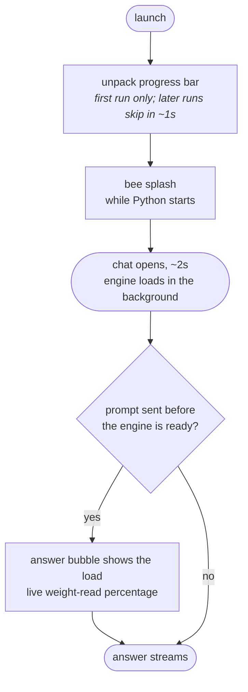

The engine is machine-level infrastructure. One **machine engine slot** per
OS user (`~/.local/state/lilbee/engine/`, `~/Library/Application
Support/lilbee/engine` on macOS, `%LOCALAPPDATA%\lilbee\engine` on Windows)
holds the running fleet's records; every process acquires its engine
through the same ladder, under a cross-process build lock:

1. **Bind** when the slot's engine is healthy and its contract (per-role
   models plus the bundled **engine pin**) covers the configuration. Binders
   spawn nothing and write nothing. lilbee version is not in the contract:
   releases sharing a pin share an engine; differing pins never run on a
   build they were not tested against.
2. **Build** into the empty slot otherwise. An incumbent is replaced in place
   when no live user holds it, and also when it is this contract's own engine
   left partially dead (a killed group) or partially covering (config grew a
   role): its members need that rebuild too, and rediscover it, so leftovers
   never poison the slot and weights are never duplicated.
3. **Overflow** to the config root's private dir (`<root>/data/engine/`) only
   when the slot holds a live *incompatible* engine in active use: two engines
   exist exactly while two different model setups run at once.

Lifetime is kernel-refcounted membership: each process holds a user lock the
OS releases on any death, and the last clean exit stops the engine.
`keep_engine_warm` opts the engine into outliving lilbee; the idle TTL
(`engine_idle_ttl_minutes`, default five minutes) applies in every mode;
`lilbee engine stop` frees everything now, whoever started it. Reaping never
disagrees with binding: an engine answering on its proxy is spared, anything
else is stopped through its state record.

Two costs ride along. A model or placement change restarts the shared engine;
peers rediscover the new ports with a one-shot retry, and an in-flight
request surfaces a retry error. And the proxy still listens on an
unauthenticated localhost port; the machine slot only makes discovery easier.

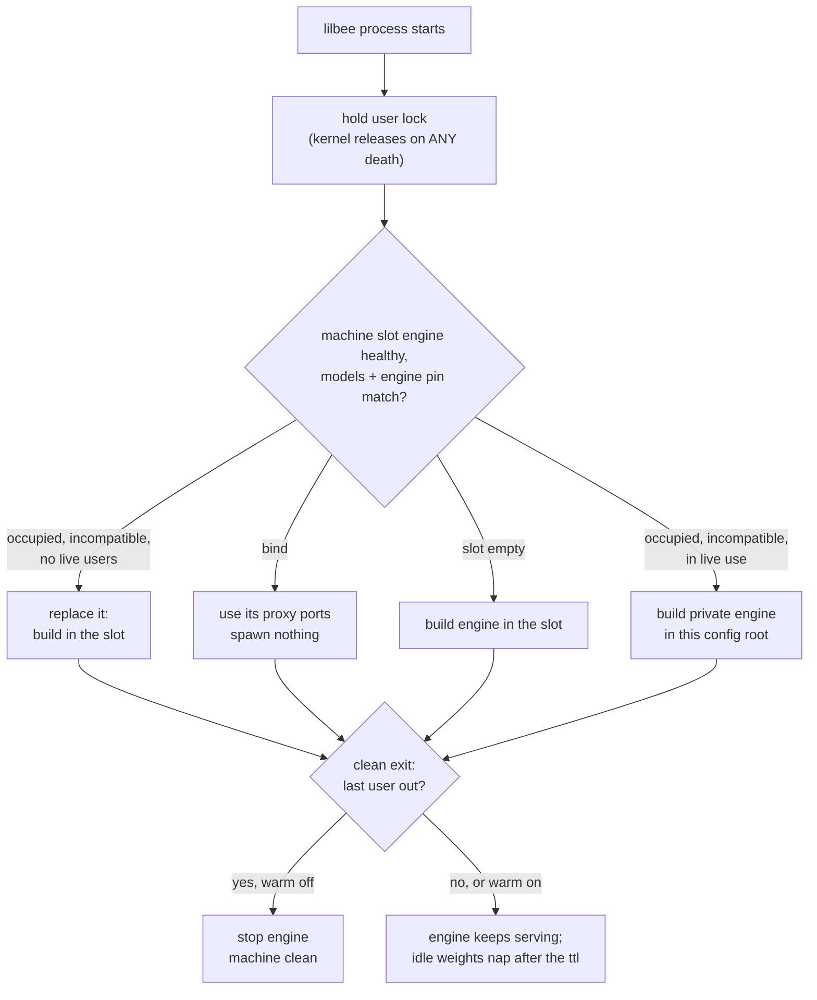

A SIGKILLed last user cannot run its exit hook: the engine lingers, its models
nap on the ttl, and the next lilbee run binds to it or cleans it. There is no
background daemon; the only processes that can outlive a session are the
engine's own, either because another lilbee still uses them or because the
user opted into warm.

### Chat context-window management

The fleet provider windows the request messages to fit the served chat
context before sending them to llama-server (`_fit_chat_context` in
`providers/fleet/provider.py`, the fitting logic in
`providers/fleet/windowing.py`). The budget is the served `n_ctx` minus
a generation reserve (the request's `num_predict`, else a default) and
a safety margin; the oldest conversation turns are dropped until the
estimated prompt fits. System messages and the most recent turn are
always kept, and a kept suffix never starts with an orphan tool result
whose originating call was dropped.

The estimate does not tokenize the real rendered prompt (llama-server
renders the chat template server-side at inference time); it counts
characters at a conservative 3 chars per token and adds a per-message
overhead for role markers and template wrappers, so the window errs
toward dropping more rather than overflowing.

When even the system messages, tools, and the final turn exceed the
budget, the provider raises a `CONTEXT_OVERFLOW` `ProviderError`, which
the chat-completions route maps to a clean 400 `context_length_exceeded`
rather than a 500 from the server.

---

## Search Pipeline

This is the core of lilbee's retrieval quality. Questions are routed by shape before retrieval runs, every result carries one canonical relevance score, and expensive operations are skipped when simpler ones produce confident results.

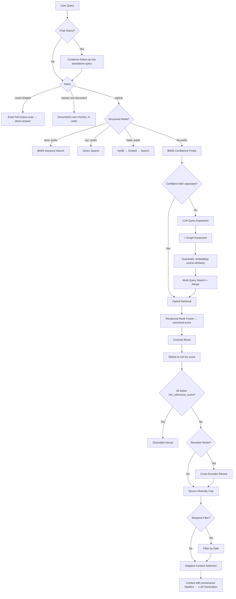

### Technique Reference

#### Intent Routing
**On by default** (`LILBEE_INTENT_ROUTING`). Three question shapes reach retrieval, and only one of them is a similarity problem, so questions are routed before top-k search runs. Detection is deterministic and conservative: anything unrecognized takes the topical path unchanged.

- **Known-item**: a question naming a document (a filename, a quoted title, "document 482") resolves the reference against source metadata; a reference matching exactly one source returns that document's chunks in document order at full confidence. Similarity search retrieves neighbors of the question's *wording*, which for "summarize survey_482.pdf" is mostly noise.
- **Aggregate**: "how many documents mention X" runs an exact scan over every chunk (streamed Arrow batches, flat memory) and answers with real numbers, no LLM involved. A count is a corpus property; the top 20 of half a million chunks structurally cannot count anything, and the model's only honest move was to hedge. Counts that need typed records the store does not hold are declined with a precise statement of what is countable.
- Every answering surface consults the same router (`Searcher.route_direct_answer`): CLI and TUI via ask, and each HTTP handler directly. Known-item resolution also runs on bare retrieval (`Searcher.search`, so HTTP `/api/search` and MCP search), where a document-naming query returns that document's head in document order instead of similarity neighbors of its wording.

#### History Condensation
**On by default** (`LILBEE_HISTORY_REWRITE`). A follow-up question is condensed into a standalone retrieval query using the recent chat history (one small LLM call, skipped when there is no history). Retrieval sees only the query text: without this, "what about his brother?" is embedded and BM25-matched with its pronouns. The user's original wording still reaches the answering prompt.

#### Hybrid Search (Weighted Reciprocal-Rank Fusion)
**Always on.** Retrieves a vector arm and a BM25 chunk arm (LanceDB FTS) independently, each fetched exactly `top_k` deep, then fuses by weighted reciprocal rank into one [0, 1] score. An optional third BM25 arm over document titles joins when `LILBEE_TITLE_SEARCH` is on:

```
score = Σ_arm weight_arm × rank_weight(rank_arm) / Σ_arm weight_arm,  rank_weight(r) = 61 / (60 + r)
```

The vector arm weighs 1.0, the lexical arm `LILBEE_LEXICAL_FUSION_WEIGHT`, the title arm `LILBEE_TITLE_SEARCH_WEIGHT`. A row ranked first by every arm scores 1.0; a row only one arm retrieved scores that arm's share of the total weight, so a peaked single-arm hit stays visible next to rows deep in the other arms. The fused ordering is final: no diversity selection runs on the hybrid path.

- **Adaptive fusion** (`LILBEE_ADAPTIVE_FUSION`, off by default pending eval): the lexical arms' weight is scaled per query by how peaked the vector ranking is, so a confident dense arm quiets lexical and a flat one keeps it. `LILBEE_LEXICAL_FUSION_WEIGHT` is the ceiling the rule scales down from. The confidence margin reads a fixed window of runners-up (so retrieval depth cannot change it) and the scale floors above zero, so BM25 provenance and the distance-cut exemption survive even a fully confident vector arm.
- **Why rank fusion and not score fusion**: a convex combination of normalized raw scores (`alpha × vector_similarity + (1 − alpha) × normalized_bm25`) was tried here and regressed graded precision about 20% against RRF, at every blend weight. Cosine similarities sit in a high narrow band, giving every dense neighbor a score floor that crowds out lexically-certain rows; ranks are scale-free, so neither arm's score distribution can drown the other. (On the rank-vs-score question, see Bruch et al. 2024, "[An Analysis of Fusion Functions for Hybrid Retrieval](https://dl.acm.org/doi/10.1145/3596512)".) Arm depth matters as much as the formula: rows both arms rank mid-pool accumulate two contributions, so deep candidate pools flood the fused top-k with both-arm mediocrity; arms therefore stay `top_k` deep.
- **Why no MMR on this path**: for lexical queries the relevant passages are often mutually similar (they quote the same identifiers), which is exactly what diversity selection penalizes; running MMR over the fused pool measurably traded relevant lexical hits for diverse off-topic neighbors. MMR still runs on the vector-only fallback path.
- **Canonical score**: every search path sets `SearchChunk.score`, and every downstream stage (sorting, filtering, greedy set cover, concept boost, reranker blending) compares only that field. `distance`, `bm25_score`, and the legacy `relevance_score` remain as provenance.
- **Abstention**: `min_relevance_score` gates on the fused [0, 1] score. The score normalizes against the weights of the arms in play for that query (the title arm counts only when it matched), so every query reports the fraction of its trusted rank support on one canonical scale and the threshold is a usable floor: when every retrieved chunk falls below it, ask refuses instead of feeding noise as context. Raw RRF sums (~0.016-0.033 total range) made any threshold meaningless.
- **max_distance** applies to rows whose *only* signal is a far vector match; a row the BM25 arm also matched keeps its standing regardless of distance, since dropping it would re-bury exactly the identifier hits fusion exists to preserve.
- **When it helps**: queries with specific terms, function names, error messages, exact phrases, document identifiers.

#### MMR Diversity
**Vector-only path.** Maximal Marginal Relevance prevents near-duplicate chunks from filling all result slots when search runs without a text query (or hybrid falls back). It does not run on hybrid results, where the fused ordering is final.

- **Paper**: Carbonell & Goldstein 1998, "[The Use of MMR, Diversity-Based Reranking](https://dl.acm.org/doi/10.1145/290941.291025)"
- **Default**: λ=0.5 (equal weight to relevance and diversity). This is the standard default from the original paper.
- **Tradeoff**: λ=1.0 gives pure relevance (may return 5 chunks from the same paragraph). λ=0.0 gives maximum diversity (may sacrifice the most relevant result for variety). 0.5 balances both.
- **When to tune**: increase λ for factual lookups ("what is the API key format?"), decrease for exploratory queries ("how does authentication work?").

#### Source Diversity
**Always on.** Caps results per source document so one large file doesn't dominate all top-k slots.

- **Paper**: Zhai 2008, "[Towards a Game-Theoretic Framework for Information Retrieval](https://dl.acm.org/doi/10.1007/978-3-540-78646-7_13)"
- **Default**: 5 chunks per source (`LILBEE_DIVERSITY_MAX_PER_SOURCE`).
- **Tradeoff**: lower cap = more diverse sources but may miss relevant sections from a single comprehensive document.

#### Query Expansion
**On by default, skipped when BM25 is already confident.** LLM generates 2-3 alternative phrasings of the query, each is searched independently, and results are merged via deduplication.

- **Technique**: standard multi-query retrieval
- **Cost**: 1 LLM call (~200 tokens) + N embedding calls per variant
- **Default**: 3 variants. Set `LILBEE_QUERY_EXPANSION_COUNT=0` to disable entirely.
- **When it helps**: queries using different terminology than the indexed documents. E.g. user asks "how to deploy" but the docs say "installation steps".

#### Confidence-Based Expansion Skip
**On by default.** Before running the expensive LLM expansion call, does a quick BM25 probe. If the top BM25 result is highly confident and clearly separated from the runner-up, expansion is skipped entirely.

- **Technique**: early termination based on BM25 score distribution
- **Default threshold**: 0.80 in saturating confidence space `s / (s + 5)`, which corresponds to a raw BM25 score of 20
- **Default gap**: 0.15 as the *relative* raw-score gap, `(top - second) / top`
- **Why not a sigmoid**: a plain sigmoid saturates at ~0.99 for any raw score above 5, so the gap between two strong scores compressed to under 0.01 and the skip condition was unsatisfiable exactly when the lexical arm was most certain. The saturating ratio keeps strong scores distinguishable and the relative gap compares where the information actually is, in raw score space.
- **Tradeoff**: higher threshold = expansion runs more often (better recall, more latency). Lower = expansion skipped more (faster, may miss some results).
- **Caveat**: these are starting defaults; calibrate for your corpus.

#### Expansion Guardrails
**On by default.** Validates LLM-generated query variants to prevent drift.

- **Technique**: cosine similarity between the question's embedding and each variant's embedding. Language-agnostic (works for any library the embedding model supports) and reuses the variant vectors that the multi-query search would have embedded anyway, so there are zero extra embed calls.
- **Threshold**: 0.5 by default via `LILBEE_EXPANSION_SIMILARITY_THRESHOLD`. Raise it to reject more variants (stricter); lower it to keep more (looser). Calibrate per embedding model. Dense 768-dim models cluster higher by default than contrastively-trained ones.
- **Concept-graph variants bypass this check**: they come from deterministic graph traversal and are expected to be partial phrases with lower similarity to the full question.
- **Tradeoff**: guardrails may filter out creative but valid variants. Disable via `LILBEE_EXPANSION_GUARDRAILS=false` if recall is more important than precision.

#### HyDE (Hypothetical Document Embeddings)
**Off by default.** Generates a hypothetical excerpt (50-100 words) that reads like a real document answering the query, embeds it, and searches with it alongside the original query vector. Reasoning-model output is stripped before embedding, so a think-block never stands in for the passage.

- **Paper**: Gao et al. 2022, "[Precise Zero-Shot Dense Retrieval without Relevance Labels](https://arxiv.org/abs/2212.10496)"
- **Cost**: 1 additional LLM call + 1 embedding (~500ms total)
- **Default weight**: 0.7, applied multiplicatively to the canonical score (hypothetical results are discounted because they're fabricated: they approximate the answer space but aren't based on real content; 1.0 trusts them as much as direct hits)
- **When it helps**: vague or short queries where the user's terminology doesn't match the indexed documents. E.g. "how does the thing work" where the "thing" is described with specific technical vocabulary in the docs.
- **When to skip**: factual lookups, keyword-heavy queries, or when latency matters.

#### Concept Graph (LazyGraphRAG Index Side)
**On by default.** At index time, extracts noun phrases from each chunk via spaCy, builds a co-occurrence graph weighted by Positive Pointwise Mutual Information (PPMI), and clusters concepts with the Leiden algorithm. Zero LLM calls at index or query time.

Two query-time effects:
- **Concept boost**: for each search result, counts concept overlap between the query's noun phrases and the chunk's concepts. The canonical score is raised by `overlap_ratio × concept_boost_weight` (default 0.3, clamped at 1.0), so the boost weight is directly comparable to a fusion arm's weight. Only promotes, never demotes.
- **Graph expansion**: traverses the co-occurrence graph (1 hop BFS) to find concepts related to the query. These supplement LLM-generated expansion variants and go through the same drift guardrails.

- **Inspiration**: Microsoft Research 2024-2025, "[LazyGraphRAG](https://www.microsoft.com/en-us/research/blog/lazygraphrag-setting-a-new-standard-for-quality-and-cost/)". NLP concept extraction at index time, defer reasoning to query time.
- **Clustering**: Traag et al. 2019, "[From Louvain to Leiden](https://www.nature.com/articles/s41598-019-41695-z)" via graspologic-native (Rust).
- **Weighting**: Church & Hanks 1990, PPMI: `max(0, log2(P(a,b) / P(a)P(b)))`. Negative values clamped to zero to discard anti-correlated concept pairs.
- **Cost**: ~10ms per chunk at index time (spaCy NLP). Zero additional cost at query time (table lookups only).
- **When it helps**: queries where related but not identical concepts appear across documents. E.g. "connection pooling" finding both database and API performance docs because both mention it alongside related concepts.
- **Browse**: `lilbee topics` shows concept communities, a map of what's in the index.

#### Cross-Encoder Reranking
**Off by default.** Requires a reranker model to be configured. After hybrid search returns candidates, a cross-encoder model scores each (query, chunk) pair for more precise relevance ranking.

- **Paper**: Nogueira & Cho 2019, "[Passage Re-ranking with BERT](https://arxiv.org/abs/1901.04085)"
- **Position-aware blending**: instead of replacing fusion scores entirely, rerank scores are blended with fusion scores using position-dependent weights:
  - Top 3 results: 70% fusion / 30% rerank (these were already ranked high by fusion for good reason)
  - Positions 4-10: 50% / 50% (equal influence)
  - Positions 11+: 30% fusion / 70% rerank (reranker has more opportunity to rescue misranked items)
- **Blending rationale**: derived from learning-to-rank literature (Burges et al. 2005, "[Learning to Rank using Gradient Descent](https://icml.cc/imls/conferences/2005/proceedings/papers/012_Learning_BurgesEtAl.pdf)"). Top positions already have strong signal, so the reranker provides diminishing returns there.
- **BM25 protection**: if the rank-1 result has a BM25 score above the expansion skip threshold, it is protected from demotion. This prevents the neural reranker from pushing down obvious exact keyword matches.
- **Context selection**: reranked results carry their blended score (`rerank_score`) and the reranked order decides which chunks become LLM context, taking the top `max_context_sources` directly instead of the set-cover pass below.
- **Cost**: depends on model and candidate count. ~200-500ms for 20 candidates with a small cross-encoder.

#### Adaptive Distance Threshold
**Off by default.** When enabled, if the initial cosine distance filter returns too few results, the threshold is widened step by step until enough results are found or a safety cap is reached.

- **Controlled by**: `LILBEE_ADAPTIVE_THRESHOLD` (default: `false`)
- **Default step**: 0.2 (widens from initial `max_distance` in increments, configurable via `LILBEE_ADAPTIVE_THRESHOLD_STEP`)
- **Safety cap**: 20 iterations maximum to prevent runaway loops
- **When it helps**: novel queries or small indexes where strict distance thresholds would return empty results.

#### Adaptive Context Selection
**On by default.** After search results are ranked, selects which chunks to include as LLM context based on query term coverage rather than just taking the top-k, with each chunk's IDF gain weighted by its canonical score. When cross-encoder reranking is active, the reranked order is the more precise signal and replaces this pass.

- **Technique**: greedy set-cover approximation
- **Algorithm**: tokenize query into terms, greedily select chunks that add the most uncovered term weight, scaled by canonical relevance
- **Default max sources**: 8 chunks (`LILBEE_MAX_CONTEXT_SOURCES`)
- **When it helps**: multi-faceted queries like "compare X and Y" where top-k might only cover X but context selection ensures Y is also represented.

#### Typed Entity Extraction (opt-in ingest mode)
**Off by default** (`LILBEE_ENTITY_EXTRACTION`). Extracts typed entities into a
dedicated `entities` table so count and cross-reference questions get exact
answers from a scan instead of a hedge from top-k retrieval. Additive: the new
table changes no existing schema, requires no migration, and a store without
it behaves as if nothing was extracted.

Turning the setting on is the whole interaction; sync runs the lifecycle:

1. **Induction** (first sync after enabling, cheap): an LLM reads a
   stratified sample of the indexed chunks and proposes the corpus-specific
   type schema, persisted inside the index alongside the tables it governs.
   A general NER tag set has no notion of the identifier types a specific
   corpus carries. The schema is machine state: nothing to review, edit, or
   keep next to the database, and it travels with the index.
2. **Extraction** (same sync, then incrementally): each type is found by
   the cheapest extractor that serves it: compiled regex for
   identifier-shaped types, spaCy labels for people/organizations/dates
   (when the `graph` extra's model is available), and an LLM only for types
   neither can catch. The full pass reads chunk text from the store (no
   documents re-ingested, no embeddings recomputed) and always clears prior
   rows first, so an interrupted pass never double-counts. New files
   extract at ingest. If no chat model is available for induction, sync
   logs it and retries next time; nothing fails.
3. **Evolution** (later syncs): a library that grows a new kind of document
   would otherwise keep answering with the taxonomy induced on day one, so
   the schema row records how many documents the index held at induction,
   and once the corpus has grown materially past that (half again as many,
   or any growth at all while the corpus is tiny) sync re-induces from a
   fresh sample and unions in types the schema has never seen. A type is
   identified by what it *extracts*, not the name a model gave it, so a
   rename of a known pattern adds nothing. Re-induction that finds nothing
   new costs one sampled chat call, records the new size, and skips the
   extraction pass; one that adds a type re-extracts under replace
   semantics, so counts never double.

Query-time effects: "how many distinct X" answers with exact distinct counts,
and "how many X per Y" groups by chunk co-occurrence, both computed by full
scans over the entities table with no LLM in the loop. Count questions whose
nouns don't resolve against the schema decline precisely, naming the types
that are countable. Re-ingesting a source replaces its entity rows the same
way it replaces its chunks.

#### Context Provenance Headers
**Always on.** Each context block opens with a one-line header naming its source and page or line span (`[3] (survey_report.pdf, pages 3-4)`), so the answering model can attribute claims to a named document, notice two chunks share a source, and confirm it is reading the document the user asked about. Citation markers in answers are parsed as `[1]`, `[1, 2]`, and bounded ranges like `[1-3]`.

#### Temporal Filtering
**On by default, activates only when temporal keywords are detected in the query.**

- **Keywords detected**: "recent", "latest", "today", "yesterday", "this week", "last week", "this month", "last month"
- **Date source**: frontmatter `date` field (preferred) or document ingestion timestamp (fallback)
- **Behavior**: when active, retrieves 3x candidates (compensating for filtering loss) and sorts by recency
- **When it helps**: queries like "what changed recently?" or "latest notes about X"

#### Structured Query Modes
**Always available.** Power-user feature for direct control over the retrieval pipeline.

- `term: kubernetes pod scheduling`: BM25 keyword search only (no vector, no expansion)
- `vec: how does container orchestration work`: vector search only (no BM25)
- `hyde: explain the scheduling algorithm`: generate hypothetical document, embed, search
- No prefix → standard hybrid pipeline with all features

Useful for benchmarking (compare BM25 vs vector on the same question), debugging (why isn't this document in keyword results?), and precision (when you know exactly what you want).

#### ANN Vector Index (scaling)
**Threshold-gated.** Below `LILBEE_ANN_INDEX_THRESHOLD` chunks (default 50,000) search uses an exact brute-force scan, which is fast and exact for personal vaults and is all a laptop needs. At/above the threshold, `sync` builds an approximate index so search stays fast at millions of vectors; `lilbee index` forces a build for the publish-a-large-index workflow.

- **Index type**: IVF_PQ. Product Quantization compresses each vector so the index fits in memory at 10M+ scale; the inverted file (IVF) restricts the scan to a few partitions.
- **Recall recovery**: PQ is lossy, so search probes multiple partitions (`nprobes`) and re-ranks the candidates against the full vectors (`refine_factor`) to keep results close to the exact scan. `nprobes` is computed per query as `max(floor, ceil(sqrt(N) * fraction))` with N the indexed row count, since the IVF partition count grows ~sqrt(N) and a fixed probe count would collapse recall at large N. The floor, fraction, and refine factor are module constants in `data/store/core.py`, not config, until a real tuning need appears.
- **Lifecycle**: built once when the corpus crosses the threshold; subsequent syncs fold new rows in via `optimize()` rather than rebuilding. The index lives inside the LanceDB directory, so a downloaded index ships with it and searches fast on the first query.
- **Why threshold-gated**: IVF_PQ needs enough vectors to train, and brute force already beats an index for small N. Setting the threshold to `0` keeps search flat regardless of size.

### Embedder identity and adoption
A store records the embedding model that built it (`_meta` row). Retrieval embeds the query and nearest-neighbor searches it against the stored vectors, so a query embedded by a different model yields silently-wrong results. The store therefore refuses to serve when the configured embedder drifts from the persisted one.

- **Self-describing index**: `Store.get_meta()` exposes the persisted model and dimension; the gate compares them to the active config before every search and write.
- **Adoption (downloaded indexes)**: when someone downloads a published index built with a different embedder, the fix is to use *that* embedder, not to rebuild. When the dimensions match, lilbee offers to adopt it: download the embedder if missing and switch to it, leaving the vectors untouched (no rebuild). The TUI prompts, `lilbee use-embedder <ref>` does it headlessly, and the REST API returns a structured 409 so a client can offer the same choice. When the dimensions differ the index is not adoptable and a rebuild is the only path.

---

## Wiki Layer

> Generation quality depends on your library and the chat model. Expect some pages to land in `drafts/` for human review rather than publish direct.

The wiki layer is lilbee's second-order index: a set of linked markdown pages auto-generated from your indexed documents so that concepts and entities which show up across many sources get their own page with citations from every source that mentions them.

### Layout

Under `$LILBEE_DATA/$wiki_dir/` (default `wiki/`):

| Directory | Contents |
|-----------|----------|
| `concepts/` | One page per LLM-identified concept (e.g. `braking-systems.md`) |
| `entities/` | One page per proper-noun entity extracted by NER (e.g. `henry-ford.md`) |
| `drafts/` | Low-faithfulness output and PENDING markers for parse failures or slug collisions. Reviewed via `lilbee wiki drafts accept / reject`. |
| `summaries/` | Landing spot for accepted drafts with no published counterpart and no recorded origin type |
| `archive/` | Pages retired by `lilbee wiki prune` |
| `synthesis/` | Cross-source pages produced by `lilbee wiki synthesize` |
| `index.md` | Auto-generated table of contents, grouped by page type |
| `log.md` | Append-only audit trail of every build, synthesize, ingest, lint, and prune, with a per-run line reporting what the quality gates did |

Slugs are lowercase hyphen-separated filenames that double as the `[[link]]` target. `make_slug` lives at `src/lilbee/core/text.py` (re-exported from `lilbee.wiki`).

### Build

`lilbee wiki build` runs a one-time Phase D migration (archives pre-Phase-D noun-chunk concept pages, unwraps stale `[[concept-slug]]` links), then extracts NER entities from the chunk store via `cfg.wiki_entity_mode` (default `ner_entities`, spaCy NER only). Per source, a single batched LLM call identifies 3-5 concepts worth their own page and drafts a section for each concept plus each extracted entity. Sections are split, citation-verified against the source chunk pool, embedding-faithfulness-scored (`wiki/quality.py::check_faithfulness`, cosine of body vs mean source-chunk vector), and written to `concepts/` or `entities/`. Sections that fail to parse become PENDING markers in `drafts/`.

### Wikification and incremental update

Enabling the wiki never starts generation on its own. A sync regenerates touched pages only when `LILBEE_WIKI_AUTO_UPDATE` is on, in which case `lilbee.wiki.ingest.incremental_update` runs after ingest with `extract_concepts=False` so re-ingest never churns concept slugs. The cap is `LILBEE_WIKI_INGEST_UPDATE_CAP` (default 20 touched wiki pages per sync); past it the sync logs a warning and leaves the rebuild to you. Otherwise wikification is explicit: `lilbee wiki build` / `wiki update`, the `b` (Wikify) binding on the TUI wiki screen, or the HTTP and MCP build endpoints.

A build spends one LLM call per source document, each carrying that document's chunks up to the context budget, so cost scales with library size rather than with how many pages you read. On a laptop a few dozen documents is minutes; a few thousand is hours of sustained GPU. Run large builds on a machine you are not also using.


### Chunk selection inside wiki generation

Wiki generation does not search. NER assigns each extracted entity to the source that mentions it most (its `chunk_refs`), and the batched call for that source is handed that source's own chunks straight from `store.get_chunks_by_source`. Synthesis pages take the chunks of every source in the cluster. In both paths `wiki/page.py::truncate_chunks_to_budget` drops trailing chunks until the prompt plus the output cap (`LILBEE_WIKI_SUMMARY_MAX_TOKENS`) fits the context window, with a quarter-window fallback when the output cap and prompt overhead alone would exceed it. Hybrid search, the reranker, and the per-source diversity cap play no part in what a page is built from.

### `[[wiki links]]`

After each build, `wiki/links.py::rewrite_wiki_links` rewrites plain-text slug surface forms to `[[slug]]` form in page bodies, skipping YAML frontmatter, code fences, and the auto-generated citation block. `lilbee wiki lint` flags concept or entity pages with zero inbound links.

### Lazy generation

A build spends one LLM call per source document, so its cost tracks library size rather than what anyone reads. `wiki/stubs.py` splits that in half: NER already names every entity in the corpus with its chunk refs and spends no call, so the index of pages-that-could-exist is free and refreshes on every sync while the wiki is enabled (not gated on `wiki_auto_update`, which governs generation). `wiki/lazy.py::generate_stub_page` then writes one page for one call.

Only entities are enumerable this way; LLM-curated concepts come from the per-source batched call and still arrive published from an explicit build.

Per-page generation also widens the evidence. `group_entities_by_primary_source` assigns an entity to the source mentioning it most and generates from that source alone, dropping what every other document says. Reading the index gathers the subject's chunks across all of them and resolves each citation against whichever source holds the excerpt. Chunk refs are capped per entity (`wiki_stub_max_chunk_refs`, default 50, already more than one page's context budget admits) so the index stays small.

### Removing a wiki

Disabling `wiki` stops new pages being written; it deletes nothing. `wiki/wipe.py::wipe_wiki` removes the whole wiki directory and then every `chunk_type=wiki` row and every citation row, in that order: rows outliving their page are what the next prune reconciles away, while a page outliving its rows reads as "nothing to do" and is never retried. It is reachable with the wiki disabled from all four surfaces: `lilbee wiki wipe`, `DELETE /api/wiki`, the `wiki_wipe` MCP tool (which needs `confirm=true`), and in the TUI the **Delete wiki** command-palette entry. The wiki screen's `W` binding is the quick route while the wiki is on, but the whole wiki view drops out of the nav once the setting is off, so the palette entry is what carries that state. The TUI also offers the wipe whenever the setting is switched off. A wipe reports whether the row delete actually landed, so a failure is never presented as a completed wipe.

### Search scope

`search()` accepts a `scope` argument (`raw`, `wiki`, `both`) that filters the hybrid search pool to source chunks, wiki chunks, or the union. Used by the TUI scope toggle and the MCP tool.

While `wiki` is off, generated pages are excluded from retrieval regardless of scope: an unscoped search narrows to `raw` (which covers table chunks), and a `wiki`-scoped search returns nothing rather than widening to the whole pool. Disabling the setting deletes no rows, so without this a library wikified once keeps surfacing generated pages in ordinary search.

---

## Interfaces

### CLI
- `lilbee ask "question"`: one-shot RAG answer with sources
- `lilbee chat`: launches the full Textual TUI (also `lilbee` with no args)
- `lilbee search "query"`: vector search, no LLM generation
- `lilbee sync` / `lilbee add` / `lilbee remove`: document management
- `lilbee model pull <name>` / `model list` / `model rm`: native GGUF model management
- `lilbee wiki build` / `wiki list` / `wiki read` / `wiki citations` / `wiki lint` / `wiki synthesize` / `wiki drafts` / `wiki prune` / `wiki wipe`: wiki layer
- `lilbee serve`: start the REST API server
- `lilbee mcp`: launch the MCP server
- `lilbee launch <client>` (e.g. `opencode`): spawn the local server, install the lilbee skill, pass the provider + MCP wiring and the startup-model pin to the client per session (inline env config; the session's port and token are ephemeral, so nothing is persisted into the client's own config), exec the client, clean up on exit
- `lilbee agent-config <client>` (`claude`, `hermes`, `opencode`, `litellm`): print the client config block for hand-wired persistent setups
- `--json` / `-j` on any command for structured output

### TUI (Textual)
Launched by `lilbee` or `lilbee chat`. Screens: chat, task center, model catalog, settings, wiki, wiki-drafts review, status. Slash commands route through `src/lilbee/cli/tui/command_registry.py` (single source of truth). Every background job (sync, crawl, wiki build, model pull) runs in the app-level `TaskBarController` and is cancellable with `/cancel`.

### REST API (Litestar)
- OpenAI-compatible: `GET /v1/models`, `POST /v1/chat/completions` (streaming + tools). Errors use the OpenAI envelope with the codes in `src/lilbee/server/chat_completions_api/errors.py::CompletionsErrorCode` (`invalid_request`, `model_not_found`, `model_does_not_support_tools`, `context_length_exceeded`, `invalid_api_key`, `rate_limit_exceeded`, `internal_error`). The active model's `/v1/models` entry carries the granted engine shape (`context_window`, `slots`); a `reasoning` request field (`separate`/`inline`/`off`, default from the `completions_reasoning` setting) picks how thinking is presented.
- Search: `GET /api/search`, `POST /api/ask`, `POST /api/chat`, `POST /api/ask/stream`, `POST /api/chat/stream` (SSE)
- Documents: `GET /api/documents`, `POST /api/documents/remove`, `POST /api/add`, `POST /api/sync`, `GET /api/source` (vault-aware source retrieval)
- Models: `GET /api/models`, `GET /api/models/catalog`, `GET /api/models/installed`, `PUT /api/models/{chat,embedding,vision,reranker}`, `POST /api/models/pull`, `DELETE /api/models/{model}`
- Crawl: `POST /api/crawl` (SSE progress)
- Wiki: `GET /api/wiki`, `GET /api/wiki/{slug}`, `GET /api/wiki/{slug}/citations`, `GET /api/wiki/citations?source=`, `GET /api/wiki/status`, `POST /api/wiki/build` (add `?dry_run=true` for the JSON entity preview), `PATCH /api/wiki/update`, `POST /api/wiki/synthesize`, `POST /api/wiki/generate/{slug}` (these four are SSE streams; generate's done event carries the slug the read route accepts), `POST /api/wiki/lint`, `POST /api/wiki/prune`, `DELETE /api/wiki` (wipe; the one wiki route that answers while the wiki is disabled), `POST /api/wiki/index`, `GET /api/wiki/stubs` (the indexed pages nothing has written yet), `GET /api/wiki/drafts`, `GET /api/wiki/drafts/diff/{slug}`, `POST /api/wiki/drafts/accept/{slug}`, `DELETE /api/wiki/drafts/{slug}`
- Config: `GET /api/config`, `GET /api/config/defaults`, `PATCH /api/config`
- Agent configs: `GET /api/agent-config` (supported clients plus whether each CLI is installed here), `GET /api/agent-config/{client}` (that client's config block, carrying this server's URL and current token)
- Status/health: `GET /api/status`, `GET /api/health`
- Interactive docs at `/schema/redoc`; OpenAPI JSON at `/schema/openapi.json`. Every release also attaches the same schema as an `openapi.json` asset, so a client can pin the contract for a version without running the server. Streaming routes declare `text/event-stream` on the decorator, which is where litestar reads the documented content type from.

All chat-generating endpoints (`/api/ask`, `/api/chat`, both their `/stream` variants, and `POST /v1/chat/completions`) share a process-wide chat lock so only one inference call runs at a time per server. Concurrent requests queue server-side; if the wait exceeds the configured timeout the request returns 429 with a `Retry-After: 1` header.

### Auth model

All network surfaces, the `/v1/*` model runtime, the `/api/*` REST routes, and the `/mcp` streamable-http endpoint, share **one** bearer session token. The daemon generates it on startup, persists it to `server.json` (mode `0600`), and hands it to local clients through `lilbee agent-config`, `GET /api/agent-config/{client}`, and `lilbee launch`. Clients send `Authorization: Bearer <token>`; `AuthMiddleware` (`src/lilbee/server/auth.py`) checks it on **every** request, reads included. There is no unauthenticated route, `GET /api/health` included: health reports the chat engine's last error, which carries model paths and loader failures, so an open liveness probe would hand out the most useful reconnaissance on the box. A local probe runs as the user and reads the token out of `server.json` like every other local client.

`/v1/models` and `/v1/chat/completions` are the only routes the middleware skips, and they are not exempt: they check the same token inside the handler so a bad one comes back in the OpenAI error envelope rather than Litestar's 401 shape. `tests/server/test_every_route_is_authenticated.py` walks the live route table and asserts every path answers 401 without a token, so a new route cannot quietly opt out.

This is deliberately a single, unscoped token rather than a per-client or per-scope system. lilbee is a local-first, single-user tool: the daemon binds localhost only (with DNS-rebinding protection), and any process running as the user can read `server.json` regardless, so a per-agent token would not add a boundary that the filesystem doesn't already remove. The token exists to keep out other local users and drive-by browser requests, not to isolate the user's own agents from each other.

That purpose is why reads are gated too. Reads used to be open on the reasoning that they only exposed local state, but `server.json` is `0600` precisely so another local user cannot act as the daemon, and leaving `GET /api/export` open handed that same user the entire corpus without it. The boundary only means something if it covers the data.

The tradeoff is that the token is all-or-nothing: a client trusted with retrieval also gets generation and the mutating tools (`reset`, `remove`, `model_rm`, `settings_set`). That is acceptable for the user's own agents on localhost. Giving retrieval-only access to a less-trusted client would require a scoped token, which lilbee does not have today.

### MCP Server
- Search + lifecycle: `search(query, top_k, scope)`, `status`, `sync`, `add`, `crawl`, `crawl_status`, `init`, `remove`, `list_documents`, `reset`
- Models: `model_list`, `model_show`, `model_pull`, `model_rm`
- Wiki: `wiki_list`, `wiki_read`, `wiki_status`, `wiki_build`, `wiki_update`, `wiki_synthesize`, `wiki_lint`, `wiki_citations`, `wiki_drafts_list`, `wiki_drafts_diff`, `wiki_prune`, `wiki_index`, `wiki_generate`, `wiki_wipe` (needs `confirm=true`, and stays registered while the wiki is disabled). Accepting or rejecting a draft is deliberately absent from MCP: that call is a human review decision, so it stays on the CLI, the TUI, and the authenticated HTTP API.

#### Transports

The same MCP tool server is reachable two ways:

- **stdio** (`lilbee mcp`): the default for a single agent. The client spawns
  the process, which loads its own in-process `Services` (its own model copy).
  Zero configuration, no network.
- **streamable-http** (on the `lilbee serve` daemon): for multiple agents
  sharing one warm backend. The tool server mounts as a Litestar sub-app at
  `/mcp`, behind the same bearer-token `AuthMiddleware` as `/v1/*` and REST, and
  resolves the same process-wide `Services`. Sync tool handlers are offloaded
  off the event loop so one slow call cannot stall the other connected agents.
  Retrieval reads run concurrently; generation shares the chat lock above.

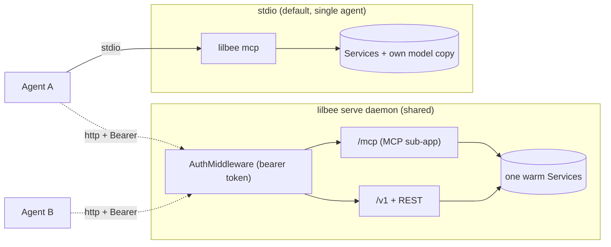

#### Schema-size discipline

The OpenAI tools schema ships on every chat request; bloat there taxes
every turn. lilbee's default surface is ~5.7 KB of raw JSON across 17
tools (~10% of a 32K context, ~35% of Gemma 4's 7K).

- Wiki tools and crawler tools are gated off the schema unless
  `cfg.wiki` is on or `lilbee[crawler]` is installed.
- Tool docstrings stay at one or two sentences (the SDK turns them
  into per-parameter schema descriptions).
- `LilbeeMCP.list_tools` in `mcp_server.py` drops the SDK/Pydantic
  auto-generated `title` keys before the tools hit the wire.
- `tests/test_mcp.py::TestToolsSchemaSize` caps the schema at 7 KB; new
  tools or doc bloat trip the cap and force a deliberate review.

### Python library
```python
from lilbee import Lilbee

bee = Lilbee("./docs")
bee.sync()
results = bee.search("authentication")
```
`Lilbee` composes the same `Store`, `Embedder`, `Searcher`, `Reranker`, and `ConceptGraph` the CLI and server use.

---

## Configuration Reference

All settings are configurable via `LILBEE_*` environment variables, `config.toml`, or `/set` in chat mode. The `GET /api/config` endpoint exposes all current values for API clients.

### Core Settings

| Setting | Default | Description | Caveats |
|---------|---------|-------------|---------|
| `LILBEE_CHAT_MODEL` | `Qwen/Qwen3-0.6B-GGUF/Qwen3-0.6B-Q4_K_M.gguf` | Model used for `ask`, `chat`, and wiki generation | Native GGUF by default; with `[remote]`, any remote name the SDK backend understands |
| `LILBEE_EMBEDDING_MODEL` | `nomic-ai/nomic-embed-text-v1.5-GGUF/nomic-embed-text-v1.5.Q4_K_M.gguf` | Model for computing vector embeddings | Changing this requires a full `lilbee rebuild` |
| `LILBEE_VISION_MODEL` | *(none)* | GGUF vision model for OCR (served with `--mmproj`) | When set, takes precedence over Tesseract for scanned PDFs and images |
| `LILBEE_TOP_K` | `10` | Number of search results returned | Higher values provide more context but increase LLM latency and token cost |
| `LILBEE_MAX_DISTANCE` | `0.9` | Cosine distance cutoff for vector results | Lower values are stricter (fewer but more precise results). Set to 1.0 to disable filtering. |
| `LILBEE_ADAPTIVE_THRESHOLD` | `false` | Enable adaptive threshold widening | When true, automatically widens distance threshold if too few results found. Useful for ensuring minimum result count. |
| `LILBEE_CHUNK_SIZE` | `512` | Target tokens per chunk | Changing requires `lilbee rebuild`. Smaller = more precise retrieval, larger = more context per chunk |
| `LILBEE_CHUNK_OVERLAP` | `100` | Overlap tokens between adjacent chunks | Changing requires `lilbee rebuild`. Prevents information loss at chunk boundaries |
| `LILBEE_SYSTEM_PROMPT` | *(built-in)* | System prompt sent to the LLM | Override per-project for domain-specific behavior |

### Retrieval Quality Settings

| Setting | Default | Description | Caveats |
|---------|---------|-------------|---------|
| `LILBEE_MMR_LAMBDA` | `0.5` | Relevance vs diversity (0.0=diverse, 1.0=relevant) | 0.5 is the standard default from Carbonell & Goldstein 1998. Lower for broad exploratory queries. |
| `LILBEE_DIVERSITY_MAX_PER_SOURCE` | `5` | Max chunks returned per source document | Lower = more diverse sources. Higher = deeper coverage of a single document. |
| `LILBEE_CANDIDATE_MULTIPLIER` | `3` | Vector-only candidate pool multiplier feeding MMR | Higher = better diversity selection but slower; hybrid search ignores it. |
| `LILBEE_QUERY_EXPANSION_COUNT` | `3` | Number of LLM-generated query variants | Each variant requires an embedding call. Set to 0 to disable expansion entirely for fastest search. |
| `LILBEE_ADAPTIVE_THRESHOLD_STEP` | `0.2` | Distance filter widening increment | Only used when `LILBEE_ADAPTIVE_THRESHOLD=true`. Smaller = more granular adaptation but more filter iterations |
| `LILBEE_EXPANSION_SKIP_THRESHOLD` | `0.8` | BM25 confidence above which expansion is skipped | Confidence is s/(s+5) of the raw top BM25 score, unsaturated. 0 disables the skip. |
| `LILBEE_EXPANSION_SKIP_GAP` | `0.15` | Min relative gap between top-1 and top-2 raw BM25 to skip expansion | Fraction of the top score. Ensures the match isn't ambiguous. |
| `LILBEE_EXPANSION_GUARDRAILS` | `true` | Validate expansion variants for drift | Prevents hallucinated variants at the cost of potentially filtering valid creative expansions |
| `LILBEE_EXPANSION_SIMILARITY_THRESHOLD` | `0.5` | Minimum question↔variant cosine similarity for an expansion variant to survive the guardrail | Raise for stricter filtering, lower to keep more variants. Calibrate per embedding model. |
| `LILBEE_MAX_CONTEXT_SOURCES` | `5` | Max chunks included in LLM context | More = more complete answers but higher latency and token cost |
| `LILBEE_HYDE` | `false` | Enable hypothetical document embeddings | Adds ~500ms per query. Best for vague queries where terminology doesn't match docs. |
| `LILBEE_HYDE_WEIGHT` | `0.7` | Weight for HyDE results relative to original | Lower = less trust in hypothetical documents. 0.7 prevents fabricated vectors from dominating. |
| `LILBEE_RERANKER_MODEL` | `""` | Cross-encoder model for reranking (empty = disabled) | Native GGUF (e.g. `bge-reranker-v2-m3`) or a remote name via the SDK backend. Only loaded when configured. |
| `LILBEE_RERANK_CANDIDATES` | `60` | Number of candidates to rerank | More = deeper pool but slower. |
| `LILBEE_RERANK_BLEND` | `true` | Blend reranker scores with retrieval fusion, position-aware | Off = pure cross-encoder ordering, useful when measuring the reranker in isolation. |
| `LILBEE_RERANK_MIN_SCORE` | unset | Absolute floor on raw reranker scores | Candidates below it are dropped, so a uniformly irrelevant pool can trigger grounded refusal. Unset = off; scale is model specific (bge logits can be negative). |
| `LILBEE_FTS_LANGUAGE` | `English` | Stemmer/stop-word language for BM25 indexes | tantivy language name; applied on index build, so change it before a rebuild. |
| `LILBEE_EMBED_TITLES` | `false` | Title-prefixed chunk embeddings | Vector-only change; stored text unchanged. Toggling needs a rebuild (embedding space shifts). |
| `LILBEE_CONTEXTUAL_ENRICHMENT` | `false` | LLM-written situating sentence embedded with each chunk | Contextual retrieval; one generation per chunk, so ingest slows. Toggling needs a rebuild. |
| `LILBEE_TEMPORAL_FILTERING` | `true` | Enable date-based result filtering | Only activates when temporal keywords are detected in the query |
| `LILBEE_SHOW_REASONING` | `false` | Show reasoning model thinking process | For Qwen3/DeepSeek-R1 models that emit `<think>` tags |
| `LILBEE_CONCEPT_GRAPH` | `true` | Enable concept graph (LazyGraphRAG index) | Extracts noun phrases, builds co-occurrence graph, boosts search by concept overlap |
| `LILBEE_CONCEPT_BOOST_WEIGHT` | `0.3` | Concept overlap boost strength (0.0-1.0) | Higher = concept overlap matters more relative to vector similarity |
| `LILBEE_CONCEPT_MAX_PER_CHUNK` | `10` | Max concepts extracted per chunk | Caps extraction to reduce noise from long chunks |
| `LILBEE_CRAWL_MAX_DEPTH` | unset | Optional global ceiling on recursion depth | Set to a positive int to cap calls that pass no explicit depth. Explicit `--depth N` always wins. |
| `LILBEE_CRAWL_MAX_PAGES` | unset | Optional global ceiling on total pages per crawl | Same shape as above. Unset / null = no ceiling. |
| `LILBEE_CRAWL_TIMEOUT` | `30` | Per-page fetch timeout in seconds | Passed to crawl4ai as page_timeout |
| `LILBEE_CRAWL_MAX_CONCURRENT` | CPU count | Max simultaneous crawl operations (top-level) | Limits parallel `crawl_and_save` invocations. Per-crawl concurrency is `crawl_concurrent_requests`. |
| `LILBEE_CRAWL_SYNC_INTERVAL` | `30` | Seconds between periodic syncs during crawl | 0 = sync only after crawl completes. Lower = documents searchable sooner |
| `LILBEE_CRAWL_MEAN_DELAY` | `0.5` | Seconds between in-flight requests within a single crawl | Uniform jitter applied by crawl4ai. Tune up for rate-sensitive sites. |
| `LILBEE_CRAWL_MAX_DELAY_RANGE` | `0.5` | Random additional delay on top of mean_delay | Total per-request delay = mean_delay + random(0, max_delay_range) |
| `LILBEE_CRAWL_CONCURRENT_REQUESTS` | `3` | Concurrent in-flight URLs within one crawl | Gentler default than crawl4ai's own `5`. |
| `LILBEE_CRAWL_RETRY_ON_RATE_LIMIT` | `true` | Enable per-domain RateLimiter + SemaphoreDispatcher | Backs off on HTTP 429/503 with jitter and retries. Set to `false` to disable. |
| `LILBEE_CRAWL_RETRY_BASE_DELAY_MIN` / `MAX` | `1.0` / `3.0` | Randomized base-delay range on rate-limit responses (seconds) | Passed as `(min, max)` to crawl4ai's `RateLimiter(base_delay=...)`. |
| `LILBEE_CRAWL_RETRY_MAX_BACKOFF` | `30.0` | Upper bound on any single backoff wait (seconds) |  |
| `LILBEE_CRAWL_RETRY_MAX_ATTEMPTS` | `3` | Retry count per URL on rate-limit codes |  |

### Provider Settings

| Setting | Default | Description | Caveats |
|---------|---------|-------------|---------|
| `LILBEE_LLM_PROVIDER` | `auto` | Backend selection: auto, remote | auto = SDK backend for remote refs, the local `llama-server` engine for native GGUF refs |
| `LILBEE_OLLAMA_BASE_URL` | `http://localhost:11434` | Ollama server URL (blank uses the default) | |
| `LILBEE_LM_STUDIO_BASE_URL` | `http://localhost:1234/v1` | LM Studio server URL (blank uses the default) | |

---

## Release pipeline

Releases are **build-once, publish-later**. Pushing a `v*` tag builds every shippable artifact one time inside a single workflow run; QA installs *those* artifacts; publishing is a separate manual step that only downloads and uploads what that run already built. Nothing is rebuilt downstream. The PyPI publish needs only the default wheels + sdist (they finish ~25 min into the run), so it doesn't wait on the executables, the CUDA matrix, or QA — only the downstream packaging fan-out (which consumes the executables on the GH release) waits for those.

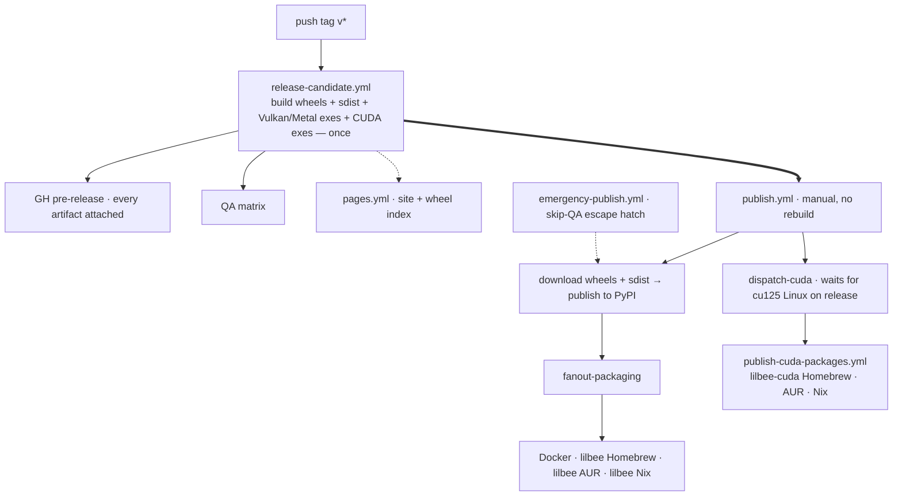

Thick arrow = the publish path; dotted = triggered/side paths. Timings, what-waits-on-what, and the fan-out's self-skip are in the notes below.

### Lanes

| Lane | Trigger | Builds | QA | Publishes |
|---|---|---|---|---|
| **Release candidate** | `git push v0.6.66bN` | default wheels, sdist, extra (CUDA) wheels, Vulkan/Metal executables, CUDA executables — once, all in parallel | yes | no (artifacts only); attaches everything to a GH **pre-release** |
| **Publish to PyPI** | `gh workflow run publish.yml -f tag=v0.6.66bN` | nothing — downloads the RC run's artifacts | n/a — needs only the default wheels (no wait on executables/CUDA/QA) | PyPI, then in parallel: Docker / lilbee Homebrew / AUR / Nix via `fanout-packaging`, and `lilbee-cuda` Homebrew / AUR / Nix via `dispatch-cuda` → `publish-cuda-packages.yml` |
| **Emergency publish** | `gh workflow run emergency-publish.yml -f tag=... -f confirm=skip-qa` | nothing — downloads the RC run's artifacts | skipped on purpose | same as Publish to PyPI; tolerates an incomplete artifact set |
| **Promote** | `make promote FROM=v0.6.90b420.dev719 TO=0.6.90b420` | everything — the version is baked into the artifacts, so a new version is necessarily a new build | full RC gates again | a **separate, new release** of the same source under the new version, with the FROM release's notes carried over; the FROM release is never modified |

`release-candidate.yml` can also be dispatched manually against a branch/SHA — same build + QA, no pre-release attach, never publishes. That's a dry run.

`build-gpu-executables.yml` is also dispatchable standalone (`gh workflow run build-gpu-executables.yml -f tag=v...`) to backfill CUDA binaries onto a historical release; in that mode each cell attaches directly to the named release tag instead of relying on `attach-prerelease`.

### Where a build's inputs come from

A release is dominated by two things it should almost never do: compiling `llama-server` (~50 min per leg) and compiling ~9056 C files with Nuitka (~176 min on Windows). Both are pure functions of pinned inputs, so both are fetched rather than rebuilt.

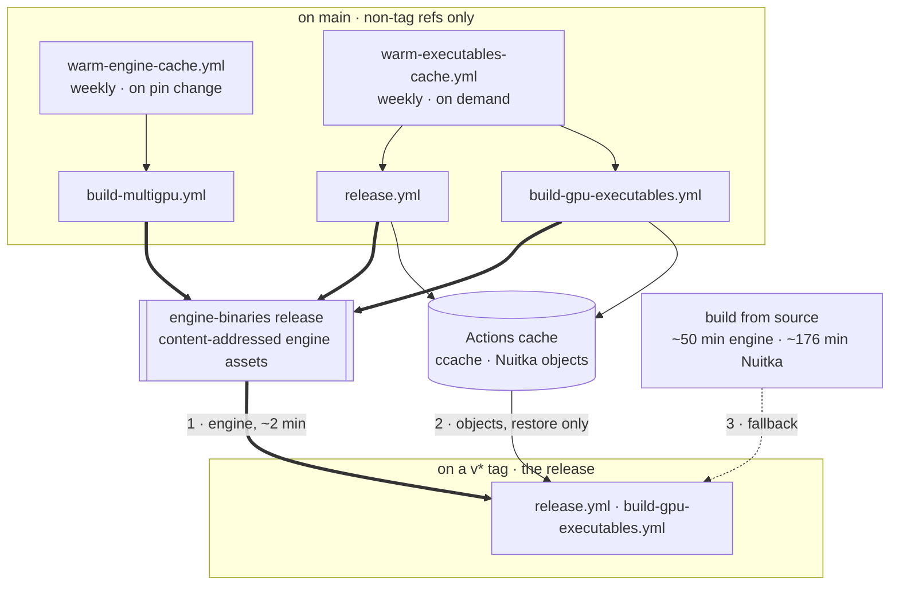

Thick arrow = the fast path. Engines resolve mirror, then Actions cache, then source build, so a missing asset degrades to the old timing rather than failing.

Two properties do the work:

**Tag runs read, they never write.** GitHub scopes a cache save to the creating ref, and a tag is its own scope, so anything a release saved was unreadable by every later run while still evicting the main-scoped entry that would have hit. Every save is now guarded on `github.ref_type != 'tag'`; the warm workflows on main are what populate.

**Engines live on a release, not in the cache.** The Actions cache has a hard 10 GiB per-repo cap with LRU eviction and drops anything unaccessed for 7 days. Engine binaries are ~3.5 GiB of that and are perfectly immutable (every source pinned in `engine-versions.env`), so they sit on the `engine-binaries` release instead, keyed by the same hash the cache key uses.

A built engine is written to the mirror and nowhere else. Storing it in the Actions cache too would spend the cap duplicating what the mirror already holds durably, and that cap is exactly what the Nuitka object caches need: object caches want per-file granularity and must be a cache, engines are a single immutable blob and need not be. Restores still fall through mirror, then cache, then a source build, so engines cached before the mirror existed are still read. `asset_name()` in `tools/wheel-build/ci_mirror.sh` maps key to asset name for both the reader and the writer, because a mismatch there would not fail, it would silently never hit. Fetched with `curl`, not `gh`: the manylinux container the Linux legs build in ships no `gh`.

**Nothing here can change a shipped binary.** Every mechanism either serves bytes that are already identical or misses:

- ccache and clcache key each entry on the preprocessed source plus the compiler and its flags, so a hit is by definition the same object file and a mismatch misses. ccache's correctness sloppiness is left at its conservative default, so translation units using `__DATE__` / `__TIME__` are not cached at all.
- The engine key covers every input `build_llama_server.sh` reads: backend, toolkit version, the llama.cpp pin, the three pins in `engine-versions.env`, and the build scripts themselves. The remaining variables are parallelism (`ENGINE_BUILD_JOBS`), a scratch path (`LLAMA_BUILD_DIR`), and `TARGET_ARCH`, which CI never sets.
- `cache-env` carries the runner image or container, which is what fixes the glibc floor. A repointed runner label changes the key and forces a rebuild.
- Mirror assets never expire, unlike cache entries. That is benign for engines: they are self-contained with a baked rpath, and an engine built on an older image of the same label carries a lower glibc floor, not a higher one.

Two optimisations were tried and rejected for exactly this reason. `--nofollow-import-to=litellm.proxy` would have dropped 581 modules and ~18 min of compile, but `litellm/__init__.py` imports 9 of them on a bare import, so the binary would raise `ImportError` on first use. Gating the CUDA toolkit install on a mirror probe would have saved 4.9 min, but the probe and the fetch are separate requests, and a cell that skips the toolkit and then has to build the engine fails with no `CUDA_PATH`; since these cells are `continue-on-error`, that ships a release missing a CUDA binary rather than failing it.

### Notes

- **Single build location.** The lilbee wheel (pure Python), sdist, the per-backend `lilbee-engine` wheels, and every executable (Vulkan, Metal, CUDA) are produced only by the `release-candidate.yml` run for the tag. `build-default-wheels.yml` builds the lilbee wheel + sdist, `build-multigpu.yml` builds the engine wheels, `release.yml` the Vulkan/Metal exes, `build-gpu-executables.yml` the CUDA exes. `publish.yml` / `emergency-publish.yml` resolve that run by commit SHA and pull its artifacts; they never invoke a builder. The engine wheels and CUDA executable cells are `continue-on-error` so a slow GPU cell never holds up anything.
- **PyPI publishes early; the fan-out waits.** `publish.yml` gates on the lilbee wheel + sdist + the three default engine wheels (Vulkan Linux/Win, Metal macOS) being complete in the RC run, then uploads all of them so a plain `pip install lilbee` resolves the engine. The Homebrew/AUR/Nix/Docker fan-out for the default `lilbee` package pins the executables by hash, so `fanout-packaging` self-skips (with a warning) until those assets are attached to the GH release; re-running `publish.yml` then completes the fan-out. The PyPI upload is `skip-existing`, so re-running is safe.
- **CUDA fan-out is its own lane.** `publish.yml`'s `dispatch-cuda` job runs in parallel with `publish-pypi` (it needs `guard` only, not the PyPI upload), polls the release for `lilbee-linux-x86_64-cu125`, and dispatches `publish-cuda-packages.yml` as soon as that asset attaches. That workflow updates the `lilbee-cuda` Homebrew formula, the `lilbee-cuda` AUR package, and the `sources-cuda.json` flake entry. Vulkan and CUDA fan-outs are fully decoupled: a slow Windows CUDA cell can't stall the `lilbee` Homebrew update, and a PyPI hiccup can't stall the `lilbee-cuda` update.
- **`sources-cuda.json` is the CUDA flake state.** `publish-packages.yml` rewrites `sources.json` from scratch on every release (the Vulkan/Metal entries); the CUDA flake entry lives in a separate `sources-cuda.json` so the Vulkan publish can't wipe it. `flake.nix` reads both files; the `lilbee-cuda` package output only appears when `sources-cuda.json` lists a system. `flake-check.yml` triggers on either file.
- **`lilbee` and `lilbee-cuda` are separate Homebrew / AUR / Nix packages.** Both ship a `lilbee` binary; the formula and `PKGBUILD` declare `conflicts_with` / `provides` so users swap between them. The Nix flake exposes them as parallel package outputs (`#default` vs `#lilbee-cuda`).
- **Promotion is a same-source re-release, not a mutation.** `make promote FROM=<tag> TO=<version>` (`scripts/promote_release.sh`) puts a commit on top of the FROM tag's commit that changes only the version line in `pyproject.toml`/`uv.lock`, tags it, and pushes just the tag — `main` and the FROM release stay untouched, so releases are immutable and anyone pinned to the old one is unaffected. The rebuild is unavoidable (the version is baked into `--version`, the wheel metadata, and every manifest), but same-source is guaranteed: `release-candidate.yml` classifies a tag as a promotion when its parent commit is itself a `v*` tag and the diff is version-only — read from the git graph, not declared, so it can't be spoofed — and creates the new release with the FROM release's notes under a "Promoted from" banner. `attach-prerelease` skips note regeneration for promoted tags and `make release-promote` keeps the copied notes when marking one latest.
- **Executable caches are warmed on main.** GitHub cache saves are scoped to the creating ref, so tag runs can never save a cache a later run restores — cold, that's ~2h Linux, ~1h15 macOS, ~4h Windows per release. `warm-executables-cache.yml` (weekly + on demand) runs both `release.yml` and `build-gpu-executables.yml` on main so tag runs restore warm ccache (Linux/macOS) and Nuitka caches (Windows, `NUITKA_CACHE_DIR`) instead. Dispatch it before a promotion: a promoted tag compiles identical source, so the build should hit nearly everything.
- **`CCACHE_DIR` has to be exported, not configured.** `hendrikmuhs/ccache-action` sets ccache's cache directory through its config file, but Nuitka exports its own `CCACHE_DIR` unless one is already set (`nuitka/build/SconsCaching.py`), and the env var outranks the config. Without the explicit export, Nuitka's objects land in a runner-local directory and every release compiles cold while `ccache -s` truthfully reports zero hits on zero lookups.
- **Cache keys carry the compile flags.** The compat cells build at `-march=x86-64-v2`; sharing a ccache key with the stock cells poisoned both. Keys include `march` where it differs. The two Windows cells compile the same C and deliberately share a restore prefix.
- **Executable build skips redundant CI.** `release.yml` has a `gate` job that checks whether the `CI` workflow already went green on the same commit (every `main` push runs it). If so it skips the lint + test re-run and goes straight to Nuitka; if not (or if anything is uncertain) it runs them. `skip_tests: true` lets you build past a known-flaky test after eyeballing the failure; lint always gates. `build-gpu-executables.yml` has no such gate (CI cost there is dominated by the CUDA-toolkit install + Nuitka build itself, not the test re-run).
- **Package versions auto-increment.** `publish-docker.yml`, `publish-packages.yml`, and `publish-cuda-packages.yml` derive the version from the `-f tag=` input (`version = ${tag#v}`), so Docker tags, the Homebrew formulas, the AUR `PKGBUILD`s, and the Nix flake all bump to the new version on their own — no manual edits.
- **PyPI Trusted Publishing is pinned to filenames.** PyPI's trusted-publisher config keys on the `publish.yml` workflow filename and the `pypi` GitHub environment name. Don't rename either.
- **The engine ships as the `lilbee-engine` wheel.** `build-multigpu.yml` builds a self-contained `llama-server` (binary + ggml/llama/mtmd libs, rpath-baked) per backend via `tools/wheel-build/build_llama_server.sh`, plus the `llama-swap` supervisor/proxy and the `gguf-parser` VRAM estimator (static Go binaries built from pinned source in the same script). The default backends (Vulkan on Linux/Win, Metal on macOS) publish to PyPI so a plain `pip install lilbee` pulls the engine; the CUDA/ROCm/CPU variants live on the per-backend PEP 503 index (`lilbee.sh/<backend>/`). The standalone executables bundle the same self-contained engine via Nuitka, so brew / Docker / AUR carry it too. The llama.cpp source tag and the llama-swap / gguf-parser source tags are pinned in `build_llama_server.sh`.

