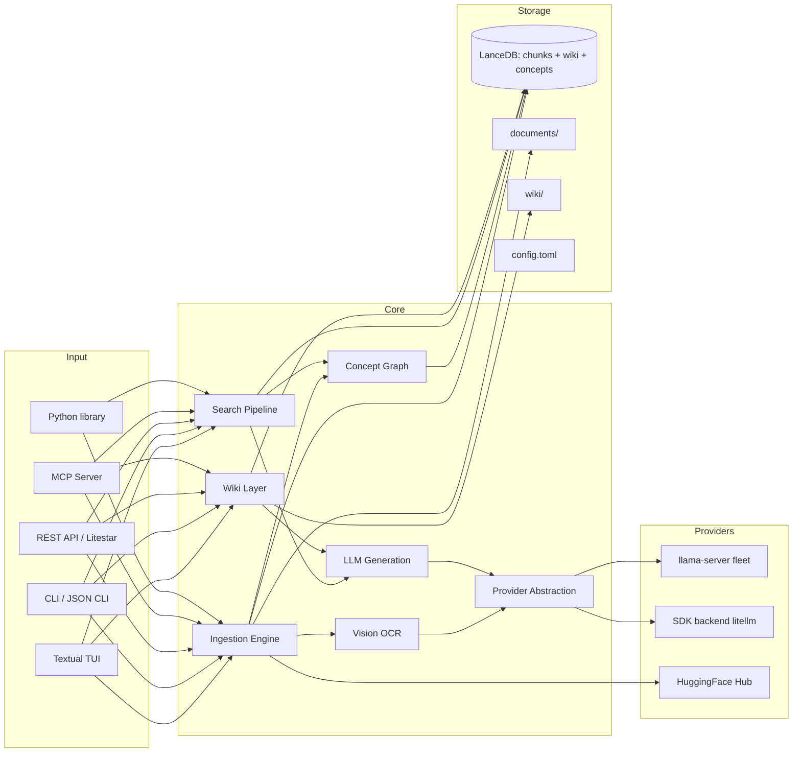
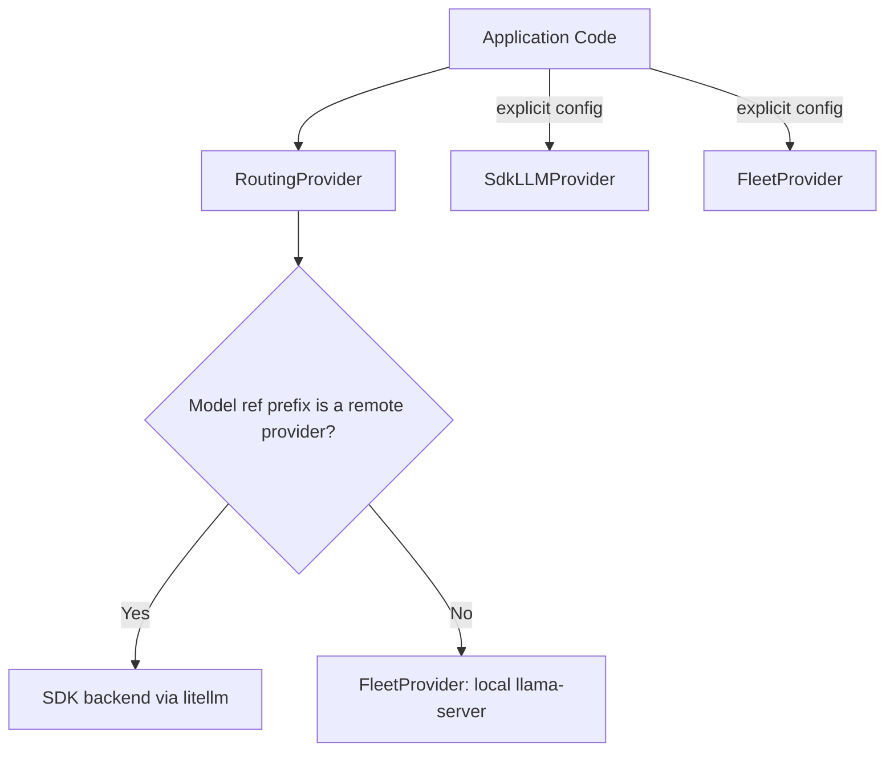
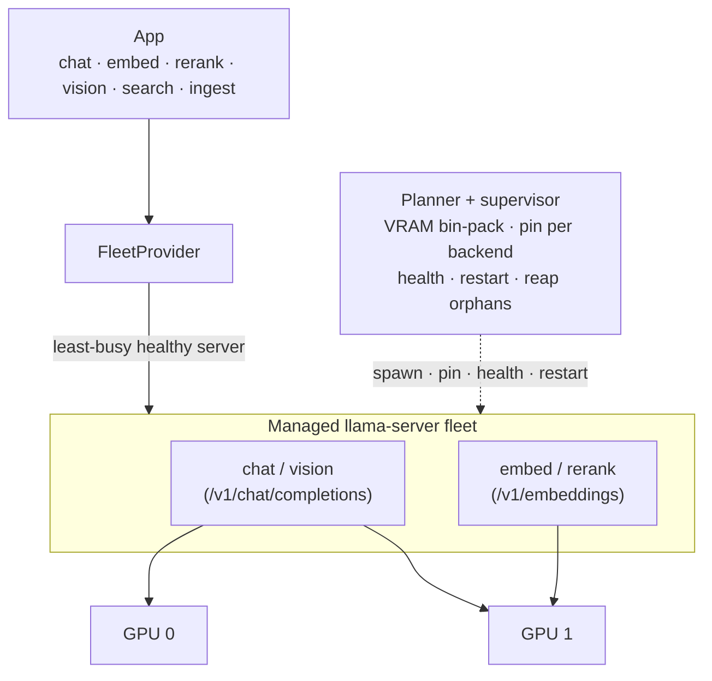
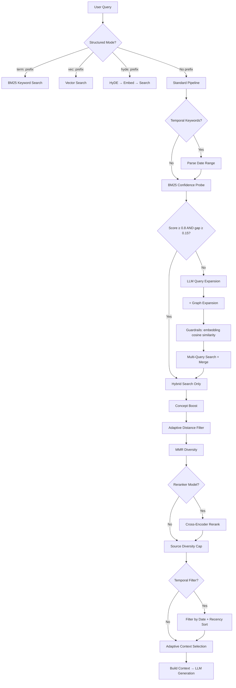
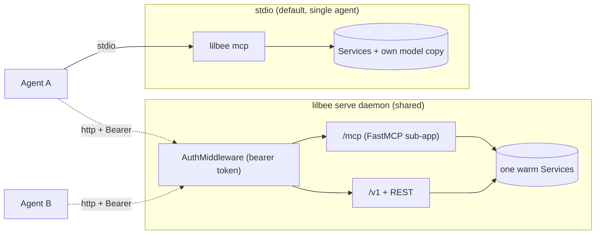
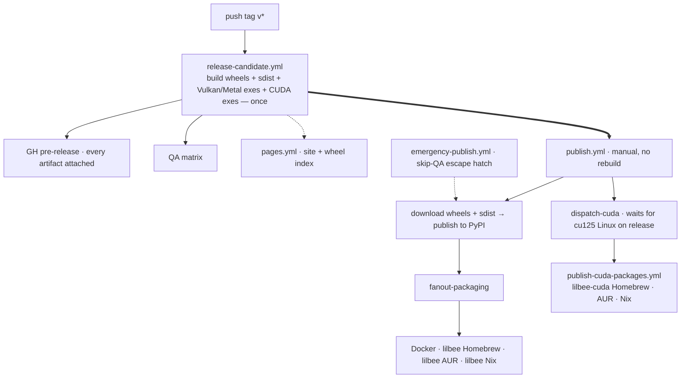

# lilbee Architecture

## What is lilbee?

lilbee is a local search engine for your own documents. It runs entirely on your machine: no cloud, no API keys, no data leaving your computer.

You point it at a folder (markdown, code, PDFs, Office docs, ebooks, images, anything), it indexes them, and then you can search them, chat with a model that answers from them, or let lilbee auto-build a wiki of the concepts and entities they contain. Every answer comes with citations linked back to the source chunk.

lilbee is a single executable: the same process drives the CLI, the Textual TUI, the REST API server, the MCP server for AI agents, and a Python library (`from lilbee import Lilbee`). No sidecar services to run alongside it.

---

## System Overview



---

## Ingestion Pipeline

Documents are chunked, embedded, and stored as vectors for later retrieval.

- **File discovery.** Recursive walk of `documents/` with SHA-256 hash-based change detection so only modified files are re-indexed.
- **Markdown.** Heading-aware chunking via kreuzberg's `chunker_type="markdown"` with `prepend_heading_context=True`. Splits at heading boundaries and prepends the full hierarchy path (e.g., `# Setup > ## Install`) so each chunk's section context travels with it. Inspired by Anthropic's Contextual Retrieval (2024), which showed adding context to chunks reduces retrieval failures by 49%.
- **Code.** tree-sitter AST splitting via tree-sitter-language-pack for 150+ languages, with symbol name, type, and line range in chunk headers.
- **PDF.** kreuzberg text extraction with an OCR fallback chain (text extraction → Tesseract OCR → GGUF vision model on `llama-server`). PDF page rasterization is delegated to kreuzberg's `PdfPageIterator`.
- **Vision OCR.** When `LILBEE_VISION_MODEL` is set, scanned PDFs and images are transcribed by a GGUF vision model served by `llama-server` with an `--mmproj` projector. The pipeline streams an SSE heartbeat during long scans and preserves tables, headings, and multi-column layout as structured markdown. Falls back to Tesseract when no vision model is configured.
- **Structured files.** kreuzberg handles XML, JSON, JSONL, YAML, and CSV natively. Language detection for code-shaped content is delegated to tree-sitter-language-pack's `detect_language()`.
- **Web pages.** crawl4ai fetches HTML with JavaScript rendering via Playwright, converts to markdown, and saves to `documents/_web/` for indexing. Recursive crawls emit live progress, respect per-domain rate limits, and retry on HTTP 429/503 with jitter. SSRF protection blocks internal networks by default.
- **Chunking strategy.** Fixed-size chunking (default, token-aware) for reliability on procedural and reference docs. Opt-in semantic chunking (`LILBEE_SEMANTIC_CHUNKING=true`) splits at topic boundaries via kreuzberg's ONNX embedding model; better on prose-heavy corpora at the cost of roughly 9x more downstream embedding calls.
- **Embedding.** Provider-agnostic: native GGUF on the local `llama-server` engine by default, or any backend reachable via the SDK protocol when `pip install lilbee[remote]` is available.
- **Concept extraction (opt-in).** With `pip install lilbee[graph]`, spaCy noun phrases are extracted per chunk, a co-occurrence graph is built with PPMI weights, and Leiden clustering assigns concepts to communities.
- **Wiki generation (experimental).** If wiki is enabled, `lilbee wiki build` and the incremental `_incremental_wiki_update` hook inside `lilbee sync` issue one LLM call per source that jointly identifies 3–5 concepts worth their own page and drafts a section for each. Sections are citation-verified and embedding-faithfulness-scored before landing in `concepts/`, `entities/`, or `drafts/`. See the [Wiki Layer](#wiki-layer) section.
- **Storage.** LanceDB tables: chunks (with FTS index for hybrid retrieval), sources, citations, wiki chunks, concept graph nodes/edges, and chunk-to-concept mappings.

---

## Provider Abstraction

lilbee treats chat, embedding, vision (OCR), and reranking as independent **model roles**. Each role resolves to a provider at call time, so you can mix local and remote freely (e.g., a local GGUF chat model with a remote embedding model, or the reverse).



- **auto** (default). `RoutingProvider` dispatches by model-ref prefix: a remote ref (`ollama/`, `openai/`, ...) goes to the SDK backend; a native GGUF ref runs locally on the managed `llama-server` engine.
- **remote**. Force all calls through the SDK backend (anything litellm reaches). Requires `pip install lilbee[remote]`.

**Model roles** (`lilbee model list --task <role>`):

| Role | Config field | Used for |
|------|--------------|----------|
| chat | `LILBEE_CHAT_MODEL` | `ask`, `chat`, wiki generation |
| embedding | `LILBEE_EMBEDDING_MODEL` | ingest, search, faithfulness scoring |
| vision | `LILBEE_VISION_MODEL` | OCR for scanned PDFs and images |
| reranker | `LILBEE_RERANKER_MODEL` | cross-encoder precision pass |

`validate_model_task_assignment` (invoked at config write time) rejects assignments where the model's capability declaration doesn't match the role, so you can't accidentally wire a pure-chat model into the vision slot.

**Model management.** Native GGUF support tracks [llama.cpp](https://github.com/ggml-org/llama.cpp) 1:1, so any GGUF that `llama-server` loads loads in lilbee. Pulls come from HuggingFace via the catalog (`lilbee model pull`, `/models` in the TUI). Featured picks per role live in `src/lilbee/featured_models.toml`; the catalog view additionally exposes the full HuggingFace GGUF search. External models reached via the SDK backend are used for inference when available but are not managed by lilbee.

---

## Local inference engine

The local engine is a managed `llama-server` fleet (`FleetProvider`,
`src/lilbee/providers/fleet/`): lilbee starts one `llama-server` per
configured role, routes each call to the least-busy healthy server for that role,
and tears them down on exit. A single machine is a fleet-of-one; the same code
scales to N GPUs by bin-packing models across them. Placement is planned jointly
for every configured role up front, but each role's server spawns lazily on first
use, so a batch `lilbee add` that only embeds never loads the chat model's VRAM;
the interactive warm-up (`worker_pool_eager_start`) brings every role up at once. There is no separate engine to
install or run, and no in-process binding: the engine is 100% llama.cpp, and lilbee
adds a placement planner, a process supervisor, and a thin httpx router. All four
roles run over HTTP: chat and vision use `/v1/chat/completions` (chat with
`--jinja` for native tool calls; vision adds an `--mmproj` projector), embed and
rerank use `/v1/embeddings` (rerank with `--pooling rank` and a
`query</s></s>candidate` pairing, never the template-dependent `/v1/rerank`). A
configured role whose server cannot start surfaces a user-facing `ProviderError`
rather than degrading silently.



- **Detection** (`devices.probe_devices`): GPUs come from the binary's own
  `llama-server --list-devices`, so enumeration and pinning share one backend-native
  index space. A device index from one API (Vulkan) is meaningless to another (CUDA),
  so we never cross them; the Vulkan VRAM probe (`gpu_select`) is only a fallback.
- **Pinning** (`devices.visible_env`): per backend, never by a foreign index —
  CUDA via `CUDA_VISIBLE_DEVICES` with `CUDA_DEVICE_ORDER=PCI_BUS_ID`, ROCm via
  `ROCR_VISIBLE_DEVICES`/`HIP_VISIBLE_DEVICES`, Vulkan via `GGML_VK_VISIBLE_DEVICES`.
- **VRAM estimation** (`vram.py`): each instance's footprint comes from
  **`gguf-parser`** (`estimate_instance_footprint`), a UMA-aware estimator run as a
  subprocess and memoized on the GGUF's path + mtime + sizing. It reports both a
  discrete-GPU footprint (`nonuma`, what lands in device VRAM) and a unified-memory
  footprint (`uma`, total resident on an Apple Silicon / shared-RAM host); the
  planner charges whichever matches the host. This replaced a hand-rolled
  weights + KV-cache estimate that used discrete-GPU accounting and over-estimated
  ~3x on unified memory, which was crowding the co-resident embed/rerank servers out
  of the budget and 503-ing every search.
- **Placement** (`placement.py`): first-fit-decreasing bin-pack with 90% headroom.
  A model that fits one GPU is a single pinned instance; small models co-locate; a
  model too big for one GPU is tensor-split **proportionally to each card's free
  VRAM** (so unequal GPUs don't OOM the smaller one). On a single CPU/Metal box this
  is a fleet-of-one against one shared pool, where the **search-critical roles
  (embed/rerank) are reserved before the elastic chat model**: chat's slot count and
  context are sized against the budget *minus* the search footprint, and the shared
  pool places search first, so a large chat can never starve search (the proven
  embed-starvation bug). Placement gates against **free system RAM** rather than a
  GPU budget: unified memory is shared with the OS, so a model that exceeds free RAM
  is marked unplaceable (no server, clean error) instead of loaded. Loading past free
  RAM on a unified-memory host drives the OS into a swap-thrash OOM livelock that
  hard-freezes the machine, so refusing is the safe outcome; chat slot count
  (`--parallel`) steps down the same way before refusing.
- **Data-parallel replicas** (`embed_replicas` / `vision_replicas`): the embed and
  vision roles can run as N independent servers, one per GPU, so large-scale ingest
  fans embedding / OCR across the whole box. The single roles (chat) are placed
  first; each replica then lands on a distinct card with the most free VRAM (only
  co-locating a second once every card has one), capped by what fits. The provider
  holds a client pool per role and round-robins to the least-busy replica. With no
  discrete GPU the replicas run as co-resident processes against the shared pool.
  Each replica is its own llama-swap model id (`<role>-<n>`); a role is ready once
  any replica is.
- **Loader flags** (`adapters.build_server_argv`): each server's flags derive from
  cfg and the model's GGUF metadata for that role and config. Chat carries
  `--jinja`, `--flash-attn` (on unless `flash_attention` is disabled) and
  `--cache-type-k/-v` from `kv_cache_type`; embed and rerank raise
  `--batch-size`/`--ubatch-size` to the full context (the server caps embeddings at
  `n_ubatch`, default 512); vision uses the full-core thread default and always
  offloads every layer. Embed and rerank requests also send `embd_normalize=-1` to
  get raw, un-normalized vectors (the server would L2-normalize pooled output by
  default, which would also collapse a rank score to +-1). Context and GPU-layer
  counts come from the shared `engine_params` helpers, never a hardcoded budget.
  `main_gpu` is the one
  setting deliberately not forwarded: it selects a single card by global index, which
  is meaningless once a server is pinned to a subset, and placement owns card choice
  in fleet mode.
- **Lifecycle** (`fleet.py`): each server runs in its own process group and claims
  its port at spawn (no racy batch allocation). Readiness is `/health` (200 only once
  the model loads); a `pid`/`port` file lets the next start reap a crashed parent's
  orphaned servers. A background monitor restarts a dead server with backoff, and the
  router serves only healthy clients. Teardown group-kills (SIGTERM then SIGKILL).
- **Routing** (`provider.py`): each role goes to its least-in-flight healthy server;
  rerank reuses the client's rank-pooling embeddings call and vision the chat call
  with image content. A per-call model that differs from the role's configured model
  is rejected (switching models is a config change that respawns the server), and a
  role with no healthy server surfaces a `ProviderError`. Fleet build is single-flight
  and the in-flight counter is atomic, because the HTTP and MCP servers route concurrently.
- **Binary** (`binary.py`): the bundled wheel ships `llama-server`; resolution falls
  back to `LILBEE_LLAMA_SERVER_PATH` / PATH. Never auto-downloaded.
- **Delegate alternative:** to use an external fleet (GPUStack, vLLM), point the
  `remote` provider at it (`LILBEE_LLM_PROVIDER=remote`); the managed fleet is the
  local, single-box option.
- **Hardware QA:** `tools/qa/multi_gpu_smoke.py` validates enumeration, placement,
  concurrency, restart, and orphan cleanup on a real multi-GPU host.

### Chat context-window management

The chat worker windows the request prompt to fit the loaded model's
`n_ctx` before inference. Two estimates are subtracted from the budget:
`_DEFAULT_RESPONSE_BUDGET` (1024 tokens for the response), and a
chat-template-inflated tools-overhead figure.

The tools-overhead figure (`count_tools_overhead`) does not tokenize the
real rendered prompt (llama-cpp-python doesn't expose chat-template
rendering as a tokenization step); it inflates the bare
`json.dumps(tools)` token count by `_TOOLS_TEMPLATE_OVERHEAD_MULTIPLIER`
(1.5x) and adds `_TOOLS_TEMPLATE_PREAMBLE_TOKENS` (256). The multiplier
is calibrated from observed rendering across Qwen3, Mistral, Gemma 4,
GLM, and Llama 3 chat templates, which typically inflate the bare JSON
by 1.3–1.7x once descriptions, `<tools>`/`# Tools` wrapping, and
schema-field repetition are accounted for. 1.5 is the conservative
middle. The preamble allowance covers the introductory text that most
templates inject (e.g. "You may call one or more functions to assist
with the user query.").

The pre-flight is intentionally conservative: better to raise a clean
400 `context_length_exceeded` than to reach llama-cpp's runtime
`ValueError`. A safety net in `_ChatSession.chat` also catches that
`ValueError` (matched by regex against llama-cpp's exact phrasing) and
re-raises as `ContextWindowExceededError`, so the user-facing 400 still
fires even when the inflated pre-flight is too optimistic.

---

## Search Pipeline

This is the core of lilbee's retrieval quality. The pipeline applies techniques progressively: expensive operations are skipped when simpler ones produce confident results.



### Technique Reference

#### Hybrid Search (BM25 + Vector + RRF)
**Always on.** Combines keyword matching (BM25 via LanceDB FTS) with semantic similarity (vector cosine distance), fused via Reciprocal Rank Fusion.

- **Paper**: Cormack, Clarke & Büttcher 2009, "[Reciprocal Rank Fusion outperforms Condorcet and individual Rank Learning Methods](https://dl.acm.org/doi/10.1145/1571941.1572114)"
- **Tradeoff**: ~5ms overhead vs vector-only search. Worth it because BM25 catches exact keyword matches that vectors miss (e.g. searching for "NavigationServer2D" needs exact string matching, not semantic similarity).
- **When it helps**: queries with specific terms, function names, error messages, exact phrases.

#### MMR Diversity
**Always on.** Maximal Marginal Relevance prevents near-duplicate chunks from filling all result slots.

- **Paper**: Carbonell & Goldstein 1998, "[The Use of MMR, Diversity-Based Reranking](https://dl.acm.org/doi/10.1145/290941.291025)"
- **Default**: λ=0.5 (equal weight to relevance and diversity). This is the standard default from the original paper.
- **Tradeoff**: λ=1.0 gives pure relevance (may return 5 chunks from the same paragraph). λ=0.0 gives maximum diversity (may sacrifice the most relevant result for variety). 0.5 balances both.
- **When to tune**: increase λ for factual lookups ("what is the API key format?"), decrease for exploratory queries ("how does authentication work?").

#### Source Diversity
**Always on.** Caps results per source document so one large file doesn't dominate all top-k slots.

- **Paper**: Zhai 2008, "[Towards a Game-Theoretic Framework for Information Retrieval](https://dl.acm.org/doi/10.1007/978-3-540-78646-7_13)"
- **Default**: 3 chunks per source. Ensures at least 2 different documents appear in top-5 results.
- **Tradeoff**: lower cap = more diverse sources but may miss relevant sections from a single comprehensive document.

#### Query Expansion
**On by default, skipped when BM25 is already confident.** LLM generates 2-3 alternative phrasings of the query, each is searched independently, and results are merged via deduplication.

- **Technique**: standard multi-query retrieval
- **Cost**: 1 LLM call (~200 tokens) + N embedding calls per variant
- **Default**: 3 variants. Set `LILBEE_QUERY_EXPANSION_COUNT=0` to disable entirely.
- **When it helps**: queries using different terminology than the indexed documents. E.g. user asks "how to deploy" but the docs say "installation steps".

#### Confidence-Based Expansion Skip
**On by default.** Before running the expensive LLM expansion call, does a quick BM25 probe. If the top BM25 result is highly confident, expansion is skipped entirely.

- **Technique**: early termination based on BM25 score distribution
- **Default threshold**: 0.80 (90th percentile of sigmoid-normalized BM25 scores)
- **Default gap**: 0.15 (top-1 must be clearly separated from top-2)
- **Threshold derivation**: BM25 scores are normalized via sigmoid centered at ~0.5. Scores above 0.8 represent strong keyword matches. The gap ensures the match isn't ambiguous.
- **Tradeoff**: higher threshold = expansion runs more often (better recall, more latency). Lower = expansion skipped more (faster, may miss some results).
- **Caveat**: these are starting defaults. Calibrate for your library using RAGAS evaluation metrics.

#### Expansion Guardrails
**On by default.** Validates LLM-generated query variants to prevent drift.

- **Technique**: cosine similarity between the question's embedding and each variant's embedding. Language-agnostic (works for any library the embedding model supports) and reuses the variant vectors that the multi-query search would have embedded anyway, so there are zero extra embed calls.
- **Threshold**: 0.5 by default via `LILBEE_EXPANSION_SIMILARITY_THRESHOLD`. Raise it to reject more variants (stricter); lower it to keep more (looser). Calibrate per embedding model. Dense 768-dim models cluster higher by default than contrastively-trained ones.
- **Concept-graph variants bypass this check**: they come from deterministic graph traversal and are expected to be partial phrases with lower similarity to the full question.
- **Tradeoff**: guardrails may filter out creative but valid variants. Disable via `LILBEE_EXPANSION_GUARDRAILS=false` if recall is more important than precision.

#### HyDE (Hypothetical Document Embeddings)
**Off by default.** Generates a hypothetical excerpt (50-100 words) that reads like a real document answering the query, embeds it, and searches with it alongside the original query vector.

- **Paper**: Gao et al. 2022, "[Precise Zero-Shot Dense Retrieval without Relevance Labels](https://arxiv.org/abs/2212.10496)"
- **Cost**: 1 additional LLM call + 1 embedding (~500ms total)
- **Default weight**: 0.7x (hypothetical results are discounted because they're fabricated: they approximate the answer space but aren't based on real content)
- **When it helps**: vague or short queries where the user's terminology doesn't match the indexed documents. E.g. "how does the thing work" where the "thing" is described with specific technical vocabulary in the docs.
- **When to skip**: factual lookups, keyword-heavy queries, or when latency matters.

#### Concept Graph (LazyGraphRAG Index Side)
**On by default.** At index time, extracts noun phrases from each chunk via spaCy, builds a co-occurrence graph weighted by Positive Pointwise Mutual Information (PPMI), and clusters concepts with the Leiden algorithm. Zero LLM calls at index or query time.

Two query-time effects:
- **Concept boost**: for each search result, counts concept overlap between the query's noun phrases and the chunk's concepts. Score adjusted by `overlap_ratio × concept_boost_weight` (default 0.3). Only promotes, never demotes.
- **Graph expansion**: traverses the co-occurrence graph (1 hop BFS) to find concepts related to the query. These supplement LLM-generated expansion variants and go through the same drift guardrails.

- **Inspiration**: Microsoft Research 2024-2025, "[LazyGraphRAG](https://www.microsoft.com/en-us/research/blog/lazygraphrag-setting-a-new-standard-for-quality-and-cost/)". NLP concept extraction at index time, defer reasoning to query time.
- **Clustering**: Traag et al. 2019, "[From Louvain to Leiden](https://www.nature.com/articles/s41598-019-41695-z)" via graspologic-native (Rust).
- **Weighting**: Church & Hanks 1990, PPMI: `max(0, log2(P(a,b) / P(a)P(b)))`. Negative values clamped to zero to discard anti-correlated concept pairs.
- **Cost**: ~10ms per chunk at index time (spaCy NLP). Zero additional cost at query time (table lookups only).
- **When it helps**: queries where related but not identical concepts appear across documents. E.g. "connection pooling" finding both database and API performance docs because both mention it alongside related concepts.
- **Browse**: `lilbee topics` shows concept communities, a map of what's in the index.

#### Cross-Encoder Reranking
**Off by default.** Requires a reranker model to be configured. After hybrid search returns candidates, a cross-encoder model scores each (query, chunk) pair for more precise relevance ranking.

- **Paper**: Nogueira & Cho 2019, "[Passage Re-ranking with BERT](https://arxiv.org/abs/1901.04085)"
- **Position-aware blending**: instead of replacing fusion scores entirely, rerank scores are blended with fusion scores using position-dependent weights:
  - Top 3 results: 70% fusion / 30% rerank (these were already ranked high by fusion for good reason)
  - Positions 4-10: 50% / 50% (equal influence)
  - Positions 11+: 30% fusion / 70% rerank (reranker has more opportunity to rescue misranked items)
- **Blending rationale**: derived from learning-to-rank literature (Burges et al. 2005, "[Learning to Rank using Gradient Descent](https://icml.cc/imls/conferences/2005/proceedings/papers/012_Learning_BurgesEtAl.pdf)"). Top positions already have strong signal, so the reranker provides diminishing returns there.
- **BM25 protection**: if the rank-1 result has a BM25 score above the expansion skip threshold, it is protected from demotion. This prevents the neural reranker from pushing down obvious exact keyword matches.
- **Cost**: depends on model and candidate count. ~200-500ms for 20 candidates with a small cross-encoder.

#### Adaptive Distance Threshold
**Off by default.** When enabled, if the initial cosine distance filter returns too few results, the threshold is widened step by step until enough results are found or a safety cap is reached.

- **Controlled by**: `LILBEE_ADAPTIVE_THRESHOLD` (default: `false`)
- **Default step**: 0.2 (widens from initial `max_distance` in increments, configurable via `LILBEE_ADAPTIVE_THRESHOLD_STEP`)
- **Safety cap**: 20 iterations maximum to prevent runaway loops
- **When it helps**: novel queries or small indexes where strict distance thresholds would return empty results.

#### Adaptive Context Selection
**On by default.** After search results are ranked, selects which chunks to include as LLM context based on query term coverage rather than just taking the top-k.

- **Technique**: greedy set-cover approximation
- **Algorithm**: tokenize query into terms, greedily select chunks that add the most uncovered terms, stop when coverage reaches 100% or marginal gain drops below 5%
- **Default max sources**: 5 chunks
- **When it helps**: multi-faceted queries like "compare X and Y" where top-k might only cover X but context selection ensures Y is also represented.

#### Temporal Filtering
**On by default, activates only when temporal keywords are detected in the query.**

- **Keywords detected**: "recent", "latest", "today", "yesterday", "this week", "last week", "this month", "last month"
- **Date source**: frontmatter `date` field (preferred) or document ingestion timestamp (fallback)
- **Behavior**: when active, retrieves 3x candidates (compensating for filtering loss) and sorts by recency
- **When it helps**: queries like "what changed recently?" or "latest notes about X"

#### Structured Query Modes
**Always available.** Power-user feature for direct control over the retrieval pipeline.

- `term: kubernetes pod scheduling`: BM25 keyword search only (no vector, no expansion)
- `vec: how does container orchestration work`: vector search only (no BM25)
- `hyde: explain the scheduling algorithm`: generate hypothetical document, embed, search
- No prefix → standard hybrid pipeline with all features

Useful for benchmarking (compare BM25 vs vector on the same question), debugging (why isn't this document in keyword results?), and precision (when you know exactly what you want).

#### ANN Vector Index (scaling)
**Threshold-gated.** Below `LILBEE_ANN_INDEX_THRESHOLD` chunks (default 50,000) search uses an exact brute-force scan, which is fast and exact for personal vaults and is all a laptop needs. At/above the threshold, `sync` builds an approximate index so search stays fast at millions of vectors; `lilbee index` forces a build for the publish-a-large-index workflow.

- **Index type**: IVF_PQ. Product Quantization compresses each vector so the index fits in memory at 10M+ scale; the inverted file (IVF) restricts the scan to a few partitions.
- **Recall recovery**: PQ is lossy, so search probes multiple partitions (`nprobes`) and re-ranks the candidates against the full vectors (`refine_factor`) to keep results close to the exact scan. These are module constants in `data/store/core.py`, not config, until a real tuning need appears.
- **Lifecycle**: built once when the corpus crosses the threshold; subsequent syncs fold new rows in via `optimize()` rather than rebuilding. The index lives inside the LanceDB directory, so a downloaded index ships with it and searches fast on the first query.
- **Why threshold-gated**: IVF_PQ needs enough vectors to train, and brute force already beats an index for small N. Setting the threshold to `0` keeps search flat regardless of size.

### Embedder identity and adoption
A store records the embedding model that built it (`_meta` row). Retrieval embeds the query and nearest-neighbor searches it against the stored vectors, so a query embedded by a different model yields silently-wrong results. The store therefore refuses to serve when the configured embedder drifts from the persisted one.

- **Self-describing index**: `Store.get_meta()` exposes the persisted model and dimension; the gate compares them to the active config before every search and write.
- **Adoption (downloaded indexes)**: when someone downloads a published index built with a different embedder, the fix is to use *that* embedder, not to rebuild. When the dimensions match, lilbee offers to adopt it: download the embedder if missing and switch to it, leaving the vectors untouched (no rebuild). The TUI prompts, `lilbee use-embedder <ref>` does it headlessly, and the REST API returns a structured 409 so a client can offer the same choice. When the dimensions differ the index is not adoptable and a rebuild is the only path.

---

## Wiki Layer

> **Experimental.** Generation quality depends on your library and the chat model. Expect some pages to land in `drafts/` for human review rather than publish direct.

The wiki layer is lilbee's second-order index: a set of linked markdown pages auto-generated from your indexed documents so that concepts and entities which show up across many sources get their own page with citations from every source that mentions them.

### Layout

Under `$LILBEE_DATA/$wiki_dir/` (default `wiki/`):

| Directory | Contents |
|-----------|----------|
| `concepts/` | One page per LLM-identified concept (e.g. `braking-systems.md`) |
| `entities/` | One page per proper-noun entity extracted by NER (e.g. `henry-ford.md`) |
| `drafts/` | Low-faithfulness output and PENDING markers for parse failures or slug collisions. Reviewed via `lilbee wiki drafts accept / reject`. |
| `archive/` | Pages retired by `lilbee wiki prune` |
| `synthesis/` | Cross-source pages produced by `lilbee wiki synthesize` |
| `index.md` | Auto-generated table of contents, grouped by page type |
| `log.md` | Append-only audit trail of every build, ingest, lint, and prune |

Slugs are lowercase hyphen-separated filenames that double as the `[[link]]` target. `make_slug` lives at `src/lilbee/wiki/shared.py`.

### Build

`lilbee wiki build` runs a one-time Phase D migration (archives pre-Phase-D noun-chunk concept pages, unwraps stale `[[concept-slug]]` links), then extracts NER entities from the chunk store via `cfg.wiki_entity_mode` (default `ner_entities`, spaCy NER only). Per source, a single batched LLM call identifies 3-5 concepts worth their own page and drafts a section for each concept plus each extracted entity. Sections are split, citation-verified against the source chunk pool, embedding-faithfulness-scored (`wiki/gen.py::_check_faithfulness`, cosine of body vs mean source-chunk vector), and written to `concepts/` or `entities/`. Sections that fail to parse become PENDING markers in `drafts/`.

### Incremental update

`lilbee sync` runs `_incremental_wiki_update` after ingest with `extract_concepts=False` so re-ingest never churns concept slugs. The cap is `LILBEE_WIKI_INGEST_UPDATE_CAP` (default 20 changed sources per sync). Full rebuild is always available via `lilbee wiki build`.

### Retrieval inside wiki generation

Each page is built from the top `LILBEE_WIKI_CONCEPT_MAX_CHUNKS_PER_PAGE` chunks returned by the same hybrid search the main pipeline uses, optionally reordered by the reranker when `LILBEE_RERANKER_MODEL` is set. Every path respects `LILBEE_DIVERSITY_MAX_PER_SOURCE` so one loud document can't monopolize a topic page.

### `[[wiki links]]`

After each build, `wiki/links.py::rewrite_wiki_links` rewrites plain-text slug surface forms to `[[slug]]` form in page bodies, skipping YAML frontmatter, code fences, and the auto-generated citation block. `lilbee wiki lint` flags concept or entity pages with zero inbound links.

### Search scope

`search()` accepts a `scope` argument (`raw`, `wiki`, `both`) that filters the hybrid search pool to source chunks, wiki chunks, or the union. Used by the TUI scope toggle and the MCP tool.

---

## Interfaces

### CLI
- `lilbee ask "question"`: one-shot RAG answer with sources
- `lilbee chat`: launches the full Textual TUI (also `lilbee` with no args)
- `lilbee search "query"`: vector search, no LLM generation
- `lilbee sync` / `lilbee add` / `lilbee remove`: document management
- `lilbee model pull <name>` / `model list` / `model rm`: native GGUF model management
- `lilbee wiki build` / `wiki lint` / `wiki synthesize` / `wiki drafts` / `wiki prune`: wiki layer
- `lilbee serve`: start the REST API server
- `lilbee mcp`: launch the MCP server
- `lilbee launch <client>` (e.g. `opencode`): spawn the local server, write a paste-ready client config and a priming `AGENTS.md`, exec the client, clean up on exit
- `lilbee agent-config <client>` (e.g. `opencode`, `litellm`): print the same client config block for hand-wired setups
- `--json` / `-j` on any command for structured output

### TUI (Textual)
Launched by `lilbee` or `lilbee chat`. Screens: chat, task center, model catalog, settings, setup wizard, wiki, wiki-drafts review, status. Slash commands route through `src/lilbee/cli/tui/command_registry.py` (single source of truth). Every background job (sync, crawl, wiki build, model pull) runs in the app-level `TaskBarController` and is cancellable with `/cancel`.

### REST API (Litestar)
- OpenAI-compatible: `GET /v1/models`, `POST /v1/chat/completions` (streaming + tools). Errors use the OpenAI envelope with the codes in `src/lilbee/server/chat_completions_api/errors.py::CompletionsErrorCode` (`invalid_request`, `model_not_found`, `model_does_not_support_tools`, `context_length_exceeded`, `invalid_api_key`, `rate_limit_exceeded`, `internal_error`).
- Search: `GET /api/search`, `POST /api/ask`, `POST /api/chat`, `POST /api/ask/stream`, `POST /api/chat/stream` (SSE)
- Documents: `GET /api/documents`, `POST /api/documents/remove`, `POST /api/add`, `POST /api/sync`, `GET /api/source` (vault-aware source retrieval)
- Models: `GET /api/models`, `GET /api/models/catalog`, `GET /api/models/installed`, `PUT /api/models/{chat,embedding,vision,reranker}`, `POST /api/models/pull`, `DELETE /api/models/{model}`
- Crawl: `POST /api/crawl` (SSE progress)
- Config: `GET /api/config`, `GET /api/config/defaults`, `PATCH /api/config`
- Status/health: `GET /api/status`, `GET /api/health`
- Interactive docs at `/schema/redoc`; OpenAPI JSON at `/schema/openapi.json`

All chat-generating endpoints (`/api/ask`, `/api/chat`, both their `/stream` variants, and `POST /v1/chat/completions`) share a process-wide chat lock so only one inference call runs at a time per server. Concurrent requests queue server-side; if the wait exceeds the configured timeout the request returns 429 with a `Retry-After: 1` header.

### Auth model

All network surfaces, the `/v1/*` model runtime, the `/api/*` REST routes, and the `/mcp` streamable-http endpoint, share **one** bearer session token. The daemon generates it on startup, persists it to `server.json` (mode `0600`), and hands it to local clients through `lilbee agent-config` / `lilbee launch`. Clients send `Authorization: Bearer <token>`; `AuthMiddleware` (`src/lilbee/server/auth.py`) checks it on every mutating request.

This is deliberately a single, unscoped token rather than a per-client or per-scope system. lilbee is a local-first, single-user tool: the daemon binds localhost only (with DNS-rebinding protection), and any process running as the user can read `server.json` regardless, so a per-agent token would not add a boundary that the filesystem doesn't already remove. The token exists to keep out other local users and drive-by browser requests, not to isolate the user's own agents from each other.

The tradeoff is that the token is all-or-nothing: a client trusted with retrieval also gets generation and the mutating tools (`reset`, `remove`, `model_rm`, `settings_set`). That is acceptable for the user's own agents on localhost. Giving retrieval-only access to a less-trusted client would require a scoped token, which lilbee does not have today.

### MCP Server
- Search + lifecycle: `search(query, top_k, scope)`, `status`, `sync`, `add`, `crawl`, `crawl_status`, `init`, `remove`, `list_documents`, `reset`
- Models: `model_list`, `model_show`, `model_pull`, `model_rm`
- Wiki: `wiki_list`, `wiki_read`, `wiki_status`, `wiki_synthesize`, `wiki_lint`, `wiki_citations`, `wiki_drafts_list`, `wiki_drafts_diff`, `wiki_prune`

#### Transports

The same FastMCP tool server is reachable two ways:

- **stdio** (`lilbee mcp`): the default for a single agent. The client spawns
  the process, which loads its own in-process `Services` (its own model copy).
  Zero configuration, no network.
- **streamable-http** (on the `lilbee serve` daemon): for multiple agents
  sharing one warm backend. The tool server mounts as a Litestar sub-app at
  `/mcp`, behind the same bearer-token `AuthMiddleware` as `/v1/*` and REST, and
  resolves the same process-wide `Services`. Sync tool handlers are offloaded
  off the event loop so one slow call cannot stall the other connected agents.
  Retrieval reads run concurrently; generation shares the chat lock above.



#### Schema-size discipline

The OpenAI tools schema ships on every chat request; bloat there taxes
every turn. lilbee's default surface is ~5.7 KB of raw JSON across 17
tools (~10% of a 32K context, ~35% of Gemma 4's 7K).

- Wiki tools and crawler tools are gated off the schema unless
  `cfg.wiki` is on or `lilbee[crawler]` is installed.
- Tool docstrings stay at one or two sentences (FastMCP turns them
  into per-parameter schema descriptions).
- `_strip_schema_noise` in `mcp_server.py` drops the FastMCP/Pydantic
  auto-generated `title` keys before the tools hit the wire.
- `tests/test_mcp.py::TestToolsSchemaSize` caps the schema at 7 KB; new
  tools or doc bloat trip the cap and force a deliberate review.

### Python library
```python
from lilbee import Lilbee

bee = Lilbee("./docs")
bee.sync()
results = bee.search("authentication")
```
`Lilbee` composes the same `Store`, `Embedder`, `Searcher`, `Reranker`, and `ConceptGraph` the CLI and server use.

---

## Configuration Reference

All settings are configurable via `LILBEE_*` environment variables, `config.toml`, or `/set` in chat mode. The `GET /api/config` endpoint exposes all current values for API clients.

### Core Settings

| Setting | Default | Description | Caveats |
|---------|---------|-------------|---------|
| `LILBEE_CHAT_MODEL` | `Qwen/Qwen3-0.6B-GGUF/Qwen3-0.6B-Q4_K_M.gguf` | Model used for `ask`, `chat`, and wiki generation | Native GGUF by default; with `[remote]`, any remote name the SDK backend understands |
| `LILBEE_EMBEDDING_MODEL` | `nomic-ai/nomic-embed-text-v1.5-GGUF/nomic-embed-text-v1.5.Q4_K_M.gguf` | Model for computing vector embeddings | Changing this requires a full `lilbee rebuild` |
| `LILBEE_VISION_MODEL` | *(none)* | GGUF vision model for OCR (served with `--mmproj`) | When set, takes precedence over Tesseract for scanned PDFs and images |
| `LILBEE_TOP_K` | `10` | Number of search results returned | Higher values provide more context but increase LLM latency and token cost |
| `LILBEE_MAX_DISTANCE` | `0.9` | Cosine distance cutoff for vector results | Lower values are stricter (fewer but more precise results). Set to 1.0 to disable filtering. |
| `LILBEE_ADAPTIVE_THRESHOLD` | `false` | Enable adaptive threshold widening | When true, automatically widens distance threshold if too few results found. Useful for ensuring minimum result count. |
| `LILBEE_CHUNK_SIZE` | `512` | Target tokens per chunk | Changing requires `lilbee rebuild`. Smaller = more precise retrieval, larger = more context per chunk |
| `LILBEE_CHUNK_OVERLAP` | `100` | Overlap tokens between adjacent chunks | Changing requires `lilbee rebuild`. Prevents information loss at chunk boundaries |
| `LILBEE_SYSTEM_PROMPT` | *(built-in)* | System prompt sent to the LLM | Override per-project for domain-specific behavior |

### Retrieval Quality Settings

| Setting | Default | Description | Caveats |
|---------|---------|-------------|---------|
| `LILBEE_MMR_LAMBDA` | `0.5` | Relevance vs diversity (0.0=diverse, 1.0=relevant) | 0.5 is the standard default from Carbonell & Goldstein 1998. Lower for broad exploratory queries. |
| `LILBEE_DIVERSITY_MAX_PER_SOURCE` | `3` | Max chunks returned per source document | Lower = more diverse sources. Higher = deeper coverage of a single document. |
| `LILBEE_CANDIDATE_MULTIPLIER` | `3` | How many extra candidates to retrieve for MMR | Higher = better diversity selection but slower. 3x is empirically effective. |
| `LILBEE_QUERY_EXPANSION_COUNT` | `3` | Number of LLM-generated query variants | Each variant requires an embedding call. Set to 0 to disable expansion entirely for fastest search. |
| `LILBEE_ADAPTIVE_THRESHOLD_STEP` | `0.2` | Distance filter widening increment | Only used when `LILBEE_ADAPTIVE_THRESHOLD=true`. Smaller = more granular adaptation but more filter iterations |
| `LILBEE_EXPANSION_SKIP_THRESHOLD` | `0.8` | BM25 score above which expansion is skipped | 90th percentile of sigmoid-normalized BM25 scores. Calibrate for your library. |
| `LILBEE_EXPANSION_SKIP_GAP` | `0.15` | Min score gap (top-1 minus top-2) to skip expansion | Approximately 1 std dev of typical score spread. Ensures the match isn't ambiguous. |
| `LILBEE_EXPANSION_GUARDRAILS` | `true` | Validate expansion variants for drift | Prevents hallucinated variants at the cost of potentially filtering valid creative expansions |
| `LILBEE_EXPANSION_SIMILARITY_THRESHOLD` | `0.5` | Minimum question↔variant cosine similarity for an expansion variant to survive the guardrail | Raise for stricter filtering, lower to keep more variants. Calibrate per embedding model. |
| `LILBEE_MAX_CONTEXT_SOURCES` | `5` | Max chunks included in LLM context | More = more complete answers but higher latency and token cost |
| `LILBEE_HYDE` | `false` | Enable hypothetical document embeddings | Adds ~500ms per query. Best for vague queries where terminology doesn't match docs. |
| `LILBEE_HYDE_WEIGHT` | `0.7` | Weight for HyDE results relative to original | Lower = less trust in hypothetical documents. 0.7 prevents fabricated vectors from dominating. |
| `LILBEE_RERANKER_MODEL` | `""` | Cross-encoder model for reranking (empty = disabled) | Native GGUF (e.g. `bge-reranker-v2-m3`) or a remote name via the SDK backend. Only loaded when configured. |
| `LILBEE_RERANK_CANDIDATES` | `20` | Number of candidates to rerank | More = better precision but slower. 20 is a good balance. |
| `LILBEE_TEMPORAL_FILTERING` | `true` | Enable date-based result filtering | Only activates when temporal keywords are detected in the query |
| `LILBEE_SHOW_REASONING` | `false` | Show reasoning model thinking process | For Qwen3/DeepSeek-R1 models that emit `<think>` tags |
| `LILBEE_CONCEPT_GRAPH` | `true` | Enable concept graph (LazyGraphRAG index) | Extracts noun phrases, builds co-occurrence graph, boosts search by concept overlap |
| `LILBEE_CONCEPT_BOOST_WEIGHT` | `0.3` | Concept overlap boost strength (0.0-1.0) | Higher = concept overlap matters more relative to vector similarity |
| `LILBEE_CONCEPT_MAX_PER_CHUNK` | `10` | Max concepts extracted per chunk | Caps extraction to reduce noise from long chunks |
| `LILBEE_CRAWL_MAX_DEPTH` | unset | Optional global ceiling on recursion depth | Set to a positive int to cap calls that pass no explicit depth. Explicit `--depth N` always wins. |
| `LILBEE_CRAWL_MAX_PAGES` | unset | Optional global ceiling on total pages per crawl | Same shape as above. Unset / null = no ceiling. |
| `LILBEE_CRAWL_TIMEOUT` | `30` | Per-page fetch timeout in seconds | Passed to crawl4ai as page_timeout |
| `LILBEE_CRAWL_MAX_CONCURRENT` | CPU count | Max simultaneous crawl operations (top-level) | Limits parallel `crawl_and_save` invocations. Per-crawl concurrency is `crawl_concurrent_requests`. |
| `LILBEE_CRAWL_SYNC_INTERVAL` | `30` | Seconds between periodic syncs during crawl | 0 = sync only after crawl completes. Lower = documents searchable sooner |
| `LILBEE_CRAWL_MEAN_DELAY` | `0.5` | Seconds between in-flight requests within a single crawl | Uniform jitter applied by crawl4ai. Tune up for rate-sensitive sites. |
| `LILBEE_CRAWL_MAX_DELAY_RANGE` | `0.5` | Random additional delay on top of mean_delay | Total per-request delay = mean_delay + random(0, max_delay_range) |
| `LILBEE_CRAWL_CONCURRENT_REQUESTS` | `3` | Concurrent in-flight URLs within one crawl | Gentler default than crawl4ai's own `5`. |
| `LILBEE_CRAWL_RETRY_ON_RATE_LIMIT` | `true` | Enable per-domain RateLimiter + SemaphoreDispatcher | Backs off on HTTP 429/503 with jitter and retries. Set to `false` to disable. |
| `LILBEE_CRAWL_RETRY_BASE_DELAY_MIN` / `MAX` | `1.0` / `3.0` | Randomized base-delay range on rate-limit responses (seconds) | Passed as `(min, max)` to crawl4ai's `RateLimiter(base_delay=...)`. |
| `LILBEE_CRAWL_RETRY_MAX_BACKOFF` | `30.0` | Upper bound on any single backoff wait (seconds) |  |
| `LILBEE_CRAWL_RETRY_MAX_ATTEMPTS` | `3` | Retry count per URL on rate-limit codes |  |

### Provider Settings

| Setting | Default | Description | Caveats |
|---------|---------|-------------|---------|
| `LILBEE_LLM_PROVIDER` | `auto` | Backend selection: auto, remote | auto = SDK backend for remote refs, the local `llama-server` engine for native GGUF refs |
| `LILBEE_REMOTE_BASE_URL` | `http://localhost:11434` | SDK backend endpoint | |
| `LILBEE_OLLAMA_BASE_URL` | `http://localhost:11434` | Ollama server URL (blank uses the default) | |
| `LILBEE_LM_STUDIO_BASE_URL` | `http://localhost:1234/v1` | LM Studio server URL (blank uses the default) | |

---

## Release pipeline

Releases are **build-once, publish-later**. Pushing a `v*` tag builds every shippable artifact one time inside a single workflow run; QA installs *those* artifacts; publishing is a separate manual step that only downloads and uploads what that run already built. Nothing is rebuilt downstream. The PyPI publish needs only the default wheels + sdist (they finish ~25 min into the run), so it doesn't wait on the executables, the CUDA matrix, or QA — only the downstream packaging fan-out (which consumes the executables on the GH release) waits for those.



Thick arrow = the publish path; dotted = triggered/side paths. Timings, what-waits-on-what, and the fan-out's self-skip are in the notes below.

### Lanes

| Lane | Trigger | Builds | QA | Publishes |
|---|---|---|---|---|
| **Release candidate** | `git push v0.6.66bN` | default wheels, sdist, extra (CUDA) wheels, Vulkan/Metal executables, CUDA executables — once, all in parallel | yes | no (artifacts only); attaches everything to a GH **pre-release** |
| **Publish to PyPI** | `gh workflow run publish.yml -f tag=v0.6.66bN` | nothing — downloads the RC run's artifacts | n/a — needs only the default wheels (no wait on executables/CUDA/QA) | PyPI, then in parallel: Docker / lilbee Homebrew / AUR / Nix via `fanout-packaging`, and `lilbee-cuda` Homebrew / AUR / Nix via `dispatch-cuda` → `publish-cuda-packages.yml` |
| **Emergency publish** | `gh workflow run emergency-publish.yml -f tag=... -f confirm=skip-qa` | nothing — downloads the RC run's artifacts | skipped on purpose | same as Publish to PyPI; tolerates an incomplete artifact set |

`release-candidate.yml` can also be dispatched manually against a branch/SHA — same build + QA, no pre-release attach, never publishes. That's a dry run.

`build-cuda-executables.yml` is also dispatchable standalone (`gh workflow run build-cuda-executables.yml -f tag=v...`) to backfill CUDA binaries onto a historical release; in that mode each cell attaches directly to the named release tag instead of relying on `attach-prerelease`.

### Notes

- **Single build location.** The lilbee wheel (pure Python), sdist, the per-backend `lilbee-engine` wheels, and every executable (Vulkan, Metal, CUDA) are produced only by the `release-candidate.yml` run for the tag. `build-default-wheels.yml` builds the lilbee wheel + sdist, `build-multigpu.yml` builds the engine wheels, `release.yml` the Vulkan/Metal exes, `build-cuda-executables.yml` the CUDA exes. `publish.yml` / `emergency-publish.yml` resolve that run by commit SHA and pull its artifacts; they never invoke a builder. The engine wheels and CUDA executable cells are `continue-on-error` so a slow GPU cell never holds up anything.
- **PyPI publishes early; the fan-out waits.** `publish.yml` gates on the lilbee wheel + sdist + the three default engine wheels (Vulkan Linux/Win, Metal macOS) being complete in the RC run, then uploads all of them so a plain `pip install lilbee` resolves the engine. The Homebrew/AUR/Nix/Docker fan-out for the default `lilbee` package pins the executables by hash, so `fanout-packaging` self-skips (with a warning) until those assets are attached to the GH release; re-running `publish.yml` then completes the fan-out. The PyPI upload is `skip-existing`, so re-running is safe.
- **CUDA fan-out is its own lane.** `publish.yml`'s `dispatch-cuda` job runs in parallel with `publish-pypi` (it needs `guard` only, not the PyPI upload), polls the release for `lilbee-linux-x86_64-cu125`, and dispatches `publish-cuda-packages.yml` as soon as that asset attaches. That workflow updates the `lilbee-cuda` Homebrew formula, the `lilbee-cuda` AUR package, and the `sources-cuda.json` flake entry. Vulkan and CUDA fan-outs are fully decoupled: a slow Windows CUDA cell can't stall the `lilbee` Homebrew update, and a PyPI hiccup can't stall the `lilbee-cuda` update.
- **`sources-cuda.json` is the CUDA flake state.** `publish-packages.yml` rewrites `sources.json` from scratch on every release (the Vulkan/Metal entries); the CUDA flake entry lives in a separate `sources-cuda.json` so the Vulkan publish can't wipe it. `flake.nix` reads both files; the `lilbee-cuda` package output only appears when `sources-cuda.json` lists a system. `flake-check.yml` triggers on either file.
- **`lilbee` and `lilbee-cuda` are separate Homebrew / AUR / Nix packages.** Both ship a `lilbee` binary; the formula and `PKGBUILD` declare `conflicts_with` / `provides` so users swap between them. The Nix flake exposes them as parallel package outputs (`#default` vs `#lilbee-cuda`).
- **Executable build skips redundant CI.** `release.yml` has a `gate` job that checks whether the `CI` workflow already went green on the same commit (every `main` push runs it). If so it skips the lint + test re-run and goes straight to Nuitka; if not (or if anything is uncertain) it runs them. `skip_tests: true` lets you build past a known-flaky test after eyeballing the failure; lint always gates. `build-cuda-executables.yml` has no such gate (CI cost there is dominated by the CUDA-toolkit install + Nuitka build itself, not the test re-run).
- **Package versions auto-increment.** `publish-docker.yml`, `publish-packages.yml`, and `publish-cuda-packages.yml` derive the version from the `-f tag=` input (`version = ${tag#v}`), so Docker tags, the Homebrew formulas, the AUR `PKGBUILD`s, and the Nix flake all bump to the new version on their own — no manual edits.
- **PyPI Trusted Publishing is pinned to filenames.** PyPI's trusted-publisher config keys on the `publish.yml` workflow filename and the `pypi` GitHub environment name. Don't rename either.
- **The engine ships as the `lilbee-engine` wheel.** `build-multigpu.yml` builds a self-contained `llama-server` (binary + ggml/llama/mtmd libs, rpath-baked) per backend via `tools/wheel-build/build_llama_server.sh`, plus the `llama-swap` supervisor/proxy and the `gguf-parser` VRAM estimator (static Go binaries built from pinned source in the same script). The default backends (Vulkan on Linux/Win, Metal on macOS) publish to PyPI so a plain `pip install lilbee` pulls the engine; the CUDA/ROCm/CPU variants live on the per-backend PEP 503 index (`lilbee.sh/<backend>/`). The standalone executables bundle the same self-contained engine via Nuitka, so brew / Docker / AUR carry it too. The llama.cpp source tag and the llama-swap / gguf-parser source tags are pinned in `build_llama_server.sh`.

