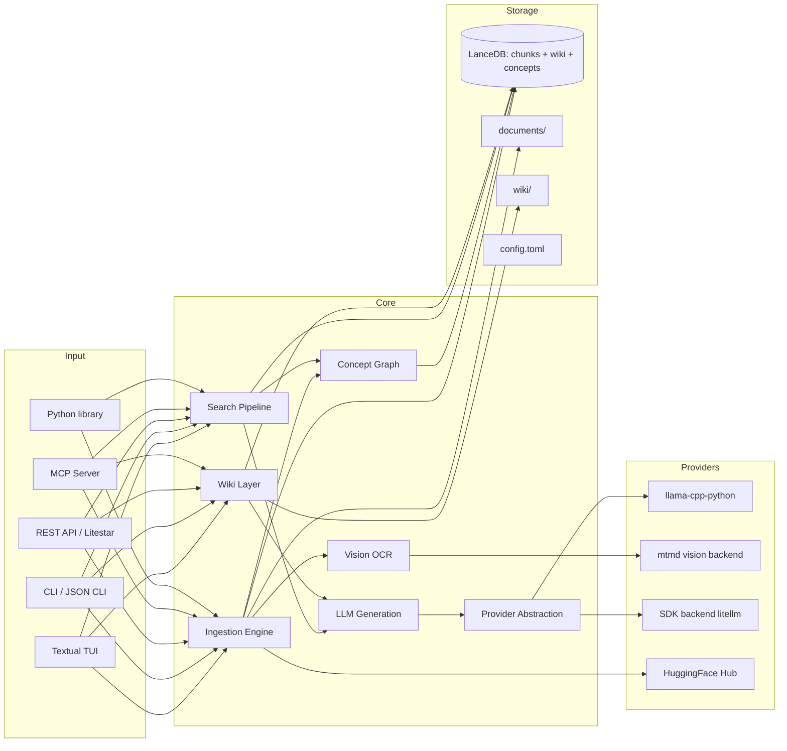
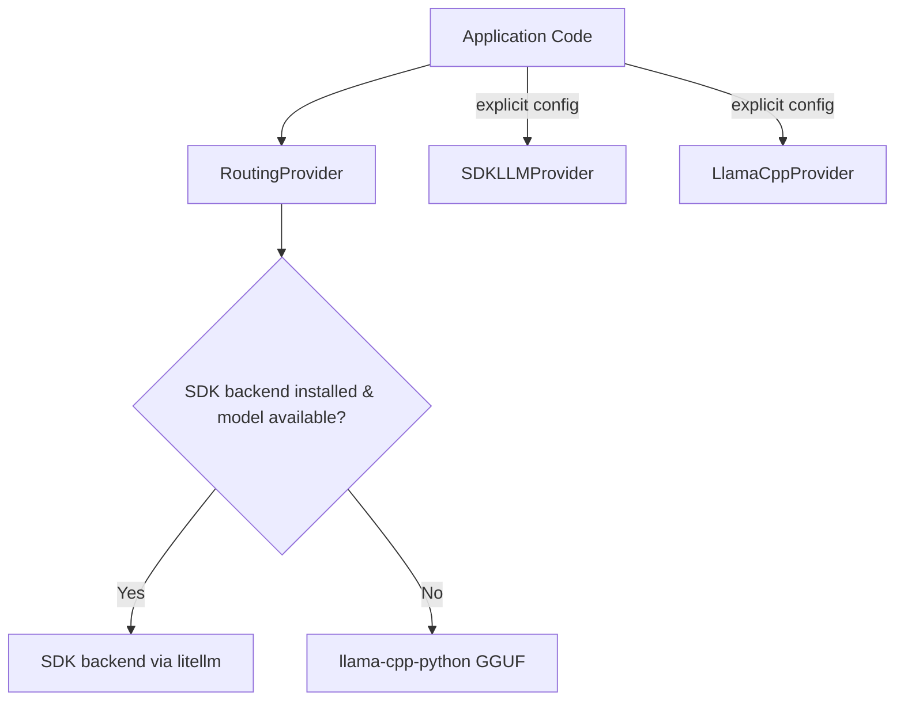
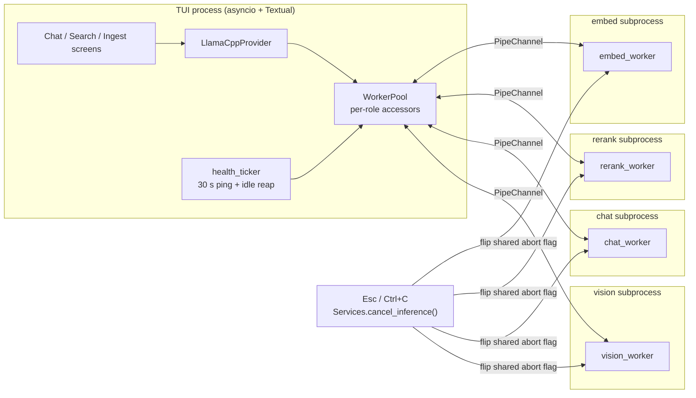
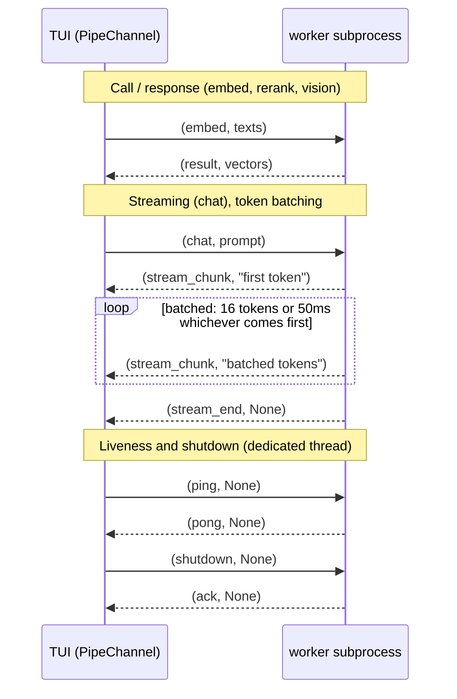
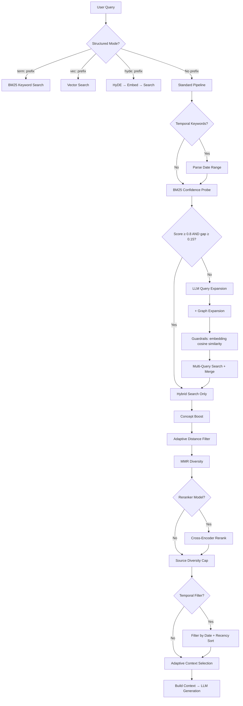
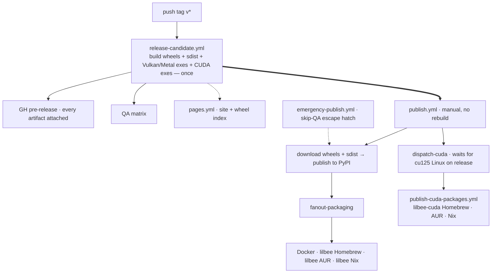

# lilbee Architecture

## What is lilbee?

lilbee is a local search engine for your own documents. It runs entirely on your machine: no cloud, no API keys, no data leaving your computer.

You point it at a folder (markdown, code, PDFs, Office docs, ebooks, images, anything), it indexes them, and then you can search them, chat with a model grounded in them, or let lilbee auto-build a wiki of the concepts and entities they contain. Every answer comes with citations linked back to the source chunk.

lilbee is a single executable: the same process drives the CLI, the Textual TUI, the REST API server, the MCP server for AI agents, and a Python library (`from lilbee import Lilbee`). No sidecar services to run alongside it.

---

## System Overview



---

## Ingestion Pipeline

Documents are chunked, embedded, and stored as vectors for later retrieval.

- **File discovery.** Recursive walk of `documents/` with SHA-256 hash-based change detection so only modified files are re-indexed.
- **Markdown.** Heading-aware chunking via kreuzberg's `chunker_type="markdown"` with `prepend_heading_context=True`. Splits at heading boundaries and prepends the full hierarchy path (e.g., `# Setup > ## Install`) so each chunk's section context travels with it. Inspired by Anthropic's Contextual Retrieval (2024), which showed adding context to chunks reduces retrieval failures by 49%.
- **Code.** tree-sitter AST splitting via tree-sitter-language-pack for 150+ languages, with symbol name, type, and line range in chunk headers.
- **PDF.** kreuzberg text extraction with an OCR fallback chain (text extraction → Tesseract OCR → GGUF vision model via mtmd). PDF page rasterization is delegated to kreuzberg's `PdfPageIterator`.
- **Vision OCR.** When `LILBEE_VISION_MODEL` is set, scanned PDFs and images are transcribed by a GGUF vision model through llama-cpp's native mtmd backend. The pipeline streams an SSE heartbeat during long scans and preserves tables, headings, and multi-column layout as structured markdown. Falls back to Tesseract when no vision model is configured.
- **Structured files.** kreuzberg handles XML, JSON, JSONL, YAML, and CSV natively. Language detection for code-shaped content is delegated to tree-sitter-language-pack's `detect_language()`.
- **Web pages.** crawl4ai fetches HTML with JavaScript rendering via Playwright, converts to markdown, and saves to `documents/_web/` for indexing. Recursive crawls emit live progress, respect per-domain rate limits, and retry on HTTP 429/503 with jitter. SSRF protection blocks internal networks by default.
- **Chunking strategy.** Fixed-size chunking (default, token-aware) for reliability on procedural and reference docs. Opt-in semantic chunking (`LILBEE_SEMANTIC_CHUNKING=true`) splits at topic boundaries via kreuzberg's ONNX embedding model; better on prose-heavy corpora at the cost of roughly 9x more downstream embedding calls.
- **Embedding.** Provider-agnostic: native GGUF via llama-cpp-python by default, or any backend reachable via the SDK protocol (Ollama, OpenAI, Gemini, etc.) when `pip install lilbee[litellm]` is available.
- **Concept extraction (opt-in).** With `pip install lilbee[graph]`, spaCy noun phrases are extracted per chunk, a co-occurrence graph is built with PPMI weights, and Leiden clustering assigns concepts to communities.
- **Wiki generation (experimental).** If wiki is enabled, `lilbee wiki build` and the incremental `_incremental_wiki_update` hook inside `lilbee sync` issue one LLM call per source that jointly identifies 3–5 concepts worth their own page and drafts a section for each. Sections are citation-verified and embedding-faithfulness-scored before landing in `concepts/`, `entities/`, or `drafts/`. See the [Wiki Layer](#wiki-layer) section.
- **Storage.** LanceDB tables: chunks (with FTS index for hybrid retrieval), sources, citations, wiki chunks, concept graph nodes/edges, and chunk-to-concept mappings.

---

## Provider Abstraction

lilbee treats chat, embedding, vision (OCR), and reranking as independent **model roles**. Each role resolves to a provider at call time, so you can mix local and remote freely (e.g., a local GGUF chat model with a remote embedding model, or the reverse).



- **auto** (default). `RoutingProvider` checks if the SDK backend is installed and the requested model is available via its API. If so, routes through the SDK; otherwise falls back to local GGUF via llama-cpp.
- **remote**. Force all calls through the SDK backend (Ollama, OpenAI, Anthropic, Gemini, and anything else litellm reaches). Requires `pip install lilbee[litellm]`.
- **llama-cpp**. Force local GGUF inference via llama-cpp-python (always available).

**Model roles** (`lilbee model list --task <role>`):

| Role | Config field | Used for |
|------|--------------|----------|
| chat | `LILBEE_CHAT_MODEL` | `ask`, `chat`, wiki generation |
| embedding | `LILBEE_EMBEDDING_MODEL` | ingest, search, faithfulness scoring |
| vision | `LILBEE_VISION_MODEL` | OCR for scanned PDFs and images |
| reranker | `LILBEE_RERANKER_MODEL` | cross-encoder precision pass |

`validate_model_task_assignment` (invoked at config write time) rejects assignments where the model's capability declaration doesn't match the role, so you can't accidentally wire a pure-chat model into the vision slot.

**Model management.** Native GGUF pulls come from HuggingFace via the catalog (`lilbee model pull`, `/models` in the TUI). Featured picks per role live in `src/lilbee/featured_models.toml`; the catalog view additionally exposes the full HuggingFace GGUF search. External models managed by the SDK backend (e.g., Ollama's own registry) are used for inference when available but are not managed by lilbee.

---

## Tool-call extraction

When a chat client sends `tools=[...]`, llama-cpp-python returns the model's
tool calls embedded in `message.content` as text markup (`<tool_call>{...}</tool_call>`,
`[TOOL_CALLS] [{...}]`, etc.) rather than structured `tool_calls` because the upstream
chat-handler registry doesn't cover most current model families. lilbee runs the
text through HuggingFace's `transformers.utils.chat_parsing_utils.recursive_parse`
with a per-family JSON schema and surfaces structured `tool_calls` in the OpenAI
envelope.

Family classification reads the loaded GGUF's chat template (and, for families
that share generic ChatML markers, the `general.architecture` field) at model
load, picks the matching schema once, caches it on `_ChatSession`. Schemas live
as JSON files in `src/lilbee/providers/worker/response_parser/schemas/`. Adding
a new family is one JSON file + one `ModelFamily` enum value + one detection
marker. No Python parser code per family.

### Schema source-of-truth

The proper place for each per-family schema is in the model's own
`tokenizer_config.json` on HuggingFace Hub, consumed via
`tokenizer.parse_response()`. The plumbing landed in transformers; no model on
Hub has populated `response_schema` yet. lilbee's local schemas are the gap
fill until upstream catches up, one model at a time.

`tools/check_upstream_schemas.py` watches: weekly cron (or `make
check-upstream-schemas` on demand) fetches `tokenizer_config.json` for each
tracked family's representative repo and reports which can be retired
(upstream populated), which are still pending, and which could not be checked
(gated, network). When upstream catches up for a family the workflow opens an
issue listing the deletion checklist for that family. The script never modifies
runtime code or the local schemas; deletion is a human decision.

The longer-term escape hatch is binding llama.cpp's runtime chat-template
autoparser (`common/chat-auto-parser.cpp`) into `llama-cpp-python`. That
removes the per-family code entirely, regardless of whether HF tokenizer
authors populate `response_schema`. Tracking in beads.

## Inference Worker Pool

`LlamaCppProvider` routes every embed, chat, rerank, and vision call through a persistent per-role subprocess. Isolating native llama-cpp inference in its own process keeps the TUI's asyncio event loop responsive under load and prevents one role's GIL-holding inference from stalling another. The pool is the only path; there is no in-process fallback.



Every byte across a pipe is a `(kind, payload)` tuple. The data pipe carries one call at a time: `PipeChannel.call` and `PipeChannel.stream` hold a channel-level `asyncio.Lock` for the full request/reply (or request/stream) window, so a frame the parent reads can only belong to the call that currently holds the lock. New callers queue on the lock until the active call returns. There is no per-frame routing id and no dispatcher thread; the call that holds the lock is the sole reader.

Three patterns cover all traffic:



`WorkerPool` (in `providers/worker/pool.py`) owns lifecycle. `Services` constructs it once at startup with a `default_spawner()` from `providers/worker/transport.py`. The pool talks to workers exclusively through the `WorkerChannel` and `WorkerSpawner` Protocols; the only concrete impl today is `transport_pipe.PipeChannel` / `PipeSpawner`, backed by `multiprocessing.Pipe`.

### Lifecycle contract

1. `WorkerPool(spawner=..., max_idle_s=...)` builds the pool object with no subprocesses spawned. Roles are registered with `pool.register(role, worker_main, config_factory)`.
2. `await pool.start_eager()` spawns one process per registered role concurrently. Optional, gated on `cfg.worker_pool_eager_start`. Most callers rely on lazy spawn instead.
3. `await pool.<role>.call(...)` lazy-spawns the role's worker on first call and reuses the live channel afterwards.
4. `await pool.shutdown(timeout=5.0)` sends shutdown to every live worker, awaits graceful exit, terminates stragglers. Idempotent.
5. Per-role accessors raise `PoolShutdownError` after `shutdown`.

The pool is async-safe: per-role accessor lookups and lazy spawn serialize on a per-role `asyncio.Lock` so two concurrent first-callers do not race to spawn two workers.

### Restart-on-crash policy

A channel that raises `WorkerCrashError` (or reports `is_alive == False`) is dropped via `_on_crash`; the next call spawns a fresh worker. The pool tracks each role's crash timestamps in a deque and refuses to spawn past `_RESTART_BUDGET` (3) crashes within `_RESTART_WINDOW_S` (60s). Past that, consumers see `RoleDegradedError` until the user calls `reset_role_failures` (typically a TUI "retry" affordance) or restarts the process.

### Idle reaping

If `cfg.worker_pool_max_idle_s > 0`, every successful round-trip stamps the role's `last_used` timestamp. `reap_idle()` (driven by the `health_ticker` at 30s intervals) closes any role whose `last_used` is older than the budget and whose `in_flight` counter is zero. The next request respawns the role transparently.

### Health pings

`ping_role()` issues one ping/pong round-trip against a live channel and propagates timeout/crash as `WorkerCrashError`. The `health_ticker` invokes this on the same 30s cadence as `reap_idle`. Cap is `_HEALTH_TIMEOUT_S` (5s).

### Health pipe isolation

The control plane (pings, shutdown) travels on a dedicated `mp.Pipe` per worker, separate from the data pipe that carries call/stream traffic. Control frames cannot interleave with stream chunks by construction; the parent reader on each pipe never sees frames meant for the other.

The worker dedicates a daemon thread to the health pipe. The thread blocks in `health_conn.recv()`, answers `ping` with `pong`, and on `shutdown` sends `ack` and sets a shared `shutdown_event` that the main data loop checks every `_DATA_POLL_INTERVAL_S` poll. This means a long-running data-frame handler (a chat stream that spends seconds inside `_handle_chat_streaming`, an embed batch chewing through a multi-thousand-vector payload) cannot starve the heartbeat or block shutdown: pings return promptly, and `close()` ack returns within the heartbeat thread's processing budget regardless of what the data loop is doing. The main data loop exits within one poll interval after the event fires.

### Cross-boundary cancel

`Services.cancel_inference()` is the canonical entry point used by Ctrl+C and the chat-stream cancel action. It calls `accessor.cancel()` on every registered role, which sets the worker's shared `mp.Value` abort flag. The chat worker's llama-cpp `abort_callback` reads that flag at every token tick and unwinds inference.

### Token batching

Per-token `conn.send()` was the largest non-inference cost in the chat worker (9.14% of py-spy samples on a 10-minute streaming session, vs. ~1.5% spent in actual ggml decode + sample). `_handle_chat_streaming` now batches: the very first token flushes immediately so the user sees output without delay, and subsequent tokens accumulate in a buffer that flushes when it hits 16 chunks or 50 ms since the last flush, whichever comes first. The pipe sees roughly one syscall per batch instead of one per token. A `try/finally` flushes any buffered tail before the outer error handler emits an error frame, so the user still sees partial output before a mid-stream LLM exception.

### IPC discipline rules (pipe transport)

The pipe transport (`transport_pipe.py`) enforces these rules that keep the parent and worker in lockstep:

1. **Channel-level serialization.** A single `asyncio.Lock` (`_call_lock`) per channel is held for the full request/reply or request/stream lifetime. Concurrent callers queue on the lock; the call that holds the lock is the sole reader of the data pipe. A reply or stream frame can only belong to the active call by construction, so no frame-routing id is needed and no stale-frame discard is possible.
2. **Pull-based backpressure.** Pipe buffers are ~64 KiB on Linux; `conn.send()` blocks once full. Because there is only one in-flight call at a time, the worker's reply send never queues behind earlier pending replies, and a slow consumer applies backpressure naturally.
3. **Pickle size cap.** `Connection.send()` raises `ValueError` past about 32 MiB on POSIX. `call` and `stream` enforce the cap (`_PICKLE_MAX_BYTES`) with a clear `PayloadTooLarge` error before the pickle round-trip.
4. **Bounded poll.** Worker main loops use `conn.poll(timeout=...)` not bare `recv` so the shutdown event set by the heartbeat thread (and SIGTERM in real deployments) fires within `_DATA_POLL_INTERVAL_S`. Bare `recv` ignores both signals and event flags.
5. **Picklable error wire.** Exceptions are serialized through `_serialize_exception` to a `(type_name, message, traceback)` triple, which falls back gracefully when the live exception is not picklable (`_thread.RLock` references in tracebacks, several `OSError` subclasses, structlog wrappers).
6. **In-flight counter for idle reaping.** Idle reaping checks `PipeChannel.in_flight` is zero, not "no recent message". A pending `recv` in the middle of a request stays in-flight until the terminator arrives.
7. **Control plane on the health pipe.** Ping/pong and shutdown/ack travel on a dedicated `mp.Pipe`, served by a worker-side daemon thread. A long inference on the data pipe never blocks liveness checks or process termination.
8. **xdist isolation.** `pytest-xdist` parallelism nests with our spawn; integration tests that exercise the pool annotate themselves with `pytest.mark.xdist_group(...)` so two pool tests do not race.
9. **Daemon flag.** `daemon=True` workers cannot spawn children. `PipeSpawner` defaults to `daemon=True`; vision/mtmd workers that ever shell out to ffmpeg etc. must override via `PipeSpawner(daemon=False)` and rely on the pool's `atexit` shutdown.
10. **Best-effort abort.** Once the parent flips the abort flag, in-flight `stream_chunk` messages already in the pipe still drain (a few extra tokens). The user-facing toast should say "Cancelling..." until the worker emits its terminator.

### Spawn context must be spawn

`PipeSpawner` always uses `multiprocessing.get_context("spawn")`. Two reasons:

- **Native context isolation.** Metal/CUDA contexts that the worker initializes are isolated. Fork inheritance crashes them (see vllm#8893 for the reference report).
- **Forward compatibility.** Python 3.14 deprecates fork as the POSIX default; relying on the per-OS default is forward-incompatible.

The cost is that spawn re-imports Python in the child, adding ~1-3s cold start per worker. The pool's lazy spawn and idle reaping keep that cost rare.

### Future zmq transport

The `WorkerChannel` and `WorkerSpawner` Protocols make the IPC primitive swappable. A future `transport_zmq.py` (pyzmq) would only need to add a new factory call site; consumer code never imports `multiprocessing` directly.

### Per-call model override

Two of the four worker roles let the parent swap models without respawning the subprocess: `chat_worker` and `vision_worker` accept a `model` field on every request and check it against the currently-loaded path inside `_ensure_loaded`; if it differs they close the old `Llama` and load the new one in place. `LOAD_AFFECTING_KEYS` lists every config key that requires reloading; the subset `PER_CALL_RELOADABLE_KEYS = {"chat_model", "vision_model"}` is the slice that the parent skips when calling `invalidate_load_cache`, because the worker will pick up the change on the next request automatically. `embed_worker` and `rerank_worker` do not have per-call model overrides — those models change at config time, not per-call, so the simpler "release the role + lazy respawn" path is correct there.

### Resource budget

Each active role spawns a subprocess. Memory cost: ~50 MB Python overhead per worker plus the loaded model's resident size. Typical sizes are embed 100–500 MB, rerank 100–300 MB, chat 1–8 GB depending on quantization, vision 2–4 GB. With all four roles warm, total resident memory is usually 4–8 GB, dominated by chat and vision. Idle reaping (`cfg.worker_pool_max_idle_s > 0`) shrinks the working set when a role goes quiet.

First-call latency per role is the spawn + model-load cost: 1–3 s on Apple Silicon, longer on cold disk. The TUI surfaces this via spawn notifications wired through `Services.add_pool_listener` (see `cli/tui/app.py`), and `cfg.worker_pool_eager_start` opts into amortizing the cost at TUI startup.

---

## Search Pipeline

This is the core of lilbee's retrieval quality. The pipeline applies techniques progressively: expensive operations are skipped when simpler ones produce confident results.



### Technique Reference

#### Hybrid Search (BM25 + Vector + RRF)
**Always on.** Combines keyword matching (BM25 via LanceDB FTS) with semantic similarity (vector cosine distance), fused via Reciprocal Rank Fusion.

- **Paper**: Cormack, Clarke & Büttcher 2009, "[Reciprocal Rank Fusion outperforms Condorcet and individual Rank Learning Methods](https://dl.acm.org/doi/10.1145/1571941.1572114)"
- **Tradeoff**: ~5ms overhead vs vector-only search. Worth it because BM25 catches exact keyword matches that vectors miss (e.g. searching for "NavigationServer2D" needs exact string matching, not semantic similarity).
- **When it helps**: queries with specific terms, function names, error messages, exact phrases.

#### MMR Diversity
**Always on.** Maximal Marginal Relevance prevents near-duplicate chunks from filling all result slots.

- **Paper**: Carbonell & Goldstein 1998, "[The Use of MMR, Diversity-Based Reranking](https://dl.acm.org/doi/10.1145/290941.291025)"
- **Default**: λ=0.5 (equal weight to relevance and diversity). This is the standard default from the original paper.
- **Tradeoff**: λ=1.0 gives pure relevance (may return 5 chunks from the same paragraph). λ=0.0 gives maximum diversity (may sacrifice the most relevant result for variety). 0.5 balances both.
- **When to tune**: increase λ for factual lookups ("what is the API key format?"), decrease for exploratory queries ("how does authentication work?").

#### Source Diversity
**Always on.** Caps results per source document so one large file doesn't dominate all top-k slots.

- **Paper**: Zhai 2008, "[Towards a Game-Theoretic Framework for Information Retrieval](https://dl.acm.org/doi/10.1007/978-3-540-78646-7_13)"
- **Default**: 3 chunks per source. Ensures at least 2 different documents appear in top-5 results.
- **Tradeoff**: lower cap = more diverse sources but may miss relevant sections from a single comprehensive document.

#### Query Expansion
**On by default, skipped when BM25 is already confident.** LLM generates 2-3 alternative phrasings of the query, each is searched independently, and results are merged via deduplication.

- **Technique**: standard multi-query retrieval
- **Cost**: 1 LLM call (~200 tokens) + N embedding calls per variant
- **Default**: 3 variants. Set `LILBEE_QUERY_EXPANSION_COUNT=0` to disable entirely.
- **When it helps**: queries using different terminology than the indexed documents. E.g. user asks "how to deploy" but the docs say "installation steps".

#### Confidence-Based Expansion Skip
**On by default.** Before running the expensive LLM expansion call, does a quick BM25 probe. If the top BM25 result is highly confident, expansion is skipped entirely.

- **Technique**: early termination based on BM25 score distribution
- **Default threshold**: 0.80 (90th percentile of sigmoid-normalized BM25 scores)
- **Default gap**: 0.15 (top-1 must be clearly separated from top-2)
- **Threshold derivation**: BM25 scores are normalized via sigmoid centered at ~0.5. Scores above 0.8 represent strong keyword matches. The gap ensures the match isn't ambiguous.
- **Tradeoff**: higher threshold = expansion runs more often (better recall, more latency). Lower = expansion skipped more (faster, may miss some results).
- **Caveat**: these are starting defaults. Calibrate per-corpus using RAGAS evaluation metrics.

#### Expansion Guardrails
**On by default.** Validates LLM-generated query variants to prevent drift.

- **Technique**: cosine similarity between the question's embedding and each variant's embedding. Language-agnostic (works for any corpus the embedding model supports) and reuses the variant vectors that the multi-query search would have embedded anyway, so there are zero extra embed calls.
- **Threshold**: 0.5 by default via `LILBEE_EXPANSION_SIMILARITY_THRESHOLD`. Raise it to reject more variants (stricter); lower it to keep more (looser). Calibrate per embedding model. Dense 768-dim models cluster higher by default than contrastively-trained ones.
- **Concept-graph variants bypass this check**: they come from deterministic graph traversal and are expected to be partial phrases with lower similarity to the full question.
- **Tradeoff**: guardrails may filter out creative but valid variants. Disable via `LILBEE_EXPANSION_GUARDRAILS=false` if recall is more important than precision.

#### HyDE (Hypothetical Document Embeddings)
**Off by default.** Generates a hypothetical passage (50-100 words) that reads like a real document answering the query, embeds it, and searches with it alongside the original query vector.

- **Paper**: Gao et al. 2022, "[Precise Zero-Shot Dense Retrieval without Relevance Labels](https://arxiv.org/abs/2212.10496)"
- **Cost**: 1 additional LLM call + 1 embedding (~500ms total)
- **Default weight**: 0.7x (hypothetical results are discounted because they're fabricated: they approximate the answer space but aren't grounded in real content)
- **When it helps**: vague or short queries where the user's terminology doesn't match the indexed documents. E.g. "how does the thing work" where the "thing" is described with specific technical vocabulary in the docs.
- **When to skip**: factual lookups, keyword-heavy queries, or when latency matters.

#### Concept Graph (LazyGraphRAG Index Side)
**On by default.** At index time, extracts noun phrases from each chunk via spaCy, builds a co-occurrence graph weighted by Positive Pointwise Mutual Information (PPMI), and clusters concepts with the Leiden algorithm. Zero LLM calls at index or query time.

Two query-time effects:
- **Concept boost**: for each search result, counts concept overlap between the query's noun phrases and the chunk's concepts. Score adjusted by `overlap_ratio × concept_boost_weight` (default 0.3). Only promotes, never demotes.
- **Graph expansion**: traverses the co-occurrence graph (1 hop BFS) to find concepts related to the query. These supplement LLM-generated expansion variants and go through the same drift guardrails.

- **Inspiration**: Microsoft Research 2024-2025, "[LazyGraphRAG](https://www.microsoft.com/en-us/research/blog/lazygraphrag-setting-a-new-standard-for-quality-and-cost/)". NLP concept extraction at index time, defer reasoning to query time.
- **Clustering**: Traag et al. 2019, "[From Louvain to Leiden](https://www.nature.com/articles/s41598-019-41695-z)" via graspologic-native (Rust).
- **Weighting**: Church & Hanks 1990, PPMI: `max(0, log2(P(a,b) / P(a)P(b)))`. Negative values clamped to zero to discard anti-correlated concept pairs.
- **Cost**: ~10ms per chunk at index time (spaCy NLP). Zero additional cost at query time (table lookups only).
- **When it helps**: queries where related but not identical concepts appear across documents. E.g. "connection pooling" finding both database and API performance docs because both mention it alongside related concepts.
- **Browse**: `lilbee topics` shows concept communities, a map of what's in the index.

#### Cross-Encoder Reranking
**Off by default.** Requires a reranker model to be configured. After hybrid search returns candidates, a cross-encoder model scores each (query, chunk) pair for more precise relevance ranking.

- **Paper**: Nogueira & Cho 2019, "[Passage Re-ranking with BERT](https://arxiv.org/abs/1901.04085)"
- **Position-aware blending**: instead of replacing fusion scores entirely, rerank scores are blended with fusion scores using position-dependent weights:
  - Top 3 results: 70% fusion / 30% rerank (these were already ranked high by fusion for good reason)
  - Positions 4-10: 50% / 50% (equal influence)
  - Positions 11+: 30% fusion / 70% rerank (reranker has more opportunity to rescue misranked items)
- **Blending rationale**: derived from learning-to-rank literature (Burges et al. 2005, "[Learning to Rank using Gradient Descent](https://icml.cc/imls/conferences/2005/proceedings/papers/012_Learning_BurgesEtAl.pdf)"). Top positions already have strong signal, so the reranker provides diminishing returns there.
- **BM25 protection**: if the rank-1 result has a BM25 score above the expansion skip threshold, it is protected from demotion. This prevents the neural reranker from pushing down obvious exact keyword matches.
- **Cost**: depends on model and candidate count. ~200-500ms for 20 candidates with a small cross-encoder.

#### Adaptive Distance Threshold
**Off by default.** When enabled, if the initial cosine distance filter returns too few results, the threshold is widened step by step until enough results are found or a safety cap is reached.

- **Controlled by**: `LILBEE_ADAPTIVE_THRESHOLD` (default: `false`)
- **Default step**: 0.2 (widens from initial `max_distance` in increments, configurable via `LILBEE_ADAPTIVE_THRESHOLD_STEP`)
- **Safety cap**: 20 iterations maximum to prevent runaway loops
- **When it helps**: novel queries or small indexes where strict distance thresholds would return empty results.

#### Adaptive Context Selection
**On by default.** After search results are ranked, selects which chunks to include as LLM context based on query term coverage rather than just taking the top-k.

- **Technique**: greedy set-cover approximation
- **Algorithm**: tokenize query into terms, greedily select chunks that add the most uncovered terms, stop when coverage reaches 100% or marginal gain drops below 5%
- **Default max sources**: 5 chunks
- **When it helps**: multi-faceted queries like "compare X and Y" where top-k might only cover X but context selection ensures Y is also represented.

#### Temporal Filtering
**On by default, activates only when temporal keywords are detected in the query.**

- **Keywords detected**: "recent", "latest", "today", "yesterday", "this week", "last week", "this month", "last month"
- **Date source**: frontmatter `date` field (preferred) or document ingestion timestamp (fallback)
- **Behavior**: when active, retrieves 3x candidates (compensating for filtering loss) and sorts by recency
- **When it helps**: queries like "what changed recently?" or "latest notes about X"

#### Structured Query Modes
**Always available.** Power-user feature for direct control over the retrieval pipeline.

- `term: kubernetes pod scheduling`: BM25 keyword search only (no vector, no expansion)
- `vec: how does container orchestration work`: vector search only (no BM25)
- `hyde: explain the scheduling algorithm`: generate hypothetical document, embed, search
- No prefix → standard hybrid pipeline with all features

Useful for benchmarking (compare BM25 vs vector on the same question), debugging (why isn't this document in keyword results?), and precision (when you know exactly what you want).

---

## Wiki Layer

> **Experimental.** Generation quality depends on your corpus and the chat model. Expect some pages to land in `drafts/` for human review rather than publish direct.

The wiki layer is lilbee's second-order index: a set of linked markdown pages auto-generated from your document corpus so that concepts and entities which show up across many sources get their own page with citations from every source that mentions them.

### Layout

Under `$LILBEE_DATA/$wiki_dir/` (default `wiki/`):

| Directory | Contents |
|-----------|----------|
| `concepts/` | One page per LLM-identified concept (e.g. `braking-systems.md`) |
| `entities/` | One page per proper-noun entity extracted by NER (e.g. `henry-ford.md`) |
| `drafts/` | Low-faithfulness output and PENDING markers for parse failures or slug collisions. Reviewed via `lilbee wiki drafts accept / reject`. |
| `archive/` | Pages retired by `lilbee wiki prune` |
| `synthesis/` | Cross-source pages produced by `lilbee wiki synthesize` |
| `index.md` | Auto-generated table of contents, grouped by page type |
| `log.md` | Append-only audit trail of every build, ingest, lint, and prune |

Slugs are lowercase hyphen-separated filenames that double as the `[[link]]` target. `make_slug` lives at `src/lilbee/wiki/shared.py`.

### Build

`lilbee wiki build` runs a one-time Phase D migration (archives pre-Phase-D noun-chunk concept pages, unwraps stale `[[concept-slug]]` links), then extracts NER entities from the chunk store via `cfg.wiki_entity_mode` (default `ner_entities`, spaCy NER only). Per source, a single batched LLM call identifies 3-5 concepts worth their own page and drafts a section for each concept plus each extracted entity. Sections are split, citation-verified against the source chunk pool, embedding-faithfulness-scored (`wiki/gen.py::_check_faithfulness`, cosine of body vs mean source-chunk vector), and written to `concepts/` or `entities/`. Sections that fail to parse become PENDING markers in `drafts/`.

### Incremental update

`lilbee sync` runs `_incremental_wiki_update` after ingest with `extract_concepts=False` so re-ingest never churns concept slugs. The cap is `LILBEE_WIKI_INGEST_UPDATE_CAP` (default 20 changed sources per sync). Full rebuild is always available via `lilbee wiki build`.

### Retrieval inside wiki generation

Each page is grounded in the top `LILBEE_WIKI_CONCEPT_MAX_CHUNKS_PER_PAGE` chunks returned by the same hybrid search the main pipeline uses, optionally reordered by the reranker when `LILBEE_RERANKER_MODEL` is set. Every path respects `LILBEE_DIVERSITY_MAX_PER_SOURCE` so one loud document can't monopolize a topic page.

### `[[wiki links]]`

After each build, `wiki/links.py::rewrite_wiki_links` rewrites plain-text slug surface forms to `[[slug]]` form in page bodies, skipping YAML frontmatter, code fences, and the auto-generated citation block. `lilbee wiki lint` flags concept or entity pages with zero inbound links.

### Search scope

`search()` accepts a `scope` argument (`raw`, `wiki`, `both`) that filters the hybrid search pool to source chunks, wiki chunks, or the union. Used by the TUI scope toggle and the MCP tool.

---

## Interfaces

### CLI
- `lilbee ask "question"`: one-shot RAG answer with sources
- `lilbee chat`: launches the full Textual TUI (also `lilbee` with no args)
- `lilbee search "query"`: vector search, no LLM generation
- `lilbee sync` / `lilbee add` / `lilbee remove`: document management
- `lilbee model pull <name>` / `model list` / `model rm`: native GGUF model management
- `lilbee wiki build` / `wiki lint` / `wiki synthesize` / `wiki drafts` / `wiki prune`: wiki layer
- `lilbee serve`: start the REST API server
- `lilbee mcp`: launch the MCP server
- `--json` / `-j` on any command for structured output

### TUI (Textual)
Launched by `lilbee` or `lilbee chat`. Screens: chat, task center, model catalog, settings, setup wizard, wiki, wiki-drafts review, status. Slash commands route through `src/lilbee/cli/tui/command_registry.py` (single source of truth). Every background job (sync, crawl, wiki build, model pull) runs in the app-level `TaskBarController` and is cancellable with `/cancel`.

### REST API (Litestar)
- Search: `GET /api/search`, `POST /api/ask`, `POST /api/chat`, `POST /api/ask/stream`, `POST /api/chat/stream` (SSE)
- Documents: `GET /api/documents`, `POST /api/documents/remove`, `POST /api/add`, `POST /api/sync`, `GET /api/source` (vault-aware source retrieval)
- Models: `GET /api/models`, `GET /api/models/catalog`, `GET /api/models/installed`, `PUT /api/models/{chat,embedding,vision,reranker}`, `POST /api/models/pull`, `DELETE /api/models/{model}`
- Crawl: `POST /api/crawl` (SSE progress)
- Config: `GET /api/config`, `GET /api/config/defaults`, `PATCH /api/config`
- Status/health: `GET /api/status`, `GET /api/health`
- Interactive docs at `/schema/redoc`; OpenAPI JSON at `/schema/openapi.json`

### MCP Server (`lilbee mcp`)
- Search + lifecycle: `search(query, top_k, scope)`, `status`, `sync`, `add`, `crawl`, `crawl_status`, `init`, `remove`, `list_documents`, `reset`
- Models: `model_list`, `model_show`, `model_pull`, `model_rm`
- Wiki: `wiki_list`, `wiki_read`, `wiki_status`, `wiki_synthesize`, `wiki_lint`, `wiki_citations`, `wiki_drafts_list`, `wiki_drafts_diff`, `wiki_prune`

### Python library
```python
from lilbee import Lilbee

bee = Lilbee("./docs")
bee.sync()
results = bee.search("authentication")
```
`Lilbee` composes the same `Store`, `Embedder`, `Searcher`, `Reranker`, and `ConceptGraph` the CLI and server use.

---

## Configuration Reference

All settings are configurable via `LILBEE_*` environment variables, `config.toml`, or `/set` in chat mode. The `GET /api/config` endpoint exposes all current values for API clients.

### Core Settings

| Setting | Default | Description | Caveats |
|---------|---------|-------------|---------|
| `LILBEE_CHAT_MODEL` | `Qwen/Qwen3-0.6B-GGUF/Qwen3-0.6B-Q4_K_M.gguf` | Model used for `ask`, `chat`, and wiki generation | Native GGUF by default; with `[litellm]`, any remote name the SDK backend understands |
| `LILBEE_EMBEDDING_MODEL` | `nomic-ai/nomic-embed-text-v1.5-GGUF/nomic-embed-text-v1.5.Q4_K_M.gguf` | Model for computing vector embeddings | Changing this requires a full `lilbee rebuild` |
| `LILBEE_VISION_MODEL` | *(none)* | GGUF vision model for OCR (via mtmd backend) | When set, takes precedence over Tesseract for scanned PDFs and images |
| `LILBEE_TOP_K` | `10` | Number of search results returned | Higher values provide more context but increase LLM latency and token cost |
| `LILBEE_MAX_DISTANCE` | `0.9` | Cosine distance cutoff for vector results | Lower values are stricter (fewer but more precise results). Set to 1.0 to disable filtering. |
| `LILBEE_ADAPTIVE_THRESHOLD` | `false` | Enable adaptive threshold widening | When true, automatically widens distance threshold if too few results found. Useful for ensuring minimum result count. |
| `LILBEE_CHUNK_SIZE` | `512` | Target tokens per chunk | Changing requires `lilbee rebuild`. Smaller = more precise retrieval, larger = more context per chunk |
| `LILBEE_CHUNK_OVERLAP` | `100` | Overlap tokens between adjacent chunks | Changing requires `lilbee rebuild`. Prevents information loss at chunk boundaries |
| `LILBEE_SYSTEM_PROMPT` | *(built-in)* | System prompt sent to the LLM | Override per-project for domain-specific behavior |

### Retrieval Quality Settings

| Setting | Default | Description | Caveats |
|---------|---------|-------------|---------|
| `LILBEE_MMR_LAMBDA` | `0.5` | Relevance vs diversity (0.0=diverse, 1.0=relevant) | 0.5 is the standard default from Carbonell & Goldstein 1998. Lower for broad exploratory queries. |
| `LILBEE_DIVERSITY_MAX_PER_SOURCE` | `3` | Max chunks returned per source document | Lower = more diverse sources. Higher = deeper coverage of a single document. |
| `LILBEE_CANDIDATE_MULTIPLIER` | `3` | How many extra candidates to retrieve for MMR | Higher = better diversity selection but slower. 3x is empirically effective. |
| `LILBEE_QUERY_EXPANSION_COUNT` | `3` | Number of LLM-generated query variants | Each variant requires an embedding call. Set to 0 to disable expansion entirely for fastest search. |
| `LILBEE_ADAPTIVE_THRESHOLD_STEP` | `0.2` | Distance filter widening increment | Only used when `LILBEE_ADAPTIVE_THRESHOLD=true`. Smaller = more granular adaptation but more filter iterations |
| `LILBEE_EXPANSION_SKIP_THRESHOLD` | `0.8` | BM25 score above which expansion is skipped | 90th percentile of sigmoid-normalized BM25 scores. Calibrate per-corpus. |
| `LILBEE_EXPANSION_SKIP_GAP` | `0.15` | Min score gap (top-1 minus top-2) to skip expansion | Approximately 1 std dev of typical score spread. Ensures the match isn't ambiguous. |
| `LILBEE_EXPANSION_GUARDRAILS` | `true` | Validate expansion variants for drift | Prevents hallucinated variants at the cost of potentially filtering valid creative expansions |
| `LILBEE_EXPANSION_SIMILARITY_THRESHOLD` | `0.5` | Minimum question↔variant cosine similarity for an expansion variant to survive the guardrail | Raise for stricter filtering, lower to keep more variants. Calibrate per embedding model. |
| `LILBEE_MAX_CONTEXT_SOURCES` | `5` | Max chunks included in LLM context | More = more complete answers but higher latency and token cost |
| `LILBEE_HYDE` | `false` | Enable hypothetical document embeddings | Adds ~500ms per query. Best for vague queries where terminology doesn't match docs. |
| `LILBEE_HYDE_WEIGHT` | `0.7` | Weight for HyDE results relative to original | Lower = less trust in hypothetical documents. 0.7 prevents fabricated vectors from dominating. |
| `LILBEE_RERANKER_MODEL` | `""` | Cross-encoder model for reranking (empty = disabled) | Native GGUF (e.g. `bge-reranker-v2-m3`) or a remote name via the SDK backend. Only loaded when configured. |
| `LILBEE_RERANK_CANDIDATES` | `20` | Number of candidates to rerank | More = better precision but slower. 20 is a good balance. |
| `LILBEE_TEMPORAL_FILTERING` | `true` | Enable date-based result filtering | Only activates when temporal keywords are detected in the query |
| `LILBEE_SHOW_REASONING` | `false` | Show reasoning model thinking process | For Qwen3/DeepSeek-R1 models that emit `<think>` tags |
| `LILBEE_CONCEPT_GRAPH` | `true` | Enable concept graph (LazyGraphRAG index) | Extracts noun phrases, builds co-occurrence graph, boosts search by concept overlap |
| `LILBEE_CONCEPT_BOOST_WEIGHT` | `0.3` | Concept overlap boost strength (0.0-1.0) | Higher = concept overlap matters more relative to vector similarity |
| `LILBEE_CONCEPT_MAX_PER_CHUNK` | `10` | Max concepts extracted per chunk | Caps extraction to reduce noise from long chunks |
| `LILBEE_CRAWL_MAX_DEPTH` | unset | Optional global ceiling on recursion depth | Set to a positive int to cap calls that pass no explicit depth. Explicit `--depth N` always wins. |
| `LILBEE_CRAWL_MAX_PAGES` | unset | Optional global ceiling on total pages per crawl | Same shape as above. Unset / null = no ceiling. |
| `LILBEE_CRAWL_TIMEOUT` | `30` | Per-page fetch timeout in seconds | Passed to crawl4ai as page_timeout |
| `LILBEE_CRAWL_MAX_CONCURRENT` | CPU count | Max simultaneous crawl operations (top-level) | Limits parallel `crawl_and_save` invocations. Per-crawl concurrency is `crawl_concurrent_requests`. |
| `LILBEE_CRAWL_SYNC_INTERVAL` | `30` | Seconds between periodic syncs during crawl | 0 = sync only after crawl completes. Lower = documents searchable sooner |
| `LILBEE_CRAWL_MEAN_DELAY` | `0.5` | Seconds between in-flight requests within a single crawl | Uniform jitter applied by crawl4ai. Tune up for rate-sensitive sites. |
| `LILBEE_CRAWL_MAX_DELAY_RANGE` | `0.5` | Random additional delay on top of mean_delay | Total per-request delay = mean_delay + random(0, max_delay_range) |
| `LILBEE_CRAWL_CONCURRENT_REQUESTS` | `3` | Concurrent in-flight URLs within one crawl | Gentler default than crawl4ai's own `5`. |
| `LILBEE_CRAWL_RETRY_ON_RATE_LIMIT` | `true` | Enable per-domain RateLimiter + SemaphoreDispatcher | Backs off on HTTP 429/503 with jitter and retries. Set to `false` to disable. |
| `LILBEE_CRAWL_RETRY_BASE_DELAY_MIN` / `MAX` | `1.0` / `3.0` | Randomized base-delay range on rate-limit responses (seconds) | Passed as `(min, max)` to crawl4ai's `RateLimiter(base_delay=...)`. |
| `LILBEE_CRAWL_RETRY_MAX_BACKOFF` | `30.0` | Upper bound on any single backoff wait (seconds) |  |
| `LILBEE_CRAWL_RETRY_MAX_ATTEMPTS` | `3` | Retry count per URL on rate-limit codes |  |

### Provider Settings

| Setting | Default | Description | Caveats |
|---------|---------|-------------|---------|
| `LILBEE_LLM_PROVIDER` | `auto` | Backend selection: auto, llama-cpp, remote | auto = use the SDK backend if installed and reachable, otherwise llama-cpp |
| `LILBEE_REMOTE_BASE_URL` | `http://localhost:11434` | SDK backend endpoint | |

---

## Release pipeline

Releases are **build-once, publish-later**. Pushing a `v*` tag builds every shippable artifact one time inside a single workflow run; QA installs *those* artifacts; publishing is a separate manual step that only downloads and uploads what that run already built. Nothing is rebuilt downstream. The PyPI publish needs only the default wheels + sdist (they finish ~25 min into the run), so it doesn't wait on the executables, the CUDA matrix, or QA — only the downstream packaging fan-out (which consumes the executables on the GH release) waits for those.



Thick arrow = the publish path; dotted = triggered/side paths. Timings, what-waits-on-what, and the fan-out's self-skip are in the notes below.

### Lanes

| Lane | Trigger | Builds | QA | Publishes |
|---|---|---|---|---|
| **Release candidate** | `git push v0.6.66bN` | default wheels, sdist, extra (CUDA) wheels, Vulkan/Metal executables, CUDA executables — once, all in parallel | yes | no (artifacts only); attaches everything to a GH **pre-release** |
| **Publish to PyPI** | `gh workflow run publish.yml -f tag=v0.6.66bN` | nothing — downloads the RC run's artifacts | n/a — needs only the default wheels (no wait on executables/CUDA/QA) | PyPI, then in parallel: Docker / lilbee Homebrew / AUR / Nix via `fanout-packaging`, and `lilbee-cuda` Homebrew / AUR / Nix via `dispatch-cuda` → `publish-cuda-packages.yml` |
| **Emergency publish** | `gh workflow run emergency-publish.yml -f tag=... -f confirm=skip-qa` | nothing — downloads the RC run's artifacts | skipped on purpose | same as Publish to PyPI; tolerates an incomplete artifact set |

`release-candidate.yml` can also be dispatched manually against a branch/SHA — same build + QA, no pre-release attach, never publishes. That's a dry run.

`build-cuda-executables.yml` is also dispatchable standalone (`gh workflow run build-cuda-executables.yml -f tag=v...`) to backfill CUDA binaries onto a historical release; in that mode each cell attaches directly to the named release tag instead of relying on `attach-prerelease`.

### Notes

- **Single build location.** Wheels, sdist, and every executable (Vulkan, Metal, and CUDA) are produced only by the `release-candidate.yml` run for the tag. `release.yml` builds the Vulkan/Metal exes, `build-cuda-executables.yml` builds the CUDA exes, both called as siblings of the wheel builders; `attach-prerelease` waits on all four and picks every artifact up via the `lilbee-*` glob. `publish.yml` / `emergency-publish.yml` resolve that run by commit SHA and pull its artifacts; they never invoke a builder. CUDA / Intel-Mac extra wheels run in parallel with QA (`continue-on-error`, soft-fail) so a slow GPU cell never holds up anything; the same `continue-on-error` policy applies to the CUDA executable cells.
- **PyPI publishes early; the fan-out waits.** `publish.yml` gates only on the default-wheel + sdist artifacts being complete in the RC run, so PyPI gets the release ~30 min after the tag push regardless of the executables/CUDA/QA still running. The Homebrew/AUR/Nix/Docker fan-out for the default `lilbee` package pins the executables by hash, so `fanout-packaging` self-skips (with a warning) until those assets are attached to the GH release; re-running `publish.yml` then completes the fan-out. The PyPI upload is `skip-existing`, so re-running is safe.
- **CUDA fan-out is its own lane.** `publish.yml`'s `dispatch-cuda` job runs in parallel with `publish-pypi` (it needs `guard` only, not the PyPI upload), polls the release for `lilbee-linux-x86_64-cu125`, and dispatches `publish-cuda-packages.yml` as soon as that asset attaches. That workflow updates the `lilbee-cuda` Homebrew formula, the `lilbee-cuda` AUR package, and the `sources-cuda.json` flake entry. Vulkan and CUDA fan-outs are fully decoupled: a slow Windows CUDA cell can't stall the `lilbee` Homebrew update, and a PyPI hiccup can't stall the `lilbee-cuda` update.
- **`sources-cuda.json` is the CUDA flake state.** `publish-packages.yml` rewrites `sources.json` from scratch on every release (the Vulkan/Metal entries); the CUDA flake entry lives in a separate `sources-cuda.json` so the Vulkan publish can't wipe it. `flake.nix` reads both files; the `lilbee-cuda` package output only appears when `sources-cuda.json` lists a system. `flake-check.yml` triggers on either file.
- **`lilbee` and `lilbee-cuda` are separate Homebrew / AUR / Nix packages.** Both ship a `lilbee` binary; the formula and `PKGBUILD` declare `conflicts_with` / `provides` so users swap between them. The Nix flake exposes them as parallel package outputs (`#default` vs `#lilbee-cuda`).
- **Executable build skips redundant CI.** `release.yml` has a `gate` job that checks whether the `CI` workflow already went green on the same commit (every `main` push runs it). If so it skips the lint + test re-run and goes straight to Nuitka; if not (or if anything is uncertain) it runs them. `skip_tests: true` lets you build past a known-flaky test after eyeballing the failure; lint always gates. `build-cuda-executables.yml` has no such gate (CI cost there is dominated by the CUDA-toolkit install + Nuitka build itself, not the test re-run).
- **Package versions auto-increment.** `publish-docker.yml`, `publish-packages.yml`, and `publish-cuda-packages.yml` derive the version from the `-f tag=` input (`version = ${tag#v}`), so Docker tags, the Homebrew formulas, the AUR `PKGBUILD`s, and the Nix flake all bump to the new version on their own — no manual edits.
- **PyPI Trusted Publishing is pinned to filenames.** PyPI's trusted-publisher config keys on the `publish.yml` workflow filename and the `pypi` GitHub environment name. Don't rename either.
- **`llama-cpp-python` version comes from `uv.lock`.** It's built from source in CI (no upstream prebuilts for our backends). The version isn't hardcoded in the workflows: `tools/wheel-build/build_llama_cpp.sh` reads the resolved version out of `uv.lock`, so `uv lock`-ing a new release is all it takes. Set `LLAMA_CPP_VERSION` (or the `llama_cpp_version` workflow input) to override for a one-off build.

